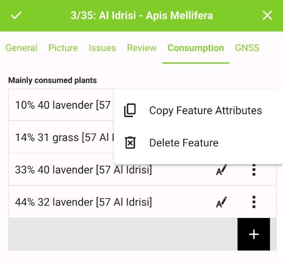
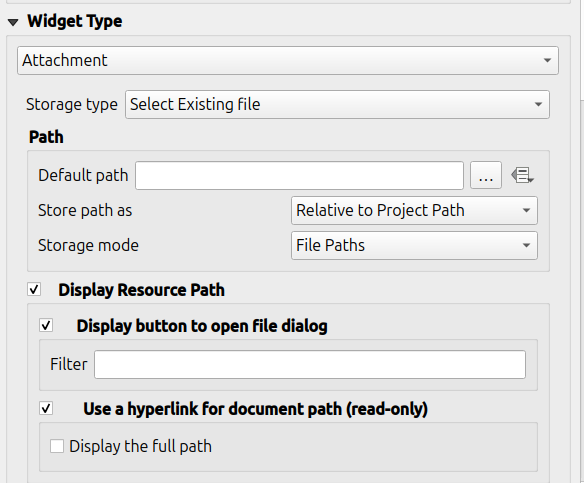

# Attribute Form Configuration

QField creates forms similar to, but not equal to QGIS.

## Suppress Attribute Form

The setting "suppress attribute form" is directly applied to the QField form.

## Field widget

The field widgets from QGIS are supported on a best effort basis.

| Widget type       | Support         | Notes                                           |
| ----------------- | ---------------| -----------|
| Text Edit         | :material-check: | - HTML is not supported <br> - Numerical input is enforced based on the type. |
| Check Box         | :material-check: |                                                 |
| Value Map         | :material-check: |                                                 |
| Hidden            | :material-check: |                                                 |
| Attachment        | :material-check: | This field is combined with camera integration. It is also able to open other files like pdf and doc (if the user has an appropriate viewer) [Attachment (photo settings)](#attachment-photo-settings)|
| Date Time         | :material-check: |                                                 |
| Relation Reference| :material-check: |                                                 |
| Relation Widget   | :material-check: |                                                 |
| Value Relation    | :material-check: |                                                 |
| Others            | :material-close: | [Funding](../../../support/#funding)            |

## Relation Widget

For more information refer to the relations chapter of the official [QGIS Documentation](https://docs.qgis.org/3.4/en/docs/user_manual/working_with_vector/attribute_table.html#creating-one-or-many-to-many-relations).

!

The relation widget shows all the referencing child features in a list. It is possible to add, delete and open them.

The visual identification of the list entries are done via the "Display Expression" of the child layer.

*Key handling*

Since the parents primary keys are used as foreign keys on the referencing child features, these primary keys must be save to use even after the synchronization back to the original data. Therefore we recommend to use stable values such as UUIDs for primary keys. 

It is possible to already add children from a parent that is about to be added. This possibility will be blocked if there is no valid primary key on the parent or the constraints are violated. In case the adding of the parent feature is canceled after some children have been added already, the children are deleted as well.

*Many-To-Many relations*

On many-to-many relationships, according to the cardinality setting in the QGIS Vector Layer Properties, on adding, deleting or opening an entry in the list effects directly the child layer (on direct cardinality) or the linking table (on many-to-one cardinality). 

The second case is usually used when there are additional relation information (e.g. percentage) in the linking table. 

<figure>
    
</figure>

In case of the many-to-one cardinality on many-to-many relations the Display Expression needs to be set on the linking table.

### Attachment (photo settings)

The widget type "Attachment" is used with fields that store the path to files.

It can be used to:

- show and take photos
- show links to external files like pdfs or documents

<figure>
    
</figure>

The path should be set to relative. The pictures, pdf and docs are stored then in a sub-directory of the project, where the link stored in the textfield is pointing to.

In QField the picture is displayed. By clicking the camera symbol the camera is started to update the picture with a new photo.

<figure>
    
</figure>

On synchronization the sub-directory with the pictures, pdf and docs has to be copied as well.

The option "hyperlink" on the attachment widget will disable the camera functionality and enable a hyperlink to open a document (pdf, doc, ...).

<figure>
    
</figure>

## Value Relation

The widget "Value Relation" offers values from a related table in a combobox. You can select layer, key column and value column. Several options are available to change the standard behaviors: allow null value, order by value and allow multiple selections. The widget will display a drop-down or multiple-select list of the referenced features.

<figure>
    
</figure>

## Drag and drop designer forms

Groups and Tabs from Drag and Drop designer forms are supported.

## Conditional visibility

Groups can be hidden based on an expression. This is useful when certain attributes are
only required under certain conditions. As an example imagine mapping trees. Some of them
might have a disease and you have a list of possible deseases. To not clutter the form with
many fields, make a group and configure a visibility expression for a group "diseases". Add
a field "desease" with a checkbox. Only when the checkbox is checked, the list of diseases
will be available to the user.

!

Let's see what we got on the field:

<video controls width="700">
    <source src="../../../assets/videos/conditional_visibility.webm"
            type="video/webm">
    Sorry, your browser doesn't support embedded videos.
</video>

## Constraints

Attribute fields can have constraints attached. Constraints are expressions that needs to
evaluate to `True` (or `1`) in order to be able to save the form. Constraints
are configured on a per-field basis and a description can be added that will be shown to the
user if a constraint is not satisfied.

<figure>
    
    <figcaption>
        Configuration of a constraint within a range
    </figcaption>
</figure>
     

### Common use cases

You cannot enter an elevation value higher than the highest mountain in this country.

``` sql
"elevation" < 5000
```

It is required to fill in an identifier.

``` sql
"identifier" IS NOT NULL
```

## Default values

Fields can have default values configured. Default values are inserted into the
attribute form when digitizing a new feature. They are visible to the user and can
be modified as long as the field is editable. They can be based on the geometry or
expression variables.

<figure>
    
    <figcaption>
        Configuration of a formatted date as default value
    </figcaption>
</figure>

### Additional variables

In QField, there are some additional variables available regarding the current
positioning information.

- `position_coordinate` (Geometry in WGS84!) : Lon, Lat, Altitude as delivered 
  by the sensor. Is also available when the crosshair is not snapped to the sensor.
- `position_timestamp` (DateTime) : Timestamp of the position information
- `position_direction` (float) : Direction in degrees from true north.
- `position_ground_speed` (float) : Groundspeed in meters / second.
- `position_magnetic_variation` (float) : The angle between the horizontal 
  component of the magnetic field and true north, in degrees. Also known as 
  magnetic declination. A positive value indicates a clockwise direction from 
  true north and a negative value indicates a counter-clockwise direction.
- `position_horizontal_accuracy` (float) : The horizontal accuracy of the 
  coordinate (in meters). 
- `position_vertical_accuracy` (float) : The vertical accuracy of the 
  coordinate (in meters).
- `position_vertical_speed` (float) : The value of the vertical speed in meters
  per second. 

### Common use cases

Insert positioning information as variable:

``` sql
@position_horizontal_accuracy
```

Insert the current date and time:

``` sql
now()
```
Insert the length of the digitized line:

``` sql
length($geometry)
```
Configure global variables on the device and insert them.

``` sql
@operator_name
```
If you want to assign a region code based on the location where a new feature is
inserted, you can do so by using an aggregate expression:

``` sql
aggregate( layer:='regions', aggregate:='max', expression:="code", filter:=intersects( $geometry, geometry( @parent ) ) )
```

## Editable

The editable flag of fields is respected.

## Remember last values

QField offers a much more fine-grained control over the last used values and ignores the QGIS setting.

## Add QML and HTML widgets

You can add a QML or HTML widget. By using QML or HTML widgets you are able to display information in charts, tables or otherwise formatted ways.

<video controls width="700">
    <source src="../../../assets/videos/qml_html.webm"
            type="video/webm">
    Sorry, your browser doesn't support embedded videos.
</video>
