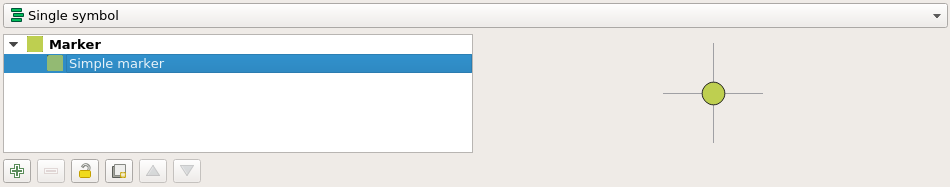

# Custom SVG symbols

It is possible to embed SVG symbols directly within a QGIS projects.

1. Choose the layer which will support SVG symbology and open its properties dialog.
2. Open the section Symbology in `Properties --> Symbology`.
3. In the *Symbol Layer Panel* choose Simple marker.

<figure>
    
</figure>

4. Change the Symbol layer type in `Symbol layer type --> SVG marker`.

<figure>
    
</figure>

5. Scroll down the bottom panel.
6. Click on the right side of the file selection button to open the drop down menu.

<figure>
    
</figure>

7. Select Embed File and choose the SVG file in the file selection dialog.
8. Apply the changes and click OK.

<figure>
    
</figure>
