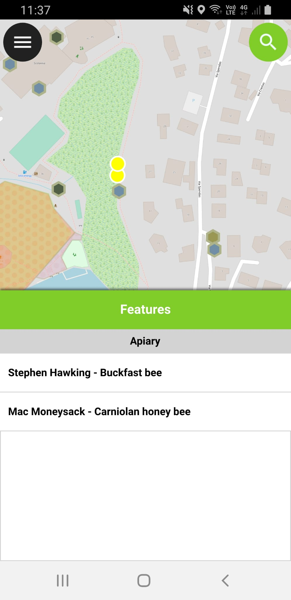

# Feature Names

You can give your features names by specifying a *display expression*.
It will appear in several places, for example when you tap to identify a feature.

In the example below, you can see how it is used with a combination of
the beekeeper and the bee species.

<figure>
    
</figure>

## Layer properties

To edit the display expression, go to "layer Properties" => "Display".

<figure>
    
</figure>

The expression used defines what you see when you click on features.
