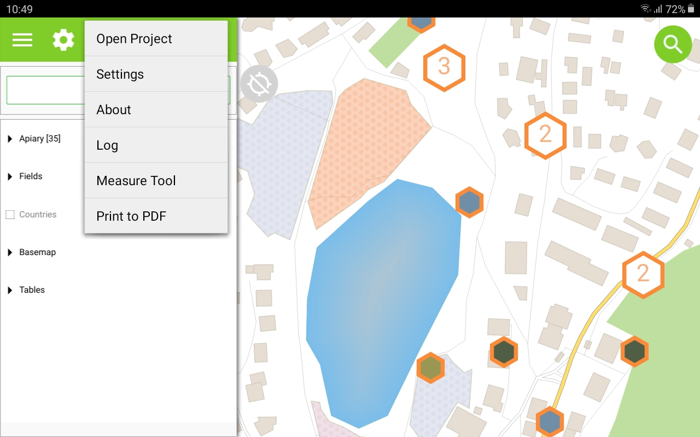
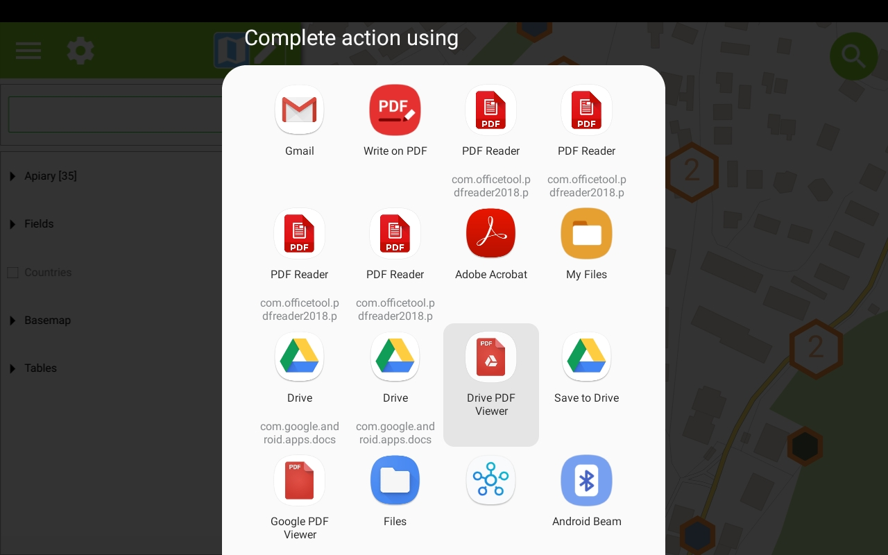

# Print to PDF

It's possible to export the maps and other items to a PDF document.

If the project has at least one print layout defined, printing is available over the menu.

<figure>
    
</figure>

After selecting the print layout, the PDF document is created and stored in the devices documents directory.

By choosing the PDF reader app, the document can be opened directly.

<figure>
    
</figure>

Done.

<figure>
    
</figure>

!!! note
    The devices documents directory is `USER>/<APPNAME>/Documents`. For `QField` this is usually a path like `////storage/emulated/0/Documents/QField`
