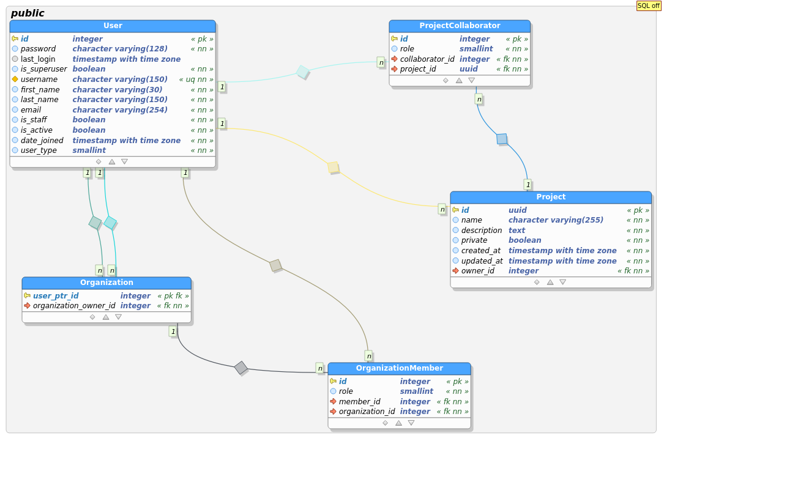
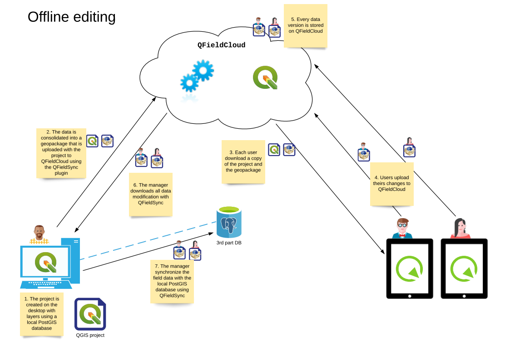

# System Documentation 

The aim of this document is to provide an overview of the system to
understand the underlaying logic and technology.

## Architecture

## Data model

## Actors

### Client (QField or other clients)

The features are:

-   Download QFieldCloud project
-   Edit QFieldCloud project's data
-   Synchronize data with QFieldCloud

### Desktop (QGIS + QFieldSync Desktop)

Features:

-   Create QGIS project
-   Configure layer actions
-   Upload QGIS project and related files
-   Edit QGIS project

### Server (QFieldCloud + QGIS + QFieldSync Server)

Features:

-   Create QFieldCloud project
-   Create QFieldCloud users and organizations
-   Store QGIS project and related files in QFieldCloud project
-   Allow to download QFieldCloud project included the offline or
    hybrid data package
-   Apply diff files to the original data

## Entities and Concepts

### QGIS Project

A QGIS project is a `.qgs` or `.qgz` file. A Project is created on
QGIS Desktop and uploaded to QFieldCloud using the QGIS's plugin
QFieldSync. Before the uploading of the QGIS project, it is
necessary for each layer of the QGIS project an "action" that
determines how QFieldSync and QField should treat the layer.

This information is saved within the QGS project as layer's
`customProperty`, with the `QFieldSync/action` key.

The available actions are:

<table border="2" cellspacing="0" cellpadding="6" rules="groups" frame="hsides">

<colgroup>
<col  class="org-left" />

<col  class="org-left" />
</colgroup>
<thead>
<tr>
<th scope="col" class="org-left">Action internal name</th>
<th scope="col" class="org-left">Name showed in the UI</th>
</tr>
</thead>

<tbody>
<tr>
<td class="org-left">OFFLINE</td>
<td class="org-left">Consolidate</td>
</tr>

<tr>
<td class="org-left">NO_ACTION</td>
<td class="org-left">Live layer</td>
</tr>

<tr>
<td class="org-left">REMOVE</td>
<td class="org-left">Ignore layer</td>
</tr>

<tr>
<td class="org-left">COPY</td>
<td class="org-left">Copy</td>
</tr>

<tr>
<td class="org-left">KEEP_EXISTING</td>
<td class="org-left">Keep Existing</td>
</tr>
</tbody>
</table>

This would be the behavior of QFieldSync Desktop with the different
layer actions:

<table border="2" cellspacing="0" cellpadding="6" rules="groups" frame="hsides">

<colgroup>
<col  class="org-left" />

<col  class="org-left" />

<col  class="org-left" />
</colgroup>
<thead>
<tr>
<th scope="col" class="org-left">Action</th>
<th scope="col" class="org-left">File based layer</th>
<th scope="col" class="org-left">Not file based layer</th>
</tr>
</thead>

<tbody>
<tr>
<td class="org-left">OFFLINE</td>
<td class="org-left">Create a consolidated copy of the data</td>
<td class="org-left">Create a consolidated copy of the data</td>
</tr>

<tr>
<td class="org-left">NO_ACTION</td>
<td class="org-left">N/A</td>
<td class="org-left">No action on the layer</td>
</tr>

<tr>
<td class="org-left">REMOVE</td>
<td class="org-left">Remove the layer from the project</td>
<td class="org-left">Remove the layer from the project</td>
</tr>

<tr>
<td class="org-left">COPY</td>
<td class="org-left">Make source path relative and copy the file</td>
<td class="org-left">N/A</td>
</tr>

<tr>
<td class="org-left">KEEP_EXISTING</td>
<td class="org-left">Make source path relative and copy the file if it does not exist</td>
<td class="org-left">N/A</td>
</tr>
</tbody>
</table>

This is the behavior of QFieldCloud (QFieldSync Server) with the
layers:

<table border="2" cellspacing="0" cellpadding="6" rules="groups" frame="hsides">

<colgroup>
<col  class="org-left" />

<col  class="org-left" />

<col  class="org-left" />
</colgroup>
<thead>
<tr>
<th scope="col" class="org-left">Action</th>
<th scope="col" class="org-left">File based layer</th>
<th scope="col" class="org-left">Not file based</th>
</tr>
</thead>

<tbody>
<tr>
<td class="org-left">OFFLINE</td>
<td class="org-left">Create consolidated copy of the data on pull, apply delta file on push to original data source</td>
<td class="org-left">Create consolidated copy of the data on pull, apply delta file on push to original data source</td>
</tr>

<tr>
<td class="org-left">NO_ACTION</td>
<td class="org-left">N/A</td>
<td class="org-left">No action on the layer</td>
</tr>

<tr>
<td class="org-left">REMOVE</td>
<td class="org-left">Remove the layer from the project</td>
<td class="org-left">Remove the layer from the project</td>
</tr>

<tr>
<td class="org-left">COPY</td>
<td class="org-left">Make source path relative and create copy of the data on pull, apply delta file on push to original data source</td>
<td class="org-left">N/A</td>
</tr>

<tr>
<td class="org-left">KEEP_EXISTING</td>
<td class="org-left">Make source path relative and create copy of the data on pull, apply delta file on push to original data source</td>
<td class="org-left">N/A</td>
</tr>
</tbody>
</table>

This is the behavior of QField with the layers:

<table border="2" cellspacing="0" cellpadding="6" rules="groups" frame="hsides">

<colgroup>
<col  class="org-left" />

<col  class="org-left" />

<col  class="org-left" />
</colgroup>
<thead>
<tr>
<th scope="col" class="org-left">Action</th>
<th scope="col" class="org-left">File based layer</th>
<th scope="col" class="org-left">Not file based layer</th>
</tr>
</thead>

<tbody>
<tr>
<td class="org-left">OFFLINE</td>
<td class="org-left">Create and push deltafile</td>
<td class="org-left">N/A (it's always file based at this point)</td>
</tr>

<tr>
<td class="org-left">NO_ACTION</td>
<td class="org-left">N/A</td>
<td class="org-left">Edit the online (live) database</td>
</tr>

<tr>
<td class="org-left">REMOVE</td>
<td class="org-left">N/A (the layer is no longer there)</td>
<td class="org-left">N/A (the layer is no longer there)</td>
</tr>

<tr>
<td class="org-left">COPY</td>
<td class="org-left">Create and push deltafile</td>
<td class="org-left">N/A</td>
</tr>

<tr>
<td class="org-left">KEEP_EXISTING</td>
<td class="org-left">Create and push deltafile</td>
<td class="org-left">N/A</td>
</tr>
</tbody>
</table>

In summary, for with QFieldCloud:

-   `NO_ACTION` is used for online layers that are located on a server
    accessible via the Internet and that are modified directly by
    QField.
-   `HYBRID` means that a geopackage will be generated on the
    server (or directly on the desktop for file-based layers) and
    downloaded by clients. The client will generate deltafiles of
    the changes.
-   `OFFLINE` is used for example to work with local databases not
    visible by QFieldCloud which are consolidated before being
    loaded from the desktop to the server and are not synchronized
    with the original data by QFieldCloud.
-   `REMOVE` will simply remove the layer from the project.
-   `KEEP_EXISTENT` will not be used for QFieldCloud syncronizations.

From QFieldSync it will be possible to update a project already
loaded on QFieldCloud. In the event that the changes concern only
styles, forms etc. but not the structure of the layers, the
project on the server will simply be updated.
If there are changes in the layers structure, the project will be
reset on the server (delta files will be deleted) and for each
client it will be necessary to download the updated version of the
project before being able to push new changes.

### QFieldCloud Project

Is composed of one and only one QGIS project and the possible
related files (e.g. geopackages, images, &#x2026;) included the offline
or hybrid data package.

### Diff files

### APIs

The autogenerated REST API documentation is available on <http://dev.qfield.cloud/swagger/>

### Synchronization

### Permissions

### Remote datasources credentials

## Use Cases

### Hybrid

**Hybrid editing mode with synchronization on the server**

### Offline database

**Offline editing mode with desktop synchronization**

