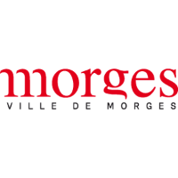
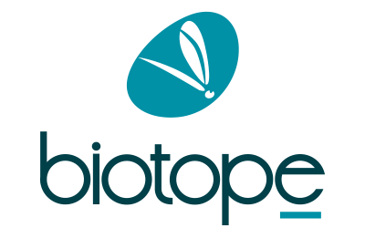

# Support and Development

## Commercial Support

As developer of QField, QFieldCloud and QFieldSync, [OPENGIS.ch](https://www.opengis.ch/#features) provides [training packages](https://www.opengis.ch/qfield-training/) and custom commercial [support contracts](https://www.opengis.ch/qgis-support/) with SLA.

## Development and Custom Apps

You probably have plenty of ideas for nice features that are not implemented yet.
Please [contact us](https://www.opengis.ch/#contact) to discuss the best approach to integrate this idea into QField or to create your own custom app.

## Community Support

You can ask your questions on [gis.stackexchange](http://gis.stackexchange.com/questions/tagged/qfield?sort=newest)

You can use the [user mailing list](http://lists.qfield.org/listinfo.cgi/users-qfield.org)

## Funding

The following oranizations have contributed to make QField what it currently is.
We would like to warmly say: Thanks a lot!

<figure>
    
</figure>
<figure>
    
</figure>
<figure>
    
</figure>
<figure>
    
</figure>
<figure>
    
</figure>
<figure>
    
</figure>
<figure>
    
</figure>
<figure>
    
</figure>

## Credits

QField, QFieldSync and QFieldCloud are developped by OPENGIS.ch. OPENGIS.ch does consulting, development and training for open source software including QField and QGIS.

<figure>
    
</figure>

## API stability

QField is currently not considered API stable.

## License

QField is released under the GNU Public License (GPL) Version 2 or above.
Developing QField under this license means that you can inspect and modify
the source code and guarantees that you will always have access to a QGIS 
based field data collection app that is free of cost and can be freely 
modified.

You can find the sourcecode on [github](https://github.com/opengisch/QField)
