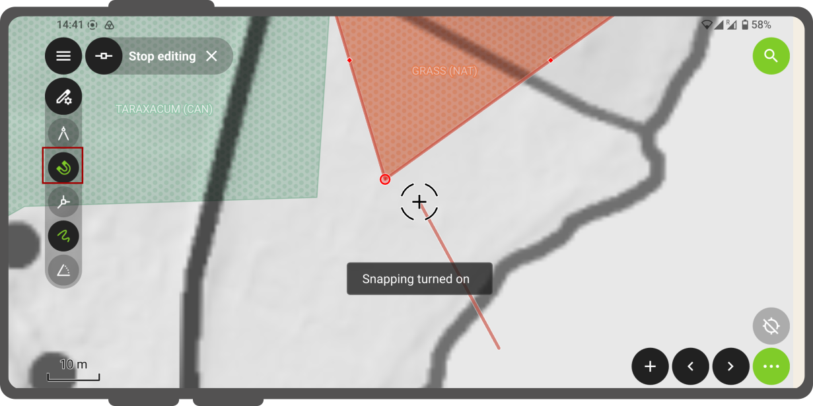

# Digitize and Edit

With QField you can digitize, edit and delete points, lines and polygons and their according attributes while being in the field.
If you only want to edit your attributes, it is enough to stay in **Browse Mode**.
If you, however, want to add a new object or edit the geometry of an existing one, you will have to switch to **Digitize Mode**.

## Adding new objects

### Adding point objects

!!! Workflow

    1. Navigate the crosshair in the center of the screen to where you want to add the point.
    2. Click the  :material-plus-circle:  at the lower right of the screen add a new point.
        (Optionable): You can use the **lock to position** button from the pie menu to force the crosshair to take the point directly at your position - if you have enabled your position.

        !

    3. (Optionable): You can click the red  **X** to cancel the current addition.

### Adding line or polygon objects

!!! Workflow

    1. Navigate the crosshair in the center of the screen to where you want to start the line or the polygon.
    2. Click the  **:material-plus-circle:** at the lower right of the screen to add the starting point.
    3. To form your line or polygon tap on the  **:material-plus-circle:** each time you want to add a new point.
    4. (Optionable) Click the  **:material-minus:** to remove the last added one.

    5. Click on the  **:material-check:** to finish your edition.
    You need to add at least 2 nodes for line features and 3 for polygons.

    6. (Optionable): You can click the  **X** to cancel the current feature creation.

    

### Additional Editing Settings

There are other more advanced settings, which you can enable to make your data collection more efficient:

- **Use volume keys to digitize**: If you want to avoid to have to tap on your device for every point you can enable this option to add and remove points using the volume keys.
**Note:** This feature is only available for Android Devices
- **Allow finger tap on canvas to add vertices**: If you want to use your finger to add points as well rather than having to press the button the whole time, you can activate this option.

!!! Workflow

    1. To enable both options, open the **Side Dashboard**
    2. Tap on the 3-dotted menu at the top right.
    3. Direct to *Settings* > *General*

    !

### Attribute form

After digitizing a geometry, the attribute form will appear allowing you to add attribute values for the new object.

#### Add values using the QR and Barcode

!!! Workflow

    1. Open the attribute form of your object.
    2. Tap on the 3-dotted menu *(⋮)* next to the field which you wish to add or edit
    3. You will see the following options
        - **Copy**
        - **Paste**
        - **Scan Code:** You can also read NFC text tags with the Code Reader
    !
    4. Click on the **Scan Code** option
    !
    5. Scan the QR Code and clickon on the :material-check:
    !
    !

!!! note
    Both the QR code camera and the NFC text tag detector are enabled by default when you open the Code Reader.
    You have the flexibility to disable either of these features to ensure that your device's battery is not used unnecessarily by using hardware that you may not need at the moment.

#### Remember attribute values

If you want to reuse values from previous entries, you can use the  :material-pin: next to the different fields to make QField **remember** the last value, you added to a specific field.

!!! Note

    This only works when you **add** a new object.

## Editing existing geometries

!!! Workflow

    1. Switch to the **Digitize Mode:** Open the **Side Dashboard** and press the :material-pen: 
    2. Go back to the map canvas and find the object you wish to edit.
    3. Tap on the object you wish to edit.
    4. Tap on the **Edit Button**
    5. Now you will have the option to choose between

        - **A Editor tool:** The vertex editor allows you to move or delete pre-existing vertices as well as adding new vertices to geometries.
        - **A Split tool:** The split tool allows you to split objects into two new objects.
        The new object(s) will be filled with the same attributes as the original.
        - **A Reshape tool:** You can reshape the geometry of your corner, by simply drawing a line on top or the object.
        - **An Eraser tool:** If you need to make a whole or erase some parts of your object, you can use this tool.
        - **Ring Tool:** Within an object, you can create a ring.
        QField will ask whether you wish to add a new polygon as a replacement of the deleted one into the hole.

### Editor Tool

### Reshape tool

### Split Tool

### Eraser tool

### Ring tool

## Merging features

QField allows you to merge objects and their geometries to become one.

!!! Workflow

    1. Tap on the first object you want to merge.
    2. Long-Press on it and select it
    3. Add as many more as you want to merge.
    4. Open the 3-dotted menu on the top right.
    5. Click on **Merge Selected Features**.
    !

## Freehand digitizing

If you are working with a stylus, you can draw freehand.
The mode is available for lines and polygons.
You can also use them to edit the existing geometries of other objects.

The freehand digitizing mode is activated through a new toolbar button which appears when QField is set to editing mode and a stylus pen or a mouse is hovering the map canvas while a line or polygon vector is selected.

<!-- markdown-link-check-disable-line -->

## Snapping

When adding new objects it is possible to enable the snapping tool, which allows you to snap new objects to the boundaries or cornerpoints of existing ones.

!!! Workflow

    1. Change to the **Digitize Mode**.
    2. Once activated on the top left below the **Side Dashboard** a :material-pen: icon becomes visible.
    3. Open an existing or add a new object to the map.
    3. Click on the :material-pen: and enable the :material-horseshoe:
    !

!!! Note

    The level of snapping depends on the rules that were set in the QGIS project.
    You can read more about this [here](../../how-to/data-collection/digitize.md#snapping)

## Snap to Common Angle

You can snap to an angle of your choice.

!!! Workflow

    1. Change to the **Digitize Mode**.
    2. Once activated on the top left below the **Side Dashboard** a :material-pen: icon becomes visible.
    2. **Add** a new line or polygon object by presing the :material-plus-circle:.
    3. Click on the :material-pen: and long-press on the **Angle Symbol**.
    4. Select amongst one of the pre-defined angles: 10°, 15°, 30°, 45°, and 90° and enable the function by tapping on the angle.
    QField will remember the angle relative to the last segment situation for consistent snapping behaviour during subsequent edits.
    

## Topological editing

Topological editing corresponds to that two or more objects with shared boundaries can be modified together to avoid gaps in between them.
Whether you have this enabled in your project, depends on the settings that were defined in the underlying QGIS project.
Below is an example what this looks like:

## Editing multiple attributes

You can edit the attributes of multiple objects at once.

!!! Workflow

    1. Long-press on one object and select
    2. Add as many others as you want to edit.
    3. Click on one of the features and edit the attribute(s) that you want to edit.
    4. Tap the :material-check: to save your edits.
    5. Now all the attributes of the selected features will have updated.
    

## Copy, Cut and Paste

You have the possibility to copy, cut and paste your attributes from one layer to another.
This function is achieved by attribute matching.
If there are any matching attributes in the target layer, the copied feature will copy the values where fields are matching while others non-matching fields will remain blank.
The same applies when cutting a feature from one layer to another.
The geometry type does not matter.

**Check out the video to see the copy, paste function in action.**

## Delete features

!!! Workflow

    1. Tap on an existing feature and select it by either
        - Opening the attribute form of one object
        - Long-pressing on the identified object(s).
    2. Open the **3-dotted menu**
    3. Select **Delete feature(s)**
    !
    !
