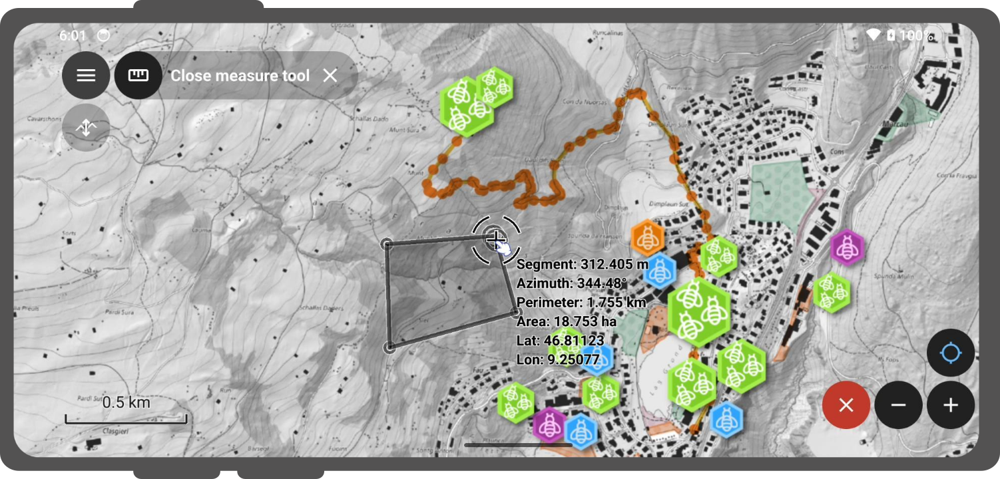

# Measuring tool

Sometimes you may want to measure the distance to between a few objects or between yourself and a target object.

!!! Workflow

    1. Open the **Side Dashboard**
    2. Tap the ruler symbol in the main menu bar.
    !
    3. Use the digitizing controls located at the bottom-right corner of the screen to add and remove vertices.
    By default, the measured geometry will be a line
    4. (Optional): To change to a polygon, connect the coordinate cursor to the first vertex entered.

    For the segment formed of the two last vertices added, details returned include segment length and its azimuth.
    When the measured geometry is a line, the total line length is provided while the perimeter and area are displayed for polygons.

## Elevation profiling

If you are more interested in the elevation difference between two objects, you can use the  *Elevation Profile* tool

!!! Workflow

    1. Enable the measuring tool as described above
    2. Toggle the **Elevation Profile Icon**
    This will show the terrain elevation as well as intersecting vector features along the measured geometry.
    !
