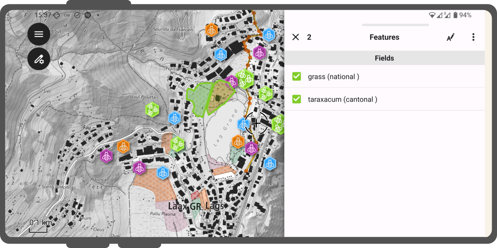
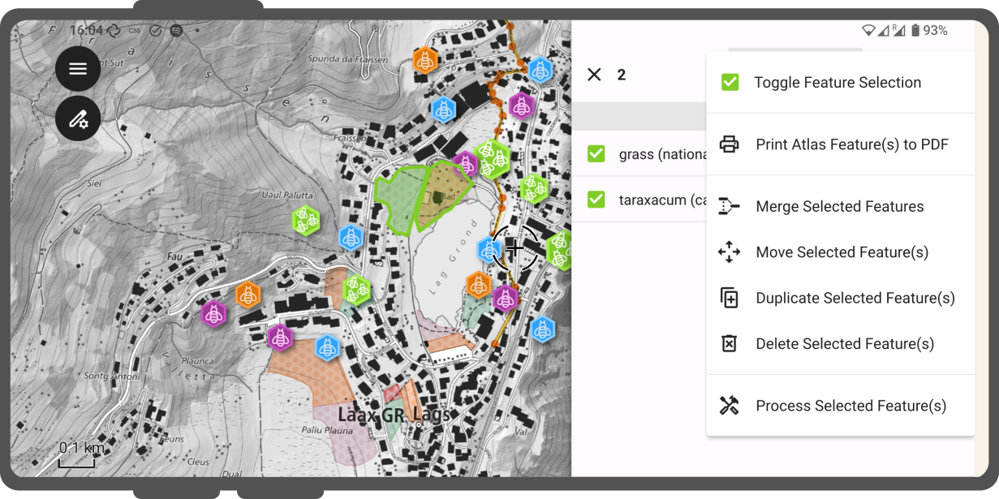

# Interact with the map

There is a lot you can do inside QField.
There exists a number of buttons, icons and settings, which may or may not be relevant for your used case.

## Modes

It is important to understand that there are two **modes** in which you can work

- The **Browse mode** and
- The **Digitize Mode**

### Browse Mode

As the name suggests, while being in browse mode, you can view and select features within all identifiable layers in the project.
It is also possible to edit attributes of existing features, by clicking on a feature of interest and opening its attribute table.

!

### Digitize Mode

:material-tablet: Fieldwork

If you want to actually digitize new objects or modify the geometry of existing ones, you have to switch to **digitize mode**.

!!! Workflow

    1. Open the **Side Dashboard**
    2. At the bottom right of the legend, tap on the **Pencil Icon** to start editing.
    3. On the bottom right of the map canvas, a **Green Plus** will indicate that you can add new features.
    You will add new features to the layer that is highlighted in green of your legend.
    !

!!! Note

    - You can only edit a feature's geometry if you are in **Digitize Mode**
    - QField insures that when you digitize that your added points, lines or polygons will not have duplicate vertices.

## Map legend
:material-tablet: Fieldwork

!!! Workflow

    1. Open the **Side Dashboard** and expand the layers list to display the legend of the map.
    2. Long-press or double-tap on a layer
    !

        - **Reload icon** to get the current data of a layer with remote sources.
        - **Show on map** to control visibility.
        - **Show labels** to control the visibility of the labels.
        - **Opacity Slider** to control the transparency of the layer.
        - **Zoom to layer** to have all the layer items on the map.
        - **Show feature list** to show all the layer's features in the identification list.
        - **Setup tracking** to set up tracking mode of layer.

## Select features
:material-tablet: Fieldwork

If you want to select an existing feature you can do this in several ways but the easiest is while being in **browse mode**.

!!! Workflow

    1. Tap on a feature on the map to identify it.
    If several features are located where you tapped (either because there are multiple features really close one to another, or because several layers are overlapping), they will all be listed in the menu that opens on the right of the screen.
    !
    2. Tap on one of the listed features to select the feature and open its attributes.
    3. Once selected you can do several things:
        1. Tap on the **Arrows** to switch between all the identified features.
        2. Tap on the **Edit Button** (A with the pen) to edit the attributes of the selected feature.
        3. Tap on the 3-dotted menu from where you can:
            - **Zoom to the Feature**
            - **Enable Auto-Zoom** to the selected feature
            - **Process** the feature further.
            - **Move** the feature
            - **Duplicate** the feature
            - **Rotate** the feature
            - **Update Attributes from feature** - this allows you to copy the attributes from another feature, which you have to select.
            - **Delete** the feature
            !

### Multi-select features

Sometimes you may want to multi-select several features at once to merge them or edit their attributes at the same time.

!!! Workflow

    1. Switch to **Browse Mode**
    2. Tap on one or more features at once and long-press on the features you want to select.
    !
    3. Tap on the 3-dotted menu on the top right of the feature list.
    4. From there you can select between multiple options:
        - **Toggle Feature Selection**
        - **Print Atlas Feature(s) to PDFs**: You can print a PDF of your selected features either with the in-built default template or with a pre-defined one which was built by your Project Manager.
        - **Merge** your selected features
        - **Move** your selected features
        - **Duplicate** your selected features
        - **Delete** your selected features
        - Further **Process** your selected features: You can read more about the different processing operations [here]()
        !

## 3D map view interactions
:material-tablet: Fieldwork

QField supports viewing and interacting with your project data in a 3D map view.
By utilizing elevation data (either an automatic online DEM or a custom DEM configured in your QGIS project),
your map layers are draped as textures over the 3D surface.
You can interactively navigate your map in 3D and seamlessly synchronize extents with the 2D canvas.

[**Learn more about configuring and using the 3D Map View.**]
