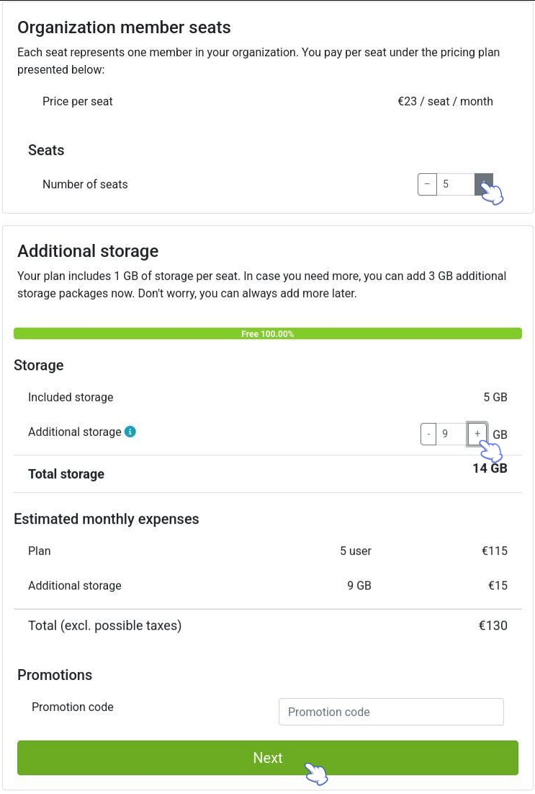
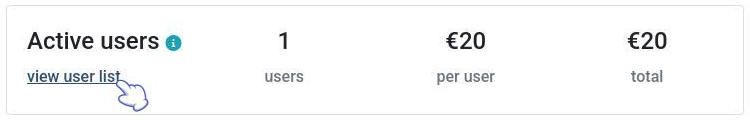
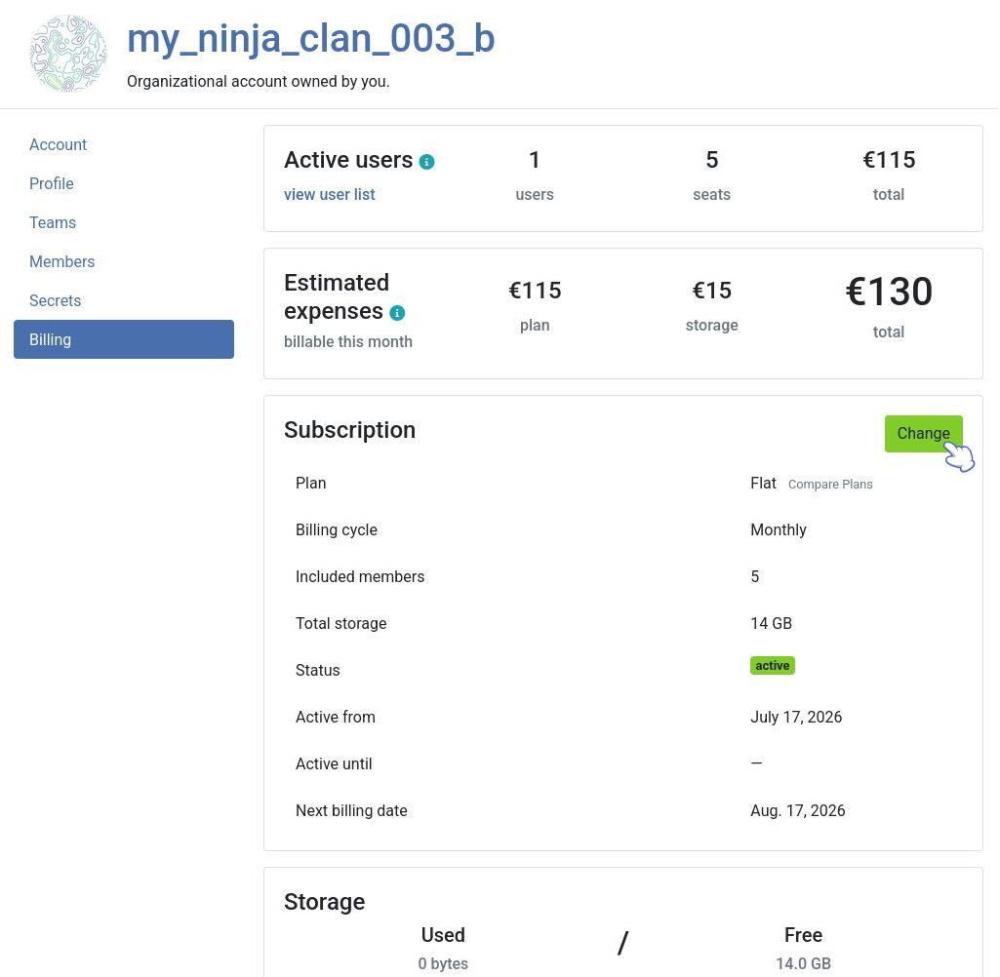
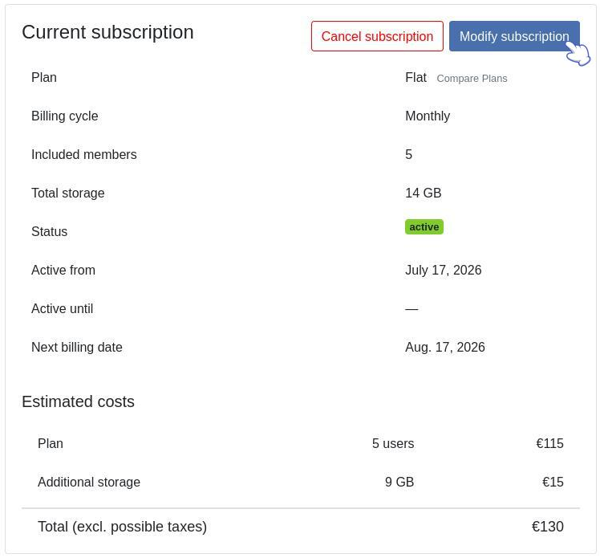
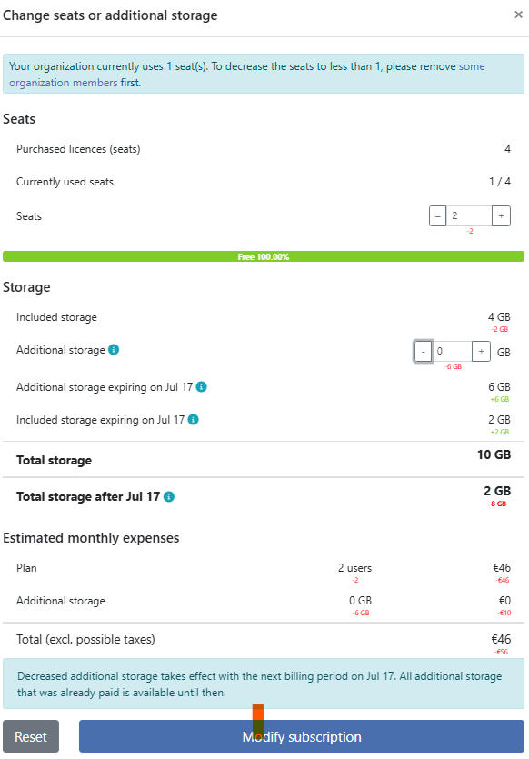
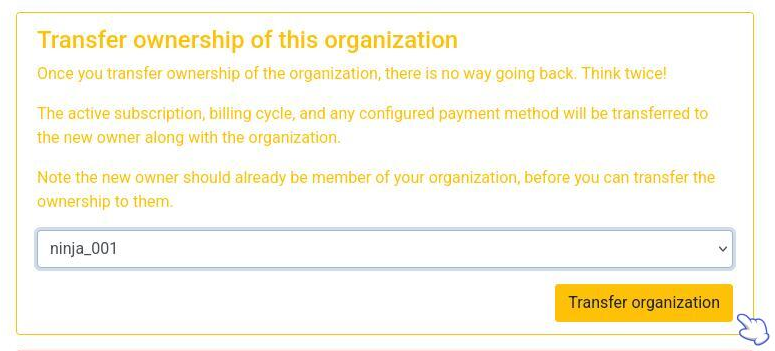
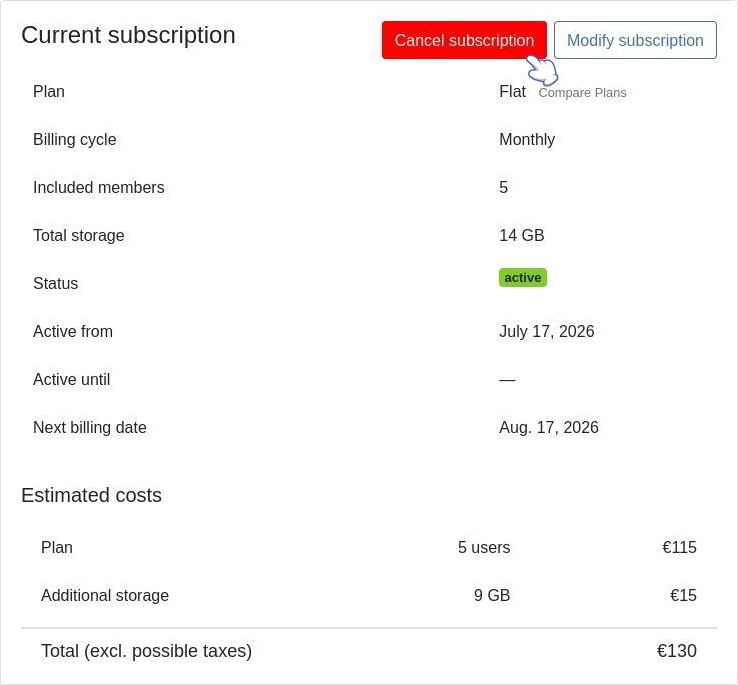
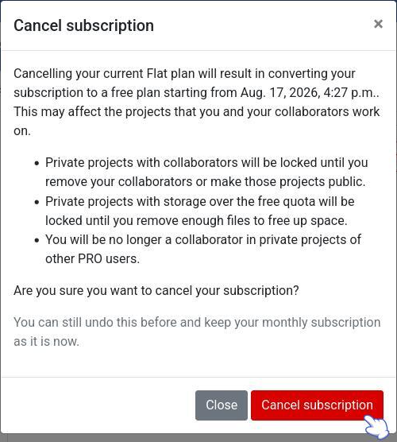
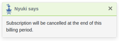

# QFieldCloud Plans and Additional Storage

By default, when registering for QFieldCloud, you create a general user account with a free community plan.
With the free community plan, you can work by yourself on QGIS projects and apply changes as much as you like, as long as you do not exceed the 100 MB storage limit.
If you require more storage or want to work in a multi-user environment, you will have to upgrade to either:

- A personal **Pro Plan** (Personal Plan)
- An **Organization Plan** (Organizational Plan)

The same applies for additional data storage.

The billing information necessary for both Pro and Organization plans and can be accessed through the **Billing section** under your personal account settings OR the organization account settings.
At any point, you can modify your plans according to your needs.

It is also possible to have a yearly subscription, where you will receive an annual invoice with a fixed amount of users and storage.

All pricing information is available <a href="https://qfield.cloud/pricing" target="_blank">on the Pricing page</a>.

!!! Warning

    1. If you have a **Personal Pro Account** and an **Organization Account**, you will have **TWO separate pages** with billing information.
        The corresponding invoices will be generated for each account separately.
    2. If you cancel your PRO Account, your Organization Account will remain active until you actively cancel it.

## Choosing a plan

To upgrade to a Personal **Pro Plan**, follow these steps:

!!! Workflow
    1. Click on the username at the top-right of the page.
    2. Click on "Upgrade to pro".
    3. In the "Subscription" section, click on "Upgrade".
    4. In the Pro section, click on "Activate".
    5. Read and accept the "Terms of Service", then click "Proceed".
    6. In the "Billing Address" section, fill in the required fields and click "Proceed to payment".

To upgrade to an **Organization plan**, follow these steps:

!!! Workflow
    1. Click on the username at the top-right of the page.
    2. Click on "Create organization".
    3. Choose your preferred payment option:
    !
        - **Monthly Payment:** You can choose between a **Flat** subscription or a **Flex** Subscription.
             - **Flat**: You select your number of seats (users in the organization) and pay each month for every seat.
             - **Flex**: You can add members directly to the organization and only pay for the active ones.
                A minimum of 1 member is always needed.
        - **Yearly Payment**: You select your number of seats and pay once for every seat at the beginning of the subscription.

    4. Click on "Create".
    5. Choose a name for your organization using fewer than 150 characters, letters, digits, and `@/./+/-/_`.
    6. Click on "Create".
    7. In the "Billing Address" section, fill in the required fields and click "Next".
    An overview page will show the plan layout and the billing details.
    8. If you would like to add additional storage, you can add as many storage packages as you need.
        !
    9. (Optional) If you have received a promotion code, please enter it at the bottom of the billing window.
    10. Under the summary page, verify your current subscription and upcoming payment.
    Add your billing details and click on **Pay** to activate your plan.

### **Active Users under Organization Plans**

Under the **Flex Plan**, at least one user must be in an organization and will be seen as active by default.
Depending on your plan, the total cost per billing cycle is defined by the number of **active** users (**Flex only**).
An "active user" corresponds to a member who has performed at least one "job" within a project belonging to the organization during an invoice cycle.

To monitor the number of active users, direct to *Organization Settings* > *Billing* > *Active users*.

!

!!! note

    An account can only be logged in to one device at a time.
    For example, if the QFieldCloud username `ninja_001` logs into the QField mobile application on a new device, their previous device will automatically be logged out.
    **Attempting to share a single account across multiple devices can cause synchronization errors, data loss, or data corruption.
    It may also prevent users from pushing data collected in the field to the cloud.**

    To have multiple people working safely and concurrently on a project (e.g., `survey_001`), you will need an **Organization Plan**.
    This allows you to invite different user accounts (e.g., `ninja_001`, `ninja_002`, `ninja_00n`) to collaborate. Administrators can add, remove, or change the permissions of these users within the organization and specific projects.

## Modification of current subscription

In QFieldCloud, you can add as much storage as desired for your projects and change the number of your preferred selected seats whenever you want.
When modifying additional storage or seats, any increases will become effective immediately. Decreases in storage or seats will become effective (and payable) with the start of the next billing cycle.
Additional storage can be obtained in sets of 3 GB.

!!! Workflow

    1. To add more storage to your organization, direct to the *Settings* section of your organization.
    2. Click on the **billing section** and click on *Change*.
        !

    3. From there, you can either cancel your subscription or modify the subscription.  Click on **Modify subscription**.
        !

    4. Adjust the number of seats and the modified storage packages depending on your needs. The reflected changes to the upcoming subscription will be indicated below the current subscription with either a green (increasing seats/storage) or red (decreasing seats/storage) color.
        !

    !!! Note

        The included storage corresponds to the storage that is associated with your number of seats.
        The additional storage corresponds to the storage that is added in packages of 3 GB.
        Once a subscription has been modified, the additional storage and seats will be immediately available to use.
        Any decreased storage or number of seats will only be updated with the next billing cycle.

## Transferring organization ownership

You can transfer the primary ownership of an Organization account to another member.

!!! warning

    "Important Billing Considerations"

    Transferring organization ownership will not affect the active status of the subscription.
    This also applies to **the payment method (credit card details)** on the Organization billing section.

    If you used a credit card to pay for the organization, the new owner must manually update the organization's payment information to replace it if necessary.
    Removing yourself or transferring the account does not clear the saved card automatically.

!!! Workflow

    1. Ensure the user you intend to appoint as the new primary owner is already a member of the organization.
    If not add them to the organization first.
    2. Navigate to your organization's overview page and click on **Edit organization**.
    3. Change **Owner** on the **Transfer ownership of this organization** section, and select the user intended to transfer from the dropdown list.
        !

## Cancellation of a subscription

You can cancel your subscriptions at any given time.
This has to be done separately for both the PRO Plans and the Organization Plans.

!!! Workflow

    1. For the **Personal Pro Plan**: From your <ins>user account's landing page</ins>, click on *Edit Profile*.
        **For the Organization Plan**: From your <ins>Organization account's landing page</ins>, click on *Edit Organization*.
    2. Switch to the corresponding **Billing Section**.
    3. Click on **change** and then click on **Cancel subscription**.

        

    4. Confirm the cancellation in the subsequent pop-up window.

        

    5. A Nyuki message will then appear, indicating that the subscription will conclude at the end of the current billing period.

        

## Retrieving an invoice

It is possible to retrieve invoices from previous months at the bottom of the billing section.

!!! Workflow

    1. For the **Personal Pro Plan**: From your <ins>user account's landing page</ins>, click on *Edit Profile*.
        **For the Organization Plan**: From your <ins>Organization account's landing page</ins>, click on *Edit Organization*.
    2. Switch to the corresponding **Billing Section**.
    3. Navigate to the bottom of the page.
        There you will find all previous and current invoices associated with your Personal Account or your Organization Account.

        !
