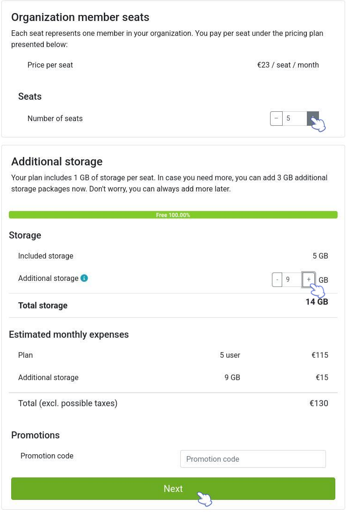
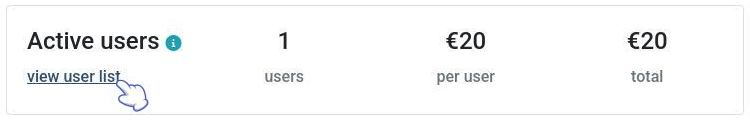
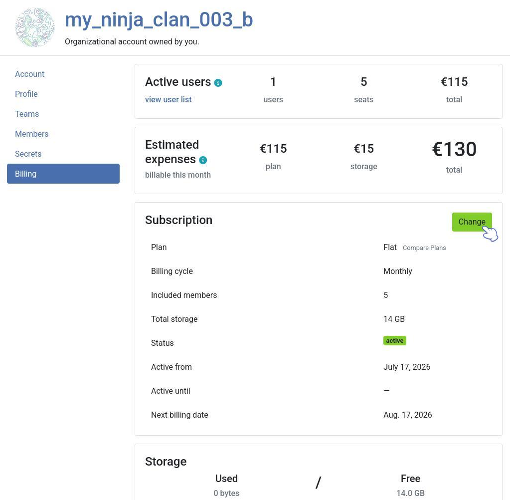
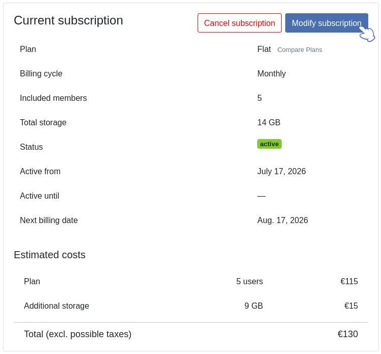
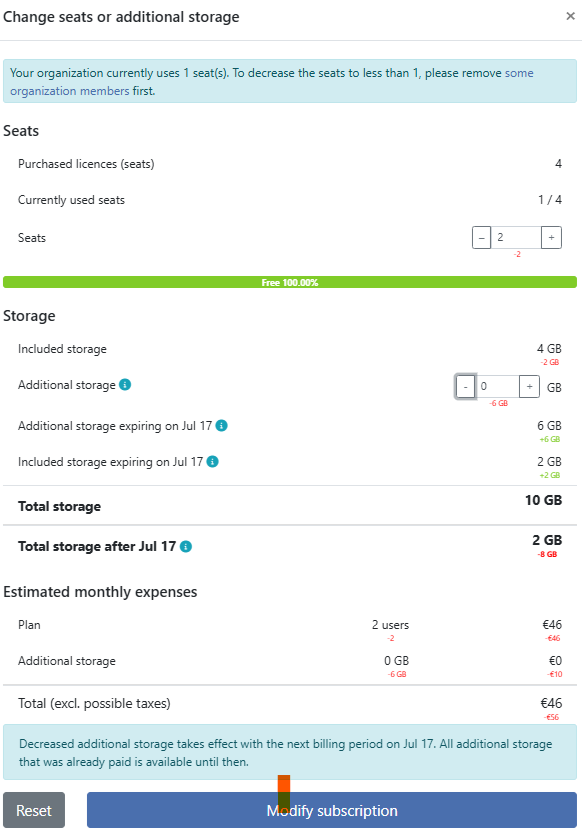
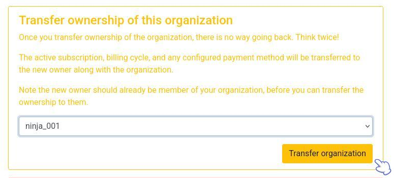
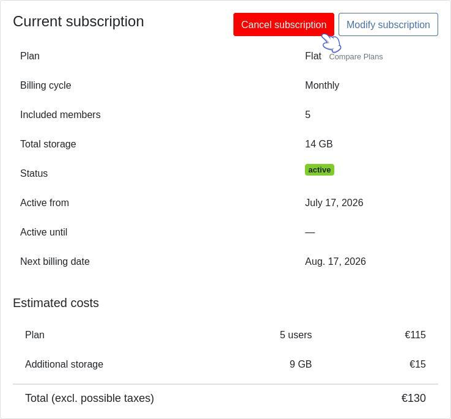

# QFieldCloud Plans and Additional Storage

When registering for QFieldCloud, you have to create a general user account.
By default you will get a free **Community Plan**.
The **Community Plan** allows you to work independently on QGIS projects and sync changes up to a 100 Mb storage limit.
If you require additional storage or multi-user collaboration, you can upgrade your plan.

You can choose in between

- A **Flat Plan** providing a fixed price per user per month; or
- A **Flex Plan** allowing organizations to pay per active users.

The billing information necessary for both Flat and Flex plans and can be accessed through the **Billing section** under your account settings OR the organization account settings.
At any point, you can modify your plans according to your needs.

It is also possible to have a yearly subscription, where you will receive an annual invoice with a fixed amount of users and storage.
For this option, please get in touch with [sales](mailto:sales@qfield.cloud)

All pricing information is available <a href="https://qfield.cloud/pricing" target="_blank">on the Pricing page</a>.

## Choosing a plan

To upgrade to an **organization plan**, follow these steps:

!!! Workflow
    1. Click your username in the top-right corner of the page.
    2. Select **"Create organization"**.
    3. Select your preferred payment model:
        !
        - **Monthly Payment:** Choose between a **Flat** or **Flex** subscription.
            - **Flat:** Select a fixed number of user seats and pay monthly for every seat.
            - **Flex:** Add members to the organization and pay only for active users during each billing cycle (requires a minimum of 1 member).
        - **Yearly Payment:** Select a fixed number of user seats and pay annually at the beginning of the subscription cycle.
    4. Click **Create**.
    5. Enter an organization name using fewer than 150 characters (accepting letters, digits, and `@/./+/-/_`).
    6. Click **Create**.
    7. Complete the required fields under the **Billing Address** section and click **Next** to view the subscription summary.
    8. (Optional) Add additional 3 GB storage packages as needed.
        !
    9. (Optional) Enter a promotion code at the bottom of the billing window if available.
    10. Review your subscription details, enter your payment information, and click **Pay** to activate your plan.

### Active Users Under Flex Plans

Under the **Flex Plan**, at least one member must belong to the organization and is marked active by default.
Total subscription costs per billing cycle depend on the number of active users during that cycle.
An active user corresponds to any member who performs at least one server job inside an organization project during an invoice cycle.

To monitor active organization users, navigate to _Organization Settings > Billing > Active users_.

!

!!! Note
    A single user account can only log into one device at a time.
    If the account `ninja_001` logs into QField on a new device, QField automatically logs out their previous session on other devices.
    Sharing a single account across multiple devices causes synchronization errors, data loss, or data corruption.
    Concurrent multi-device use on a single account also blocks field teams from uploading collected data to QFieldCloud.

    To enable multiple field workers to collaborate safely on a project, use an **Organization Plan**.
    An **Organization Plan** allows administrators to invite unique user accounts (such as `ninja_001`, `ninja_002`, `ninja_003`) as project collaborators.
    Administrators can manage user roles and permissions across organizations and specific projects.

You can add additional storage packages or adjust user seats at any time in QFieldCloud.
Subscription increases take effect immediately, while plan decreases take effect at the start of the next billing cycle.
Additional storage is available in packages of 3 GB.

!!! Workflow
    1. Navigate to your organization settings by selecting _Organization > Settings_.
    2. Navigate to the **Billing** section and click **Change**.
        !
    3. Click **Modify subscription**.
        !
    4. Adjust your required number of user seats and 3 GB storage packages.
        Green text indicates increased items, while red text indicates decreased allocations for the upcoming billing cycle.
        !

!!! Note
    - Included storage corresponds to storage allocated per user seat.
    - Additional storage is added in 3 GB packages.
    - Increased storage and seats become available immediately.
    - Decreased storage or seat allocations take effect during the next billing cycle.

## Transferring Organization Ownership

Primary ownership of an organization account can be transferred to any existing member.

!!! Warning
    Transferring organization ownership does not alter subscription statuses or billing payment methods.
    Stored credit card details remain active on the organization billing page after ownership transfers.
    The new owner must manually update the organization payment details if card details need to be replaced.

!!! Workflow
    1. Ensure the new owner is already a member of the organization.
    2. Navigate to your organization overview page and click **Edit organization**.
    3. Locate the **Transfer ownership of this organization** section, select the new user from the **"Owner"** dropdown menu, and confirm the transfer.
        !

## Canceling Subscriptions

You can cancel subscriptions at any time.
Personal **Pro** plans and **Organization** plans must be canceled separately.

!!! Workflow
    1. Navigate to your account settings:

        - For **Pro Plans:** Click **Edit Profile** on your personal account landing page.
        - For **Organization Plans:** Click **Edit Organization** on your organization landing page.

    2. Navigate to the **Billing** section.
    3. Click **Change**, then click **Cancel subscription**.

        

    4. Confirm the cancellation in the popup window.

        
  

    5. A confirmation message displays indicating that the subscription ends at the conclusion of the active billing period.

        
  

## Retrieving Invoices

You can access past invoices at the bottom of the billing section.

!!! Workflow
    1. Navigate to your account settings:

        Click on **Edit Profile**/**Edit Organization** on your (organization) landing page.

    2. Navigate to the **Billing** section.
    3. Scroll down to the bottom of the page to view and download past or current account invoices.

        !
