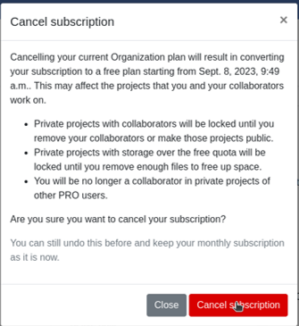
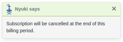

# QFieldCloud Billing

Adding billing information to the account is needed to use QFieldCloud Pro plan or Organization plan.

For a **Pro plan**, follow these steps :

1. Click on the username up-right the page
2. Click on "Upgrade to pro"
3. In the "Subscription" section, click on "Upgrade"
4. In Pro section, click on "Activate"
5. Carefully read the "Terms of Service" and agree to the terms of service, then "Proceed"
6. In the "Billing Address" section, fill up the form, and then click on "Proceed to payment"

For an **Organization plan**, follow these steps :

1. Click on the username up-right the page
2. Click on "Create organization"
3. Click on "Create"
4. Choose a name for your organization with only 150 characters or fewer, letters, digits, and @/./+/-/_
5. Click on "Create"
6. Choose how much storage is needed
7. Carefully read the "Terms of Service"and agree to the terms of service, then "Proceed"
8. In the "Billing Address" section, fill up the form, and then click on "Proceed to payment"

If the billing information is incomplete, at any time it is possible to finish filling up the form by going to *Billing > Subscription > Finish checkout*

All pricing information is available <a href="https://qfield.cloud/pricing" target="_blank">on the Pricing page</a>.

## Discontinuing QFieldCloud subscription

1. If you need to cancel your subscription on QFieldCloud:
1.1. For **Pro** plan accounts, click on your username, choose "Settings."
1.2. For **Organization** plan account, click on the name of your Organization, click on "Edit Organization". Note you need to be owner of that Organization.

    

2. Proceed to the "Billing" section, click on "Change".

    

3. Select "Cancel Subscription".

    

4. Confirm the cancellation in the subsequent pop-up window.

    

5. A Nyuki message will then appear, indicating that the subscription will conclude at the end of the current billing period.

    

# Add QFieldCloud storage

QFieldCloud allows you to configure as much storage as you need for your project.

To add more storage to QFieldCloud *Settings > Billing > Subscription > Change > Update storage*

!

!

!
