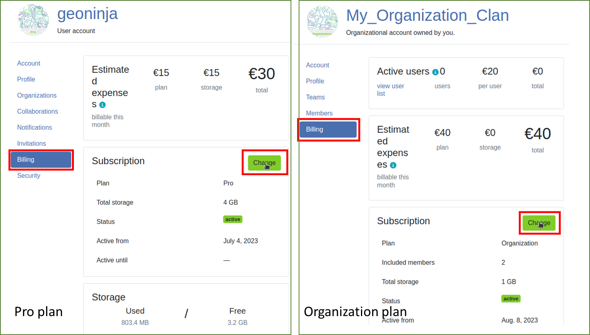

# QFieldCloud Plans and Additional Storage

By default, when registering for QFieldCloud, you create a general user account with a free community plan.
With the free community plan, you can work by yourself on QGIS projects and apply changes as much as you like, as long as you do not exceed the 100 MB storage limit.
If you require more storage or want to work in a multi-user environment, you will have to upgrade to either:

- A personal **Pro Plan**  (Personal Plan)
- An **Organization Plan**  (Organizational Plan)

The same applies for additional data storage.

The billing information is necessary for both Pro and Organization plans and can be accessed through the **Billing section**  under your personal account settings OR the organization account settings.
Below is an overview of the different plans and what they include.
At any point you can modify your your plans according to your needs.

!

It is also possible to have a yearly subscription, where you will receive an annual invoice with a fixed amount of users and storage.
All pricing information is available <a href="https://qfield.cloud/pricing" target="_blank">on the Pricing page</a>.

!!! Warning

    1. If you have a **Personal Pro Account** and an **Organization Account** you will have **TWO separate pages** with billing information.
    The corresponding invoices will be generated for each account separately.
    2. If you cancel your PRO Account your Organization Account will remain active until you actively cancel it.

## Choosing a plan

To upgrade to a Personal **Pro Plan**, follow these steps:

!!! Workflow
    1. Click on the username at the top-right of the page
    2. Click on "Upgrade to pro"
    3. In the "Subscription" section, click on "Upgrade"
    4. In Pro section, click on "Activate"
    5. Read and accept the "Terms of Service", then "Proceed"
    6. In the "Billing Address" section, fill the required fields and "Proceed to payment"

To upgrade to an **Organization plan**, follow these steps:

!!! Workflow
    1. Click on the username at the top-right of the page
    2. Click on "Create organization"
    3. Click on "Create"
    4. Choose a name for your organization with only less than 150 characters, letters, digits, and `@/./+/-/_`
    5. Click on "Create"
    6. Select the desired storage
    7. In the "Billing Address" section, fill the required fields and "Proceed to payment".
    An overview page will show the overview of the plan and the billing details.
    8. (Optionable) If you have received a referral code, please enter it at the bottom of the billing window.

    !

### **Active Users under Organization Plans**

An organization requires at least two users.
The total cost per billing cycle is defined by the number of **active** users.
An "active user" corresponds to a member who has performed at least one "job" within a project belonging to the organization during an invoice cycle.

To monitor the number of active users direct to *Organization Settings* > *Billing* > *Active users*

!

## Adding QFieldCloud storage

In QFieldCloud you can configure as much storage as desired for your projects.
Additional storage can be obtained in the sets of 3 GB, each costing 5€.

To add more storage to QFieldCloud direct to *Settings* > *Billing* > *Subscription* > *Change* > *Update storage*

!

!

!

## Cancellation of a subscription

You can cancel your subscriptions at any given time.
This has to be done separately for both the PRO Plans and the Organization Plans.

!!! Workflow

    1. For the **Personal Pro Plan**: From your <ins>user account's landing page</ins> click on *Edit Profile*.
    **For the Organization Plan**: From your <ins>Organization account's landing page</ins> click on *Edit Organization*
    2. Switch to the corresponding  *Billing Section**

        

    3. Select "Cancel Subscription".

        

    4. Confirm the cancellation in the subsequent pop-up window.

        

    5. A Nyuki message will then appear, indicating that the subscription will conclude at the end of the current billing period.

        

## Retrieving an invoice

It is possible to retrieve invoices from previous months at the bottom of the billing section.

!!! Workflow

    1. For the **Personal Pro Plan**: From your <ins>user account's landing page</ins> click on *Edit Profile*.
    **For the Organization Plan**: From your <ins>Organization account's landing page</ins> click on *Edit Organization*
    2. Switch to the corresponding  *Billing Section**

        

    3. Direct to the bottom of the page.
    There you will find all previous and current invoices that are associated with your Personal Account or your Organization Account.

        !
