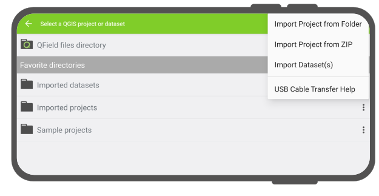

# QField Storage Access

Below are OS-specific instructions on how to access manipulate projects as well as
individual datasets in QField.

!!! note
    Note to pre-existing QField users: for security reasons, Google has since November 2021
    enforced a new set of storage access rules which prohibits most applications from directly
    accessing files in most locations on a device‘s internal and external storages. To work
    within this new confine, QField has to import projects and datasets into its Google-specified
    storage location within which QField has unrestricted read/write access. Instructions below
    should guide users' migration to the new paragdim.

## Opening projects and datasets on Android and iOS

QField can open projects and datasets in three ways:

* by importing from a URL;
* by importing a project folder (Android-only);
* by importing a compressed project file (Android-only); and
* by importing individual dataset(s) (Android-only).

!

These actions are available by click on the ‘import (+) button‘ located on the
bottom-right corner of the project/dataset picker screen, which can be accessed by
clicking on the ‘Open local files’ button located in QField‘s welcome screen.

### Importing from a URL

When importing a project or individual dataset through the "Import URL" action, users
will be asked to provide a URL string to a file. QField will subsequently fetch the content and
save it into the ‘Imported projects’ - provided the URL points to a project compressed into a ZIP
archive - or ‘Imported datasets’.

!

QField will consider a ZIP archive as a compressed project when one or more .qgs/.qgz
project file is detected.

### Importing a project folder

When importing a project through the "Import project from folder" action, users will be
asked to grant permission for QField to read the content of a given folder on the
device’s storage via a system folder picker. When the folder is selected, QField copies
the folder content (including its sub-folders) into its ‘Imported projects’
location. Users can then open and interact with the project from there.

Re-importing a given folder through the drop-down menu action will overwrite preexisting
projects given an identical folder name. That allows users to be able to update projects.

!!! note
    Feature editing, addition, and deletion will be saved into the imported project’s
    datasets, not in the original folder selected during the import process. See sections below
    on how to send/export edited projects and datasets.

### Importing a compressed project

Projects can be imported into QField by being provided a project compressed into a ZIP
archive. When choosing the ‘Import project from ZIP’ action, users will be asked to select
a ZIP file on their device‘s storage. QField will then decompress the file into its
‘Imported projects’ location. Users can then open and interact with the project from there.

This can greatly ease remote deployment of projects by being able to send a single
file to users.

### Importing individual dataset(s)

The ‘Import dataset(s)‘ action allows users to select one or more datasets via an Android
system file picker. Upon selecting the datasets, QField will copy those into the
‘Imported datasets’ folder, where users can then open and modify their content.

!!! note
    Users will have to ensure that all sidecar files are selected when importing
    datsets (e.g. a shapefile would require users to select the .shp, .shx, .dbf, .prj,
    and .cpg files).

## Exporting modified projects and datasets on Android

Once users modify imported projects and datasets, QField offer various means through which
the content can be sent from and exported out of its system-protected files storage:

* by exporting a project folder or an individual dataset;
* by sending a compressed project folder to a {cloud, email, messenger, etc.} app;
* by sending an individual dataset to a {cloud, email, messenger, etc.} app; and
* by accessing imported content directly through USB cable.

!

These actions are available via the dropdown action menu attached to project folders and
individual datasets list in the project/dataset picker, which can be accessed by clicking
on the ‘Open local files‘ button located in QField’s welcome screen.

### Exporting a project folder or an individual dataset

When choosing the ‘Export to folder‘ action, users will be asked to pick a location - using
the Android system‘s folder picker activity - within which the content of a select project folder
or individual dataset will be copied to.

This action can be used to copy the content of modified projects or datasets into a folder on
the device that can be accessed by third-party synchronization apps such as Syncthing, or
directly copy content into cloud accounts of providers that support Android‘s Scoped Storage directory
provider (at the time of writing, only NextCloud app has such support).

!!! note
    Exporting onto a folder will overwrite preexisting content.

### Sending a compressed project folder

The ‘Send compressed folder to‘ action compresses the content of a selected folder into a
ZIP archive. Users are then asked through which app on their device the resulting ZIP
archive should be send through.

Users can compress and send whole projects by selecting root folders in QField‘s ‘Imported
projects‘ directory, as well as send selective folders within project folders. This allows for
users to narrow down the compressed files to e.g. a /DCIM subfolder.

### Sending an individual dataset

Users can select the ‘Send to‘ action for individuald datasets, allowing for the sending of
edited datasets directly to third party apps such as Gmail, Drive, Dropbox, Nextcloud,
<insert your favourite messenger app>, etc.

## Accessing imported content directly through USB cable

### Android

Imported projects and datasets can be accessed directly using a USB cable. The location
is displayed in the top navigation bar of the project/dataset picker.

On most devices plugged into a computer via USB cable connection, the path will be
`<drive>:/Android/data/ch.opengis.qfield/files/`. Users will find both the Imported Datasets and
Imported Projects folders within which the imported projects and datasets will be located.
Changes done to project content and datasets are saved in the files found in this location.

### iOS

Imported projects and datasets can be accessed directly using a USB cable by navigating
to the QField application folder using iTunes on Windows and macOS. On Linux, users
can do so through [‘libimobiledevice‘](https://libimobiledevice.org/).

# QFieldCloud add storage

Add more storage to QFieldCloud *Settings > Billing > Subscription > Change > Update storage*

!
