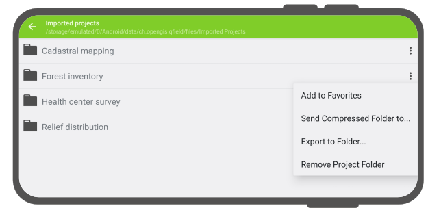

# QField Storage Management

On the QField homescreen, users are presented with two options to open a project.

 **QFieldCloud projects**: The first option is to [access a project stored on QFieldCloud](../get-started/index.en.md)
How to set up and work with QFieldCloud is explained in the next chapter.

* **Open local file**: The second option involves copying a working copy of the project file from a laptop or PC (the source device), on to the phone or tablet (the target device).
On the target device, users can access and edit this local copy using QField, and eventually copy the new version back to the desktop or to an alternative cloud storage service. How to prepare, store and access these local copies is the topic of this chapter.

There are various possibilities of exporting copies of project files and datasets from the source device runnign QGIS and importing them on to a target device for field-data collection. Below are OS-specific instructions on how to access projects and individual datasets through QField.

!!! note
    Note to active QField users: Since November 2021, Google has, for security reasons, enforced a new set of storage access rules.
    These prohibit most applications from directly accessing files in many locations on a device‘s internal and external storages.
    Therefore, QField has to import projects and datasets into its Google-specified storage location within which QField has unrestricted read/write access.
    Instructions below should help users' adjust to the new circumstances.

## Exporting QGIS project files for use in QField
QFieldQField supports a [wide range of data formats](../reference/data-format.en.md).
There are three ways of preparing and copying a project in QGIS for use in QField.

* [Storing files in a designated folder](###storing-files-in-a-designated-folder)
* [Packaging the project as a GeoPackage](###packaging-the-project-as-a-geopackage)
* [Packaging the project as a SpatiaLite database](###packaging-the-project-as-a-spatiaLite-database)

### Storing files in a designated folder

One way of compiling all necessary parts of a QGIS project is to store them in a folder.
This folder can contain individual files such as a
* QGIS project file (.qgs or .qgz)
* Vector data (shapefiles, GeoJSON or Geopackage)
* Raster data (GeoTIFFs, JPEGS and others)
* Auxiliary files, which includes additional files used for styling (.qml or .sld) and any other files referenced by the project

### Packaging the project as a GeoPackage

The simplest and most efficient way to package a QGIS project and its corresponding geospatial data into one file is to use [GeoPackages](https://www.geopackage.org/).
We recommend using the GeoPackage file format for projects in QField, since packaging in QGIS is easy and straightforward. To package a project as a GeoPackage, three steps are necessary.

1. **Package vector layers to GeoPackage:**
First, click on the toolbox and search for the tool “package layers”. This tool lets you package selected vector layers in the project file (and elsewhere) into a single GeoPackage containing the geospatial data.

2. **Add raster layers to GeoPackage**
If your project contains raster layers, then these can also be stored in the GeoPackage. Click on the raster layer you want to export, then “export” -> “save as”, and select GeoPackage as the format. Add a filename and select the three dots to browse for the GeoPackage. Select the GeoPackage and change the file format at the bottom of the dialogue window from “GeoTIFF” to “All files (*.*)”. Now both vector and raster layers are saved in the GeoPackage. To make sure, browse for the GeoPackage in the browser panel and expand it.

3. **Add project file (.qgs) to GeoPackage:**
Next go to Project -> Save to -> GeoPackage, and select the GeoPackage file containing all the vector layers. This saves the project file, with the .qgs extension into the GeoPackage as well.

<!-- markdown-link-check-disable-line -->
*Package QGIS Project into GeoPackage*

For more information, consult the QGIS documentation  [packaging layers](https://docs.qgis.org/3.34/en/docs/user_manual/processing_algs/qgis/database.html#package-layers).

### Packaging the project as a SpatiaLite database

Another possibility is to store the project and its layers in a [SpatiaLite](https://www.gaia-gis.it/fossil/libspatialite/index) database.

## Copying project over to the QField target device

On both Android and iOS, installing QField creates a folder called QField, containing three folders; `Imported Datasets`, `Imported Projects` and `QField`.
After packaging the project accordingly, the folder or file containing the project has to be copied over to the target device running QField, specifically to the folder called `Imported Projects`.
This folder can be found on the following paths

* Android path: `Android/data/ch.opengis.qfield/files/Imported Projects`
* iOS path: `On My iPhone/QField/Imported Projects`

Copying the packaged project over to the corresponding folder of each device can be done in various ways.

### Android

#### Transfer via USB-cable

If you want to use a cable connection to import the project on to your android device, simply connect both devices using a USB cable and follow the instructions on [how to transfer files between your computer and the android device.](https://support.google.com/android/answer/9064445?hl=en#zippy=%2Cwindows-computer)
On most devices plugged into a computer via USB cable connection, the path will be `<drive>:/Android/data/ch.opengis.qfield/files/`.
Users will find both the Imported Datasets and Imported Projects folders within which the imported projects and datasets will be located.
Changes done to the project content and datasets are saved in the files found in this location.

#### Send via Bluetooth

Wireless transfer of files is also possible by [sharing files via a Bluetooth connection.](https://www.wikihow.com/Connect-Your-Android-Phone-to-a-Windows-PC-Using-Bluetooth#:~:text=Click%20the%20Windows%20Start%20menu,%22Yes%22%20on%20your%20computer.)

#### Google Drive (and other cloud storage services)

The advantage of using Google Drive is that both the source device and target device have shared access to a central working directory containing the current project files.
A possible workflow may look like this

* Prepare and package a QGIS project on the source device
* Upload the project to a cloud (For instance Google Drive)
* Download the project to the target devices and collect data
* Upload the changed project (or parts of the project) from the target devices back to the cloud and replace the old files with the new ones
* Download the project back on to the source device

!!! note
    When working with Google Drive, it may be helpful to create a dedicated folder in the cloud containing all the projects.
    A parallel of this folder can then also be created on the target device, to which the QGIS projects can be downloaded and save in.

### iOS

#### Transfer via USB-cable

Transfering files from MacBooks or Macs to iPhone using a cable is not straightforward, since it is not possible to access individual files in the QField directory.
One workaround could be the following

* copy the entire folder `Imported Projects` from your iOS target device over to your source device
* copy the packaged QGIS project file into the copied `Imported Projects`folder
* copy back and replace the old `Imported Folder` with the new one

#### iCloud (and other cloud storage services)

An efficient way to synchronize projects is to use iCloud as a shared workspace to [download and upload project files.](https://support.apple.com/en-in/111764)
It is not possible to import projects from folders inside the iOS QField application.
Instead, the new project files have to be saved in the `Imported Projects` folder so that QField can access them.
One possible workflow could be the following:

* On the source device, upload the packaged project to a folder on iCloud (titled e.g. "QField projects")
* On the target device, download the packaged project and move the file to the QField folder `Imported Projects`
* Open the project file from inside the QField app and collect data
* Upload the project file back to the shared iCloud folder and replace the old project file
* On the source device, download the new project file containing the added data and the changes made

#### Share via AirDrop

A quick and easy way to exchange files back and forth is using AirDrop.
The only requirement is that both source and target device have to be OS and iOS respectively.
On the source device, right-click the file and select `Share...`, choose `AirDrop`, and then select the target device.
On the target device, save the project directly to the QField directory `Imported Projects`.
After accessing and manipulating the project files in QField, use AirDrop on the target device to transfer the project files back to the source device.

## Importing projects and datasets

Apart from using QFieldCloud, QField can open projects and datasets in four ways:

* [importing a project folder](#importing-a-project-folder)  

* [importing a compressed project file](#importing-a-compressed-project) 

* [importing from a URL](#importing-from-a-url)  

* [importing individual datasets](#importing-individual-datasets) 

!

On Android all of these actions are available by clicking on the ‘import (+) button‘ located on the bottom-right corner of the project/dataset picker screen, which can be accessed by clicking on the ‘Open local files’ button located in QField‘s welcome screen.

 

On iOS, the only action available through the 'import (+) button' is import from a URL.

### Importing a project folder (Android and iOS)

#### Android

When importing a project through the "Import project from folder" action, users will be asked to grant permission for QField to read the content of a given folder on the device’s storage.
When the folder is selected, QField copies the folder content (including its sub-folders) into its ‘Imported projects’ location. Users can then open and interact with the project from there.

Re-importing a given folder through the drop-down menu action will overwrite preexisting projects given an identical folder name. That allows users to be able to update projects.

!!! note
    Feature editing, addition, and deletion will be saved into the imported project’s
    datasets, not in the original folder selected during the import process. See sections below
    on how to send/export edited projects and datasets.

#### iOS

On iOS, installing QField creates a folder titled QField in the Files app.
Packaged projects prepared on the source device and exported on to the target device must be stored in `QField` -> `Imported Projects` folder.
To open a local file, press on 'Open local file' on the QField home screen and navigate to `QField files directory`-> `Imported Projects`, and choose the project you want to open.

### Importing a compressed project (Android only)

On Android, it is possible to import compressed (zipped) projects into QField. When choosing the ‘Import project from ZIP’ action, users will be asked to select a ZIP file on their device‘s storage. QField will then decompress the file into its ‘Imported projects’ location, from which users can open and interact with the project.

This can greatly ease remote deployment of projects by being able to send a single
file to users.

### Importing from a URL (Android and iOS)

When importing a project or individual dataset through the "Import URL" action, users
will be asked to provide a URL string to a file. QField will subsequently fetch the content and
save it into the ‘Imported projects’ - provided the URL points to a project compressed into a ZIP
archive - or ‘Imported datasets’.

!

QField will consider a ZIP archive as a compressed project when one or more .qgs/.qgz
project file is detected.

### Importing individual datasets (Android only)

The ‘Import dataset(s)‘ action allows users to select one or more datasets via an Android
system file picker. Upon selecting the datasets, QField will copy those into the
‘Imported datasets’ folder, where users can then open and modify their content.

!!! note
    Users will have to ensure that all sidecar files are selected when importing
    datasets (e.g. a shapefile would require users to select the .shp, .shx, .dbf, .prj,
    and .cpg files).

## Exporting modified projects and datasets (Android only)

Once users modify imported projects and datasets, QField offer various means through which
the content can be sent from and exported out of its system-protected files storage:

* [by exporting a project folder or an individual dataset;](#exporting-a-project-folder-or-an-individual-dataset)
* [by sending a compressed project folder to a {cloud, email, messenger, etc.} app;](#sending-a-compressed-project-folder)
* [by sending an individual dataset to a {cloud, email, messenger, etc.} app;](#sending-an-individual-dataset) and
* [by accessing imported content directly through USB cable.](#accessing-imported-content-directly-through-usb-cable)

!

These actions are available via the dropdown action menu attached to project folders and
individual datasets list in the project/dataset picker, which can be accessed by clicking
on the ‘Open local files‘ button located in QField’s welcome screen.

### Exporting a project folder or an individual dataset

When choosing the ‘Export to folder‘ action, users will be asked to pick a location - using
the Android system‘s folder picker activity - within which the content of a select project folder
or individual dataset will be copied to.

This action can be used to copy the content of modified projects or datasets into a folder on
the device that can be accessed by third-party synchronization apps such as Syncthing, or
directly copy content into cloud accounts of providers that support Android‘s Scoped Storage directory
provider (at the time of writing, only NextCloud app has such support).

!!! note
    Exporting onto a folder will overwrite preexisting content.

### Sending a compressed project folder

The ‘Send compressed folder to‘ action compresses the content of a selected folder into a
ZIP archive. Users are then asked through which app on their device the resulting ZIP
archive should be send through.

Users can compress and send whole projects by selecting root folders in QField‘s ‘Imported projects‘ directory, as well as send selective folders within project folders.
This allows for users to narrow down the compressed files to e.g. a /DCIM subfolder.

### Sending an individual dataset

Users can select the ‘Send to‘ action for individual datasets, allowing for the sending of
edited datasets directly to third party apps such as Gmail, Drive, Dropbox, Nextcloud,
<insert your favourite messenger app>, etc.

To export the layers from a synchronized QFieldCloud project, either on your device or a preferred cloud provider. To do this, within your project:

1. Click on the 'Gear icon' located within your project.

!

2. Select 'Open Project Folder' action.

!

3. Inside this project folder, you will find your project files. Offline layers will be stored in a file named 'data.gpkg'. You can also export your attached files (Photos, Audio, Video, etc).

4. Now, click on the three dots (⋮) located on the right side of the file or folder.

!

5. Choose between the actions 'Send to...' or 'Export to folder...' based on your preference and follow the prompts accordingly.

!

!!! note
    This functionality is available on Android only.
