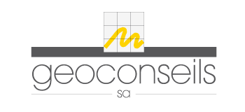
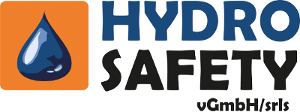
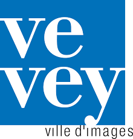
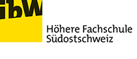

# Support

## Commercial Support

As developer of QField, [OPENGIS.ch](https://www.opengis.ch/#features)
provides [training packages](https://www.opengis.ch/qfield-training/)
and custom commercial [support contracts](https://www.opengis.ch/qgis-support/) with SLA

### Development and Custom Apps

You probably have plenty of ideas for nice features that are not
implemented yet. Please [contact us](https://www.opengis.ch/#contact) to
discuss the best approach to integrate this idea into QField or to
create your own custom app.

## Community Support

You can ask your questions on
[gis.stackexchange](http://gis.stackexchange.com/questions/tagged/qfield?sort=newest)

You can use the [user discussions platform](https://github.com/opengisch/qfield/discussions)

## Funding

The following oranizations have contributed to make QField what it
currently is. We would like to warmly say: Thanks a lot!

[{width="200px"}](http://www.sige.ch)

[{width="200px"}](http://www.vogelwarte.ch)

[{width="200px"}](http://www.geoconseils.ch)

[{width="200px"}](http://www.hydro-safety.com/)

[{width="100px"}](http://www.vevey.ch)

[{width="100px"}](http://www.morges.ch)

[{width="200px"}](http://www.ibw.ch)

[{width="200px"}](http://www.biotope.fr)
