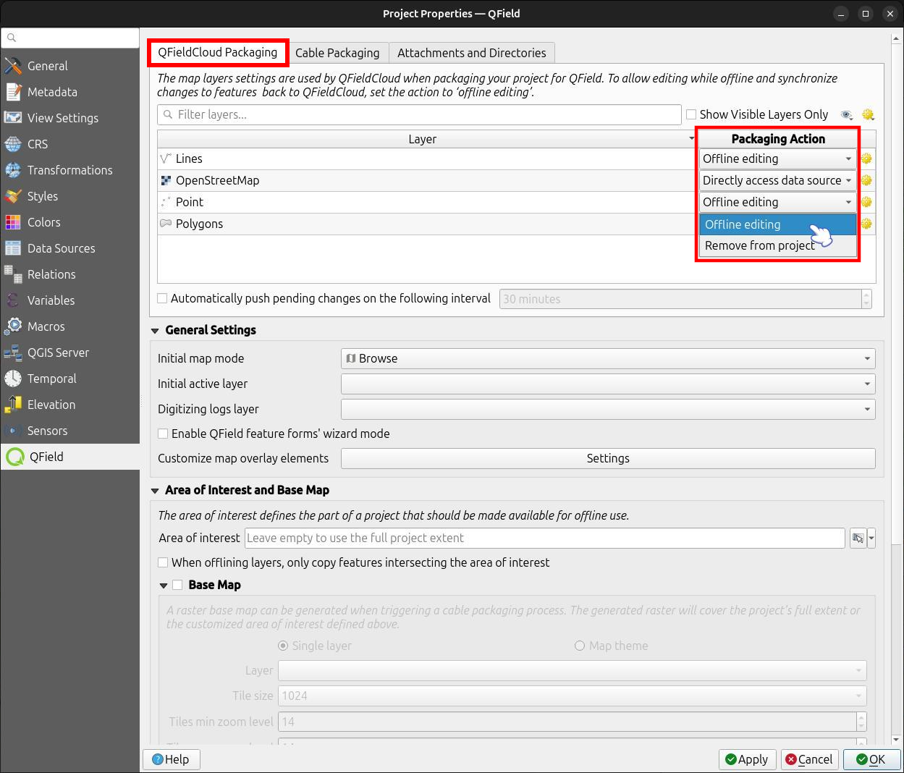
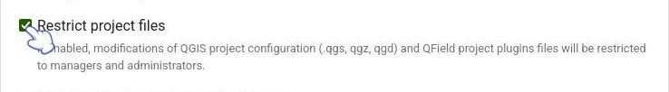
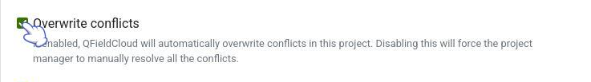
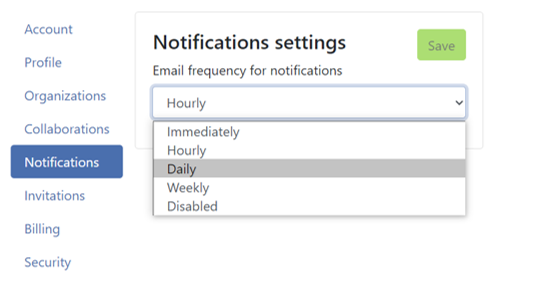
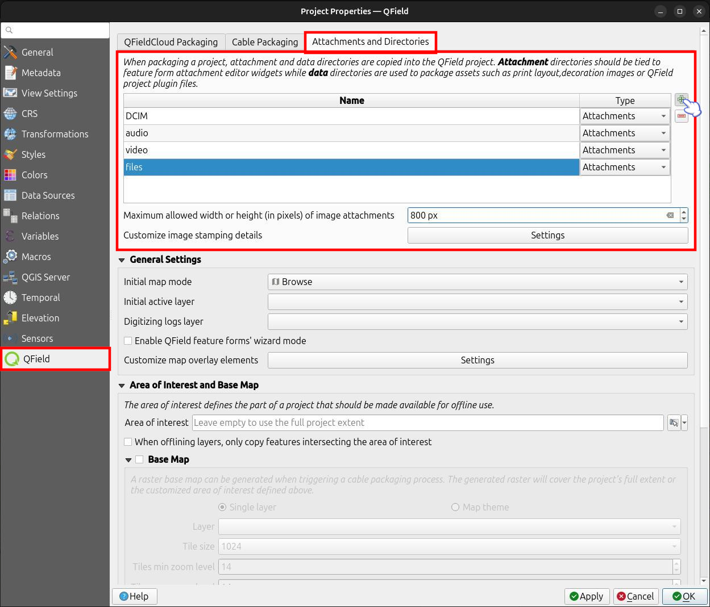

# Advanced Setup Guide

## Supported Vector Providers

Currently, QFieldCloud supports GeoPackage and PostGIS layers for collaborative editing.
Other formats supported by QGIS should also work but are not officially supported.

## Synchronization Process

When working with QFieldCloud, it is important to understand the synchronization process to avoid data loss or overwriting files and deltas.
You can find technical details on the different job types in the [technical documentation section](../../reference/qfieldcloud/jobs.md).
In simple words, three different synchronization activities exist:

- **From QGIS to QFieldCloud:** Uploads a complete new project package and replaces the existing package stored in the cloud.
When working with GeoPackages, the existing GeoPackage in the cloud is replaced with the newly uploaded file.
- **From QFieldCloud to QField:** Downloads the uploaded project package to your mobile device.
QFieldCloud packages the project into a specific format saved in the internal application folder structure.
When working with PostgreSQL databases in offline editing mode, a local GeoPackage is created in the corresponding folder (ensure your [secret](../../reference/qfieldcloud/secrets.md) is configured properly).
- **From QField to QFieldCloud:** Applies changes as deltas after completing data collection.
Deltas reflect only the attribute and geometry changes made in the field.
When uploading or synchronizing with QFieldCloud, only the deltas are applied, so the entire GeoPackage is not replaced.

!

!!! Tip
    We recommend following these guidelines to avoid synchronization issues or overwritten data:

    1. Do not modify the QGIS project while personnel work simultaneously in QField.
    If you synchronize your desktop version to the cloud, QFieldCloud will overwrite the files.
    If you must work in parallel on desktop, check the QFieldCloud status and download the most recent data before uploading new file versions from desktop.
    2. Do not change the data structure before synchronizing the latest field edits.
    Adapting the data structure in QGIS before pushing field edits leads to errors if changes from QField have not yet been uploaded.
    3. Use UUIDs as primary keys, especially when working with relations and in teams.
    Synchronization issues often occur due to missing primary keys in datasets.
    Without explicit primary keys, simultaneous editing can cause data loss.

## Working Modes

When configuring a project for QField, choose between different packaging options:

- **Offline editing:** Regardless of whether files are stored in a GeoPackage, database, or other formats, QFieldCloud creates a temporary GeoPackage of all project data.
Changes made to this GeoPackage remain local until synchronized.
Once changes are uploaded or synchronized back to QFieldCloud, only the modifications are applied to the existing cloud file.
We recommend this option to prevent data loss during connection drops.
- **Direct Data Access:** Edits data directly in the PostGIS database.
This option requires a reliable internet connection in the field.
It allows all users to immediately view data changes and use PostGIS-specific configurations (such as triggers and generated fields).

Changes become visible to other users once synchronization via QFieldCloud occurs across devices.
When a local copy is created, advanced PostGIS operations (such as triggers) are not available in QField.

Find more information in the [QFieldCloud technical reference](../../reference/qfieldcloud/projects.md).

## Working with GeoPackages

Using GeoPackages is usually the best choice for a simple setup to centralize data collected by your QField users into a single file.

If you set up a relation, add a UUID field and use it as the primary or foreign key.
Do not use the default `fid` field for relations as a primary or foreign key.
The `fid` field can be modified during synchronization with QFieldCloud and lead to errors over time.
A [UUID](https://docs.qgis.org/latest/en/docs/user_manual/expressions/functions_list.html#id549) is unique and will not cause conflicts during synchronization. <!-- markdown-link-check-disable-line -->

!!! Workflow
    :material-monitor: Desktop preparation

    1. Create a new project in QGIS.
    2. Create GeoPackage layers and save them in the same folder as your QGIS project.
    3. Set the GeoPackage to **"Offline editing"** in the QFieldSync plugin settings.
        !
    4. Upload the project to QFieldCloud.

    :material-tablet: Fieldwork

    1. Sign in to QFieldCloud and download the project to your device.
    2. Collect and edit data, then upload your changes.

    :material-monitor: Desktop preparation

    1. Download the updated files using QFieldSync (the GeoPackage file will update with the new edits).

!!! Warning
    We do not recommend editing or adding new data directly from QGIS while field edits are pending.
    Every time QGIS synchronizes the project to QFieldCloud, the entire GeoPackage replaces the cloud version, whereas QField updates only the actual changes.

## PostGIS

Using PostGIS is a good choice if your data must be visible and editable for multiple users.

It requires your database to be publicly accessible, and credentials must be saved unencrypted in the QGIS project file.
Please consider the security implications of these requirements and maintain regular backups.

Access to the database can be saved and made available for QFieldCloud in two ways:

- **Direct Connection:** Store all information, including credentials, directly inside the QGIS project file.
- **Using a PG Service File:** Use a service file saved as a secret in QFieldCloud.
We highly recommend using a PG Service file for data security.
Read more on PG Service and secrets in the [PG Service documentation](../../how-to/project-setup/pg-service.md).

!!! Workflow
    :material-monitor: Desktop preparation

    1. Create a new QGIS project.
    2. Add a PostGIS layer, making sure to store credentials in the project or create a PG Service file.
    3. Ensure the PostGIS database connection is publicly accessible via a public IP or domain name (it will not work with `127.0.0.1` or `localhost`).
    4. In the QFieldSync project settings, select your preferred packaging mode.
    5. Upload the project to QFieldCloud.

    :material-tablet: Fieldwork

    1. Sign in to QFieldCloud and download the project.
    2. Collect data in the field.
    3. Upload or synchronize changes once back online when using **"Offline editing"**.

    :material-monitor: Desktop preparation

    1. View all changes directly inside the PostGIS database.

!!! Note
    When using direct database access, QField edits data directly in the PostGIS database.
    This option requires a reliable internet connection in the field, but allows all users to view edits immediately and utilize PostGIS setup features (such as triggers and generated fields).

!!! Note
    When using offline editing, QField works on a local copy of the database in a GeoPackage, which QFieldCloud syncs to the original database upon synchronization.
    We recommend using offline editing to avoid data loss during connection drops.
    Changes become visible to other users only after synchronization occurs across devices.
    Advanced PostGIS operations (such as triggers) are unavailable on local GeoPackage copies in QField.

Find more information in the [QFieldCloud technical reference](../../reference/qfieldcloud/jobs.md).

## Restriction of Project Files

To prevent modifications to the core QGIS project file, project administrators can restrict access to these files in QFieldCloud.

!!! Workflow
    1. Navigate to _Settings_ on your QFieldCloud project page.
    2. Enable the **"Restrict project files"** setting option.

!

Once enabled, only administrators and managers can push changes to restricted files.
Other project collaborators can still upload and modify project datasets (such as GeoPackages), but cannot alter the main project file or its core components.

### Restricted Files

When enabled, the following files can only be modified or uploaded by a user with an **Admin** or **Manager** role:

- The primary **QGIS project file** (e.g., `my_project.qgz`)
- The **attachments zip archive** associated with the project (e.g., `my_project_attachments.zip`)
- **QGIS auxiliary data files** that store information like label positions (e.g., `my_project.qgd`)
- **QField style files** (`.qml`) that share the same name as the project file

## Handling Conflicts

When working in a collaborative environment with multiple users accessing the same project, two users might modify the same feature during fieldwork.
In your project settings page, choose whether QFieldCloud applies the **"last wins"** policy or flags conflicts for project managers to resolve manually.

!

Read more on how QFieldCloud handles conflicts in the [technical documentation](../../reference/qfieldcloud/jobs.md#understanding-conflicts-delta_apply-jobs).

## Activate Email Notifications for QFieldCloud Changes

To receive notifications about activity in your teams and projects, activate the email notification option in QFieldCloud.

!!! Workflow
    1. Navigate to _Settings_ on your QFieldCloud landing page.
    2. Navigate to the **"Notifications"** section.
    3. Customize the notification frequency for your registered email address.

You can receive notifications for the following events:

- User created
- Organization created
- Organization deleted
- Organization membership created
- Organization membership deleted
- Team created
- Team deleted
- Team membership created
- Team membership deleted
- Project created
- Project deleted
- Project membership created
- Project membership deleted

You only receive notifications for actions initiated by other organization members or project collaborators.

## Enhance Your Project with the "Optimized Packager"

We recommend using the **"Optimized Packager"** over the deprecated **"QGIS Core Offline Editing"** packager for all projects.

!!! Explanation
    Unlike the **"QGIS Core Offline Editing"** packager, the **"Optimized Packager"** consolidates filtered layers originating from the same data source into a single offline layer.
    This preserves distinct symbologies while using less storage.
    For example, if you set multiple filters on your project layers, older packagers downloaded the entire layer multiple times before applying filters locally.
    With the **"Optimized Packager"**, filters are applied during the server packaging job, reducing download sizes.

Consider this example configuration:

- **Layer 1.1:**
  - Data Source: `layers.gpkg`
  - Table: `layer1`
  - Filter: `id % 2 = 1`
- **Layer 1.2:**
  - Data Source: `layers.gpkg`
  - Table: `layer1`
  - Filter: `id % 2 = 0`

**Result:**

- **Optimized Packager:** Generates a single layer in the offline GeoPackage, combining data from `layer1` with specified filters applied.
- **QGIS Core Offline Editing Packager:** Creates two separate layers representing the filtered datasets:
  - Layer 1: Filtered with `id % 2 = 1`
  - Layer 2: Filtered with `id % 2 = 0`

!

!!! Note
    Configure this setting on the **"Settings"** page of each project in [QFieldCloud](https://app.qfield.cloud/).

## Configuration of Attachment Folders

If your project contains photos, documents, or other attachments, configure your QGIS project to ensure files download to your QField device.

!!! Workflow
    1. In QGIS, navigate to _Project > Properties... > QField_.
    2. Add your folder path under the **"Attachments and Directories"** section.
    Ensure entered paths are relative to your project file location.

!!! Example
    If you use pictures for symbology stored in a folder named `assets` inside your project home directory, add `assets` to the attachment directories list.

!

## Connect to a Custom QFieldCloud Server in QField and QFieldSync

QField and QFieldSync connect to the default QFieldCloud service at [app.qfield.cloud](https://app.qfield.cloud/).

Modify the default server address in QField and QFieldSync if using a custom deployment:

!!! Workflow
    1. Open the login screen in QField or QFieldSync.
    2. Double-tap the Nyuki logo (the QFieldCloud logo).
    3. Enter your custom server URL in the revealed address field.
    Leaving the field empty automatically reconnects to the default [QFieldCloud server](https://app.qfield.cloud/).

!

!

!!! Note
    QField remembers the last entered server URL for future sessions.
    QFieldSync does not support opening the same cloud project across multiple QGIS profiles.
    Use a single QGIS profile for your QFieldCloud projects to prevent synchronization issues.
