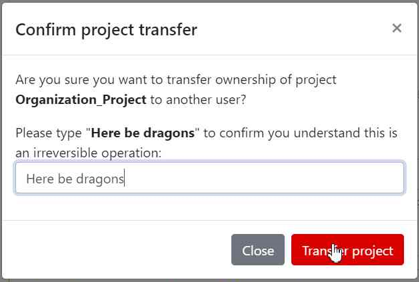

# Advanced setup guide

## Supported vector providers

Currently, QFieldCloud supports GeoPackage and PostGIS layers for collaborative editing.
Other formats supported by QGIS should also work but are not officially supported.

## Synchronization process

When working with QFieldCloud it is important that you understand the synchronization process so that you avoid data loss or the overwriting of files / deltas (changes).
You can find the technical details on the different job types in the [technical documentation section](../../reference/qfieldcloud/jobs.md).
In simple words, there exist three different synchronization activities:

- **From QGIS to QFieldCloud**: This synchronization process uploads a complete new "project package" and replaces the existing one stored in the cloud.
If you are working with GeoPackages it is important to note, that the existing GeoPackage on the cloud will be replaced with the one you have just uploaded.
- **From QFieldCloud to QField**: If you want to download the uploaded "project package" to your mobile device,
QFieldCloud "packages" the project into a specific format that is saved in the internal application folder structure.
Important to know here is that in case you are working with PostgreSQL databases and have chosen the [working mode](#working-modes) *offline editing* then a local
GeoPackage of the data will be created in the corresponding folder
(make sure to configure your [secret](../../reference/qfieldcloud/secrets.md) properly), unless a direct connection is needed.
- **From QField to QFieldCLoud**: Once you are done with collecting data, you can choose among two different [synchronization options](../tutorials/get-started-qfc.md#synchronization-with-qfieldcloud).
The changes made are being applied as so-called *deltas*.
*Deltas* reflect only the changes made to the different attributes.
When pushing to or synchronizing with QFieldCloud, it is only the deltas that are being applied.
Unlike in the synchronization process from QGIS to QFieldCloud, the whole GeoPackage is **<ins>NOT</ins>** replaced.

!

!!! Tip

    There are a few tips, which we recommend to follow in order to avoid synchronization issues or overwritten data.

    1. <ins>Do not modify the QGIS project while personnel is working simultaneously in QField.</ins>
    If you synchronize your Desktop local version to the cloud, QFieldCloud will prioritize your files pushed from your Desktop and overwrite the files.
    Although there may have been changes applied in QFieldCloud, QFieldSync will not show this by default.
    If you must work parallel on Desktop, make sure to check the QFieldCloud status and download the most recent data before uploading new files versions from your Desktop.
    2. <ins>Do not change the data structure before synchronizing the latest field edits</ins>.
    Often, officers work in QGIS and adapt the data structure of the project files, which leads to errors if the changes from QField have not yet been pushed to QFieldCloud.
    3. <ins>Use uuid's as primary keys, especially when working with relations and in teams.</ins>
    Synchronization often occur due to the lack of adding primary keys to your datasets.
    Especially, when working with relationships and in teams, if the data were not configured with an according primary key, it may happen that data loss occurs because of simultaneous editing of the data.


## Working Modes

When configuring a project for QField you can choose between the different "Packaging" options.

- **Offline editing:** Regardless of whether your files are stored in a GeoPackage, database or other format, QFieldCloud will create a temporary GeoPackage of all the project data.
Changes made to this GeoPackage will not be available to others.
Once the changes are synchronized or pushed back to QFieldCloud, the made changes only will be applied to the existing file on QFieldCloud.
We recommend to use this option to avoid unnecessary data losses in case of lost data connection.

- **Direct Data Access:** When using `direct database access`, QFieldCloud will directly edit data in the PostGIS database.
This will only work with a reliable internet connection in the field, but has the advantage that all data is directly visible to all users and allows to use any PostGIS specific setup (triggers, generated fields, etc).

Changes will only be visible to users once the Synchronization via QFieldCloud has been applied on the different devices.
When a local copy is created, advanced PostGIS operations (like triggers) will not be available on QField.

You can find more information on [QFieldCloud technical reference](../../reference/qfieldcloud/concepts.md).

## Working with GeoPackages

Using GeoPackages is usually the best choice for a simple setup to centralize data collected by your QField users to one single file.

If you would like to set up a relation, add a UUID field and use that as the primary or foreign key.
**Note:** Do not use the default `fid` field for relations (as primary or foreign key).

*Why?* The `fid` field can be synchronized when working with QFieldCloud and will lead to errors over time.
A [UUID](https://docs.qgis.org/latest/en/docs/user_manual/expressions/functions_list.html#id549), on the other hand, is unique and will not be synchronized.<!-- markdown-link-check-disable-line -->

!!! Workflow

    :material-monitor: Desktop preparation

    1. Create a new project in QGIS.
    2. Create GeoPackage layers, save it in the same folder as your QGIS project.
    3. Set the GeoPackage to "Offline editing" in the settings of the QFieldSync plugin. !
    4. Upload the project to QFieldCloud.

    :material-tablet: Fieldwork

    1. Sign in to QFieldCloud and download the project to your device.
    2. Collect and edit some data and upload the changes.

    :material-monitor: Desktop

    1. Using QFieldSync, download the updated files (the GeoPackage file should have changed).

!!! warning
    We do not recommend to edit or add new data from QGIS directly because everytime QGIS synchronizes the project to QFieldCloud the whole GeoPackage replaces the existing on QFieldCloud, whereas when using QField, only the actual changes within the file will be updated.

## PostGIS

Using PostGIS is a good choice if your data should be visible and editable for multiple users.

It requires your database to be publicly accessible, and credentials must be saved unencrypted in the QGIS project.
Please be aware of the security implications of such requirements, and remember to have backups.
There are two possible ways, in which the access to the database can be saved and made available for QFieldCloud.

1. **Direct Connection:** When connecting to a PostGIS database, you can store all information including the credentials inside the QGIS Project directly.
2. **Using a PG Service File:** Using a service file that can be saved as a "secret" in QFieldCloud.
We highly recommend to make use of this option due to data safety.
Read more on PG Service and Secrets [here](../../how-to/project-setup/pg-service.md)

!!! Workflow

    :material-monitor: Desktop preparation

    1. Create a new project.
    2. Add a PostGIS layer, making sure to store the credentials in the project or having created the PG Service file.
    3. Make sure the PostGIS database connection is publicly accessible (public IP or domain name, it will not work with `127.0.0.1` or `localhost`).
    4. In the QFieldSync project settings, choose your preferred packaging mode.
    5. Upload the project to QFieldCloud.

    :material-tablet: Fieldwork

    1. Sign in to QFieldCloud and download the project.
    2. Collect some data
    3. Push or synchronize the changes once back at the office if you were using `offline editing`.

    :material-monitor: Desktop

    1. All changes should be directly visible inside the PostGIS database.

!!! note
    When using `direct database access`, QFieldCloud will directly edit data in the PostGIS database.
    This will only work with a reliable internet connection in the field, but has the advantage that all data is directly visible to all users and allows to use any PostGIS specific setup (triggers, generated fields, etc).

!!! note
    When using `offline editing`, QField will work on a local copy of the database in a GeoPackage, which will be synced by QFieldCloud to the original database once synchronized by the user.
    We recommend to use this option to avoid unnecessary data losses in case of lost data connection.

    Changes will only be visible to users once the Synchronisation via QFieldCloud has been applied on the different devices.
    When a local copy is created, advanced PostGIS operations (like triggers) will not be available on QField.

You can find more information on [QFieldCloud technical reference](../../reference/qfieldcloud/jobs.md).

## Project Configuration Best Practices

To ensure a smooth synchronization process between QGIS, QField and QFieldCloud, follow these recommendations.

**1. Centralized Data Storage - Add all data in the same folder as your .qgs profject file**

Before uploading your project, ensure all relevant data sources (GeoPackages, rasters, etc.) are located in the same directory as your project file (`.qgs/.qgz`)
or in a subdirectory (e.g., `./data`, `./assets`).
If files are spread across different drives or folders on your computer, QFieldSync and QFieldCloud may fail to package them correctly for the mobile device.

**2. Managing Unique IDs - Add a unique ID to your layers**

When multiple users collect data offline simultaneously, standard auto-incrementing IDs (1, 2, 3...) will result in conflict errors when applying the deltas changes data on QFieldCloud.

- **For Relations**: Create a specific text field (e.g., `survey_uuid`) and use `uuid()` or `uuid('WithoutBraces')` as the default value.
Use this field for all foreign keys and for primary key if the layer is from PostgreSQL/PostGIS.
- **For the `fid` (Feature ID)**: If you are working with GeoPackages, you can reduce conflicts on the internal `fid` integer column
by setting the "Default Value" to the expression `epoch(now())`.
This generates a unique integer based on the current timestamp.

!!! Tip
    To set this up, go to **Layer Properties > Attributes Form**, select the `fid` field, and set the **Default Value** to:
    ```sql
    epoch(now())
    ```
    Ensure the "Apply default value on update" box is **unchecked** so the ID remains constant after creation.

**3. Relative Paths - Ensure that all attachment paths are relative**

Absolute paths (e.g., `C:\Users\{username}\Downloads\photo_001.jpg`) will break when the project is transferred to a mobile device (Android/iOS), as the file system structure is different.

!!! Workflow

    1. Navigate to **Project** > **Properties...** > **General**.
    2. Set **Save paths** to `Relative`.

**4. Stable Layer References in Expressions - Use the Layer Name in expressions, not the Layer ID**

When writing expressions (for example, inside `aggregate()` or `relation_aggregate()`)functions, QGIS allows you to reference layers by their internal ID (e.g., `places_2348274...`) or their Name (e.g., `Places`).
Always use the **Layer Name** (e.g., `Places`).

**Why?**
The internal Layer ID changes if you remove and re-add a layer or internally in QFieldCloud when a packaging job is triggered could change,
which breaks your expressions.
The Layer Name remains stable as long as you do not rename it in the layer tree.

**5. Preferred File Formats - Convert your layers to GeoPackage**

QField and QFieldCloud are optimized for the **GeoPackage (.gpkg)** format.
While QField and QFieldCloud support others formats like Shapefiles (`.shp`), GeoJSON, and KML, etc., we strongly recommend converting these layers to GeoPackage before starting your project.

**How to Convert to GeoPackage?**

!!! Workflow

    1. In QGIS, right-click your layer in the layer tree.
    2. Select **Export** > **Save Features As...**
    3. Set **Format** to `GeoPackage`
    4. In **File name**, click `...` and navigate to your project folder. Give the new database a name (e.g., `layer.gpkg`)
    5. In **Layer name**, give your layer a simple name (e.g., `survey_points`)
    6. Click **OK**
    7. The new layer will load into your project.
    You can now remove the old layer

### Common Configuration Errors

If you are experiencing synchronization issues, check for these common configuration errors:

| Issue | Cause | Solution |
| :--- | :--- | :--- |
| **Missing Images** | Paths are set to "Absolute" | Go to Project Properties and set paths to "Relative". |
| **Sync Failures** | Data is outside the project folder | Move all .gpkg and raster files into the same folder as the project file (`.qgz/.qgs`). |
| **Expression Errors** | Layer ID used in expression | Update expressions to use `'Layer Name'` instead of `'Layer_ID_123'`. |
| **Duplicate Keys** | Using default 1, 2, 3 IDs | Implement `uuid()` or `epoch(now())` for unique identification. |

## Restriction of Project Files

To prevent any modification to the core QGIS project file, **the project administrators** can restrict the access to these files.
This can be achieved under the settings section in QFieldCloud.

1. From the QFieldCloud homepage direct to *Settings*
2. Enable the **`Restrict project files`** button

!

Once set, only administrators and managers will be able to push changes to the files listed above.
Other project collaborators can still upload and modify other project files, such as data in GeoPackages, but they cannot alter the main project file or its core components.

### Restricted Files

When enabled, the following files can only be modified or uploaded by a user with an "admin" or "manager" role for the project:

- The primary **QGIS project file** (e.g., `my_project.qgz`).
- The **attachments zip archive** associated with the project (e.g., `my_project_attachments.zip`).
- **QGIS auxiliary data files** that store information like label positions (e.g., `my_project.qgd`).
- **QField style files** (`.qml`) that share the same name as the project file.


## Automatic push to QFieldCloud

With this functionality, you can enforce automatic pushing of pending changes to QField devices in the field, as well as specify the interval in between automated pushes.
The functionality is activated through a project setting, allowing remote activation.

:material-monitor: Desktop preparation

1. **Access Project Settings**: Direct to *Project* > *Properties...* > *QField* > *QFieldCloud Packaging*
2. **Enable Auto-Push**: Toggle the "Automatically push pending changes on the following interval" option and establish your preferred interval.

!

!

!!! note
    **Benefits:**
    - *Real-Time Updates*: Ensures prompt Synchronisation of field data with the QFieldCloud project.
    - *Streamlined Workflow*: Minimizes manual intervention and ensures surveyors do not need to worry about Synchronisation, helping them focus on data quality.
    **Considerations:**
    - *Network Stability*: Ensure stable internet connectivity for auto-push functionality.
    - *Battery Optimization*: Implement strategies to mitigate battery consumption on QField devices during prolonged fieldwork.

## Project creation in an organisation

There are several ways in which you can create and upload a project to QField.

- Using QFieldSync
- Using QFieldCloud
- Change of ownership

!!! workflow

    ### **Option 1: Using QFieldSync**

    1. Follow the steps [configure your cloud project](#create-and-configure-your-cloud-project), until you get to the "Project details".

    2. Change the owner of the project to your Organization.

        

    3. Click on "Create" to start the conversion and Synchronisation.
        When finished the project will appear in the list of projects of your Organization in QFieldCloud.

        

    

    ### **Option 2: Using QFieldCloud**

    1. In the QFieldCloud landing page direct to your organization.

        

    2. Click on "Create a project".

        

    3. Select "Create a new empty project"

        

    4. You can see the new project in the overview.

        

    5. In QGIS open QFieldSync and you will see the new project listed, click on "Edit Selected Cloud Project".

        

    6. Choose the folder where you want to save the project.

        

    7. In the selected folder, you can either paste an already worked-on project or save a new one.

        

    8. Once the folder contains the project, you can synchronize it.

        

    9. Finally, push the changes to the cloud.

        

    10. You can verify that the files are present in the Organization project.

        

    ### Option 3: Changing the Ownership of a project

    1. On the QFieldCloud landing page, click on your project of concern.
    2. Direct to the *Settings* and select "Transfer ownership of this project" and choose the desired Organization for the transfer.

        

    3. A pop-up window will appear to confirm the transfer. To proceed, you will need to type the requested text and click "Transfer project".

        

    

## Activate email notifications for QFieldCloud changes

If you wish to be notified by QFieldCloud what happens to your team(s) and your projects, you can activate the email notification option.

1. On your QFieldCloud landing page direct to *settings*.
2. Navigate to the notifications section.
    Here, you can customize the frequency of notifications you wish to receive at the email address registered with your account.


The events you get notified about are:

- User created
- Organization created
- Organization deleted
- Organization membership created
- Organization membership deleted
- Team created
- Team deleted
- Team membership created
- Team membership deleted
- Project created
- Project deleted
- Project membership created
- Project membership deleted

You will receive notifications for events in which you are not the actor.
These notifications are specifically for events that are initiated by other members of your organization or collaborators on your projects.

## Enhance your project with the "Optimized Packager"

We recommend using the new "Optimized Packager" over the deprecated "QGIS Core Offline Editing" for all your projects.
The "Optimized Packager" supports consolidating filtered layers of same datasource into a single offline layer, respecting distinct symbology but also using less storage.

1. On the QFieldCloud landing page and select the project of concern
2. Direct to *Settings* and set the packager under "Packaging Offliner" in the "Settings" tab of your project.

Here is an example to illustrate this feature:

**Example Configuration:**

- **Layer 1.1:**
  - Data Source: `layers.gpkg`
  - Table: `layer1`
  - Filter: `id % 2 = 1`

- **Layer 1.2:**
  - Data Source: `layers.gpkg`
  - Table: `layer1`
  - Filter: `id % 2 = 0`

**Result:**

For the new offliner:

- A single layer is generated in the offline GeoPackage, combining data from `layer1` with the specified filters.

For the old (QGIS) offliner:

- Two separate layers are created, each representing the filtered datasets:
  - Layer 1: Filtered with `id % 2 = 1`
  - Layer 2: Filtered with `id % 2 = 0`

!

!!! note
    This configuration must be set in the Settings page of each project in [QFieldCloud](https://app.qfield.cloud/).

## Configuration of Attachment Folders

If your project contains photos, documents or other attachments, you have to configure your QGIS project accordingly to ensure that the data are downloaded to your QField device.

1. In QGIS navigate to *Project* > *Properties...* > *QField*.
2. Add your folder's path to the "Attachments and Directories" list.
    The path you enter must be relative to the location of your project file.

!!! example
    You used pictures for a specific symbology.
    These are stored in a folder named "assets" located inside your project home folder.
    Add them under the folder name to the list.

!

## On-Demand Attachment Downloads

For projects with many attachment files, you can enable on-demand downloading in QField.
This is useful for saving storage space on field devices and reducing data transfer over limited network connections.

To enable this feature:

1. From the QFieldCloud landing page, select your project.
2. Direct to *Settings*.
3. Enable the "On demand attachment files download" option.

!!! note
    This feature can be activated during project creation or enabled at any time for existing projects.

!

## Connect to a custom QFieldCloud server in QField and QFieldSync

QField and QFieldSync connect to the QFieldCloud service [app.qfield.cloud](https://app.qfield.cloud/) by default.

You can modify the default that QField and QFieldSync connect to:

1. Open the login screen in QField or QFieldSync.
2. Double-tap on the Nyuki icon (the QFieldCloud logo).
3. This action will reveal a field where you can enter the preferred QFieldCloud server address.
4. Enter the details of the desired server in the provided field.
(Leaving the field empty will automatically connect to the default [QFieldCloud server](https://app.qfield.cloud/))

!

!

!!! note
    QField will remember the last entered URL for future sessions.
    It's important to note that QFieldSync does not support the same cloud project in multiple QGIS profiles.
    As a recommendation use a single QGIS profile for your QFieldCloud projects to avoid Synchronisation issues.
