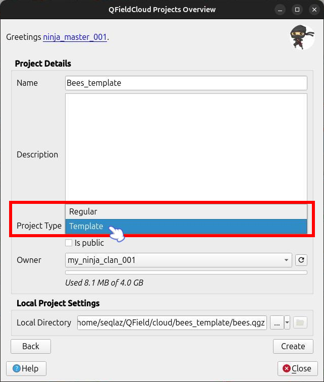

# Basic concepts

## Users

To interact with QFieldCloud you need to be a registered user. Each user can create, modify and delete **projects** and **organizations**.

## Projects

Projects are the main data container within QFieldCloud.
Each user can create one or more QFieldCloud projects.
Each project contains a single `.qgs`/`.qgz` QGIS project file, the geospatial files - GeoPackages, TIFs, and additional data such as photos, PDFs etc.
All project data files must be within a single QFieldCloud project.

Read more about [QFieldCloud Projects](../../reference/qfieldcloud/projects.md).

!

### Project Types

QFieldCloud projects can be assigned one of three project types:

| Project Type                            | Primary Purpose                                                                              | Field Sync / changes | Packaging Jobs | Can be Cloned? |
|:----------------------------------------|:---------------------------------------------------------------------------------------------|:---------------------|:---------------|:---------------|
| **Regular** (`regular`)                 | Active fieldwork projects used for data collection.                                          | ✅ Allowed            | ✅ Allowed      | ✅ Yes          |
| **Template** (`template`)               | Master blueprints used to configure setups once and clone them for new survey campaigns.     | ❌ Blocked            | ❌ Disabled     | ✅ Yes          |
| [**Shared Datasets**](../../how-to/advanced-how-tos/shared-datasets.md) (`shared_datasets`) | Dedicated central project hosting shared base layers and localized datasets across projects. | ❌ Blocked            | ❌ Disabled     | ❌ No           |

#### Regular Project

A regular project is any project which used for the day to day fieldwork.
This is by default the project type you should use if you wish to work in a collaborative environment.
Users can manipulate the data, upload and synchronize as well as copy the project to their desktop devices.

#### Template Project

Projects of type **template** act as read-only projects for field workers while remaining fully editable for administrators:

- **Master Project:** Project administrators can upload files, edit QGIS configurations, and update layers on a template project.
- **Data Protection:** Field workers cannot package projects that are marked as a template.
    Attempting to do so will return an error (`operation_not_allowed_for_template_project`).
- **Cloning Source:** Both **Regular** and **Template** project types can be used as sources for cloning new projects.

!!! Workflow

    When creating a project in **QFieldSync**, change the project type to **Template** if you want it to be used as a template.

     !

     To designate a project as a template (when already exist in QFieldCloud), navigate to the project's **Settings** section and change the **Project Type** dropdown to **Template**.

     !

#### Shared Datasets Project

If you repeatedly use the same layers in multiple projects across your organization, you may want to consider using [shared datasets](../../how-to/advanced-how-tos/shared-datasets.md).
These are projects that act as a separate project to which the shared datasets are uploaded.
Despite being visible in your QGIS project, they are not part of the synchronization.

### Project collaborators

A project collaborator is another QFieldCloud user invited to contribute to a project.
One project may have multiple collaborators.
Collaborators can have the roles **Admin**, **Manager**, **Editor**, **Reporter**, and **Reader**.
Only users with the roles of **Admin** and **Manager** can add more users as collaborators to the project.
If the project is owned by an organization, whole **teams** can also be added as collaborators.
Read more about [collaborator roles](../../reference/qfieldcloud/permissions.md).

## Organizations

Organizations are shared accounts where multiple QFieldCloud users can collaborate across many projects at once.
Owners and administrators can manage member access to the organization's projects and projects with sophisticated security and administrative features.
Any QFieldCloud user can own or participate in one or more organizations.
Each organization owns one or more projects.

### Organization members

Organization membership allows access to projects within an organization.
Members with **owner** or **admin** role can add other members.

### Organization teams

Teams allow organization members with a **owner** or **admin** role to easily assign permissions to multiple users at once.
A team consists of one or more organization members within the organization.
When a team is assigned a role in a project, all the team members automatically have that role too.
Teams can be added as collaborators only to projects owned by the same organization.
One organization member can be part of multiple teams.
If an organization member is a project collaborator directly or through multiple teams, that organization member has the highest possible role.

!!! note
    Collaborators must first be a Member of the Organization.
