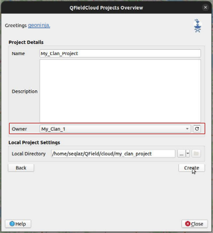
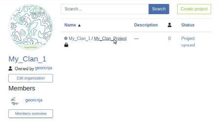
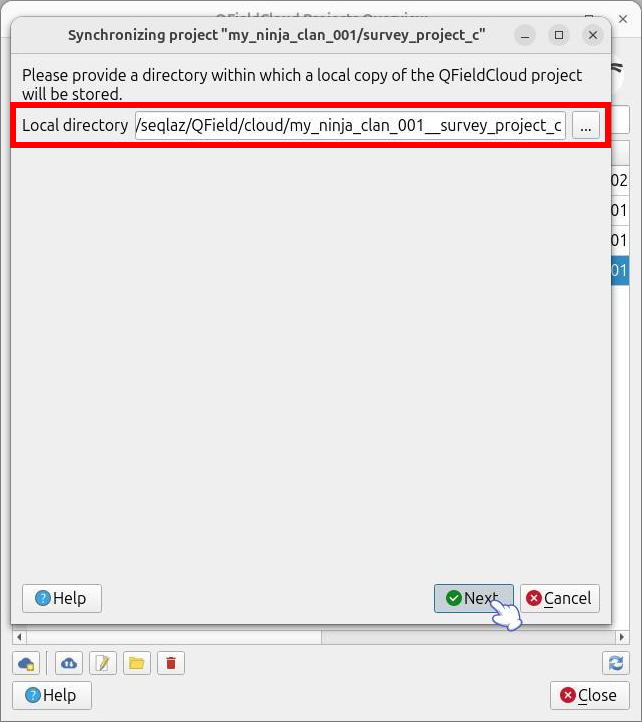
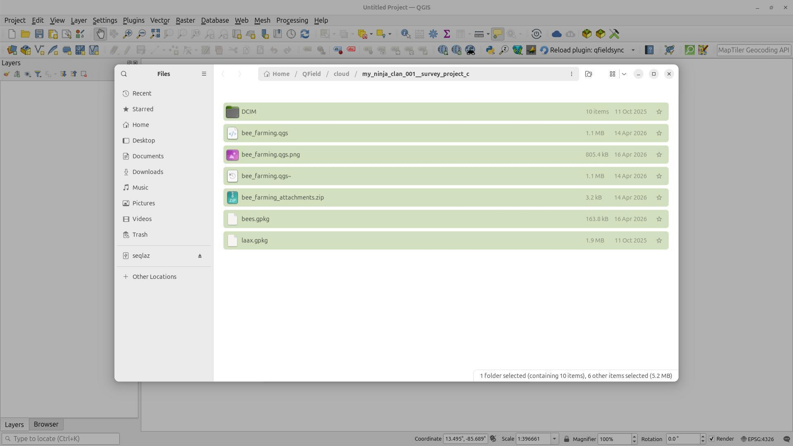
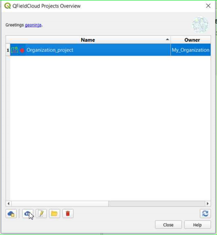
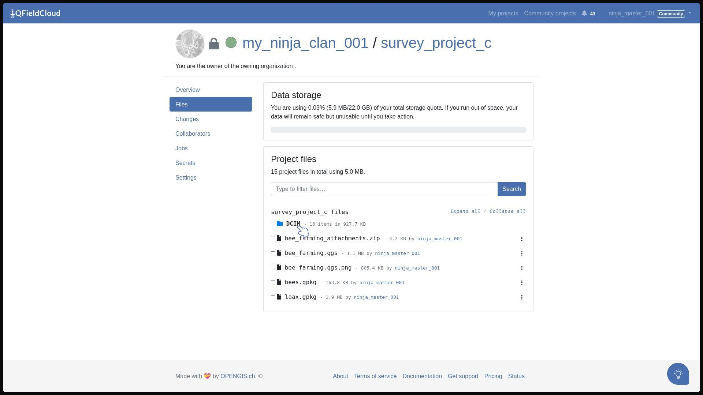

## Project creation in an organisation

There are several ways in which you can create and upload a project to QField.

- Using QFieldSync
- Using QFieldCloud
- Change of ownership

!!! Workflow

    ### **Option 1: Using QFieldSync**

    1. Follow the steps [configure your cloud project](../tutorials/get-started-qfc.en.md#project-creation-and-configuration), until you get to the "Project details".

    2. Change the owner of the project to your Organization.

        

    3. Click on "Create" to start the conversion and Synchronisation.
        When finished the project will appear in the list of projects of your Organization in QFieldCloud.

        

    

    ### **Option 2: Using QFieldCloud**

    1. In the QFieldCloud landing page direct to your organization.

        

    2. Click on "Create a project".

        

        - Add your project name, give a description and select the required settings regarding conflict management and project file restriction.
        - Choose your preferred project creation method:
            - **Create an empty project:** This will create a complete empty project without any basemap.
            - **Use a basic template:** This will allow you to select a dedicated basemap provider either OpenStreetMap (by default) or your preffered basemap provider for which you need to provide the URL and define your project extent.
            You can do this by clicking on the little map icon on the right of the Project extent line.

        

        Once you have entered all your details click *Create* at the bottom right of the screen

    4. You can now see the new project in the overview.

        

    5. In QGIS open QFieldSync and you will see the new project listed, click on "Edit Selected Cloud Project".

        

    6. Choose the folder where you want to save the project.

        

    7. In the selected folder, you can either paste an already worked-on project or save a new one.

        

    8. Once the folder contains the project, you can synchronize it.

        

    9. Finally, push the changes to the cloud.

        

    10. You can verify that the files are present in the Organization project.

        

    ### Option 3: Changing the Ownership of a project

    1. On the QFieldCloud landing page, click on your project of concern.
    2. Direct to the *Settings* and select "Transfer ownership of this project" and choose the desired Organization for the transfer.

        

    3. A pop-up window will appear to confirm the transfer. To proceed, you will need to type the requested text and click "Transfer project".

        

    

## Cloning Projects

QFieldCloud allows you to duplicate existing projects through its cloning functionality.
This feature is highly useful when you need to establish project templates, duplicate a survey project for a different team,
or start a new data collection campaign using an identical QGIS configuration to a previous successful project.

### How Cloning Works

When you clone a project, QFieldCloud creates a brand new project and duplicates the following elements from the source project:

- The QGIS project file (e.g., `.qgs` or `.qgz`).
- All associated project files and datasets (GeoPackages, images, etc.).
- Project settings, including description, public status, offline editing configurations,conflict resolution, and attachment download policies.

The newly cloned project is completely independent. Any subsequent changes, file uploads, or data collection done within the cloned project will not affect the original source project.


### Overriding Project Parameters

While cloning effectively duplicates the source project, you can override specific parameters during the creation process:

- **Project Name:** You must provide a unique name for the new cloned project (e.g., `survey_zone_b`, `survey_zone_n`).
- **Owner:** You can assign the cloned project to a different owner (e.g., a specific organization or user account), with the appropriate permissions.
- **Extent:** By providing new extent for the cloned project (for easy moving the zoom to the new extend zone).

### Constraints and Limitations

To ensure system stability and security, project cloning is subject to the following technical rules:

- **Permissions:** You must have admin, manager role to the source project to be able to clone it.
- **Storage Quotas:** The target owner account must have enough free storage quota available to accommodate the entire file size of the source project.
    If the storage limit is exceeded, the clone operation will fail.
- **XLSForms:** Project cloning is mutually exclusive with XLSForm project creation. You cannot provide an XLSForm file and clone an existing project simultaneously.
- **Seed Configuration:** When cloning, you cannot configure new basemaps via the project seed. The seed data is strictly limited to updating the project's `extent`.
- **Shared Datasets:** The system-level `shared_datasets` project cannot be used as a source for cloning. Attempting to clone it will raise a `NotCloneableProjectError`.

### API Usage

Users and developers can easily clone projects using the QFieldCloud API. To clone a project, send a `POST` request to the `/api/v1/projects/` endpoint.
Include the `clone_from_project` parameter with the UUID of the source project.

**Example Request:**
```bash
curl --location 'https://app.qfield.cloud/api/v1/projects/' \
--header 'Content-Type: application/json' \
--header 'Authorization: Token {MY_TOKEN}' \
--data '{
    "name" : "clone-me-public",
    "is_public": true,
    "description": "Hello from the cloned public project",
    "owner": "{USERNAME}",
    "seed": {
        "extent": "-180, -90, 180, 90"
    },
    "clone_from_project": "{PROJECT_UUID}"
}'
```

!!! note
    The seed object is optional and only accepts the extent field when utilizing the clone functionality.
