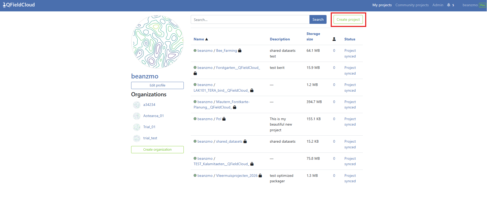
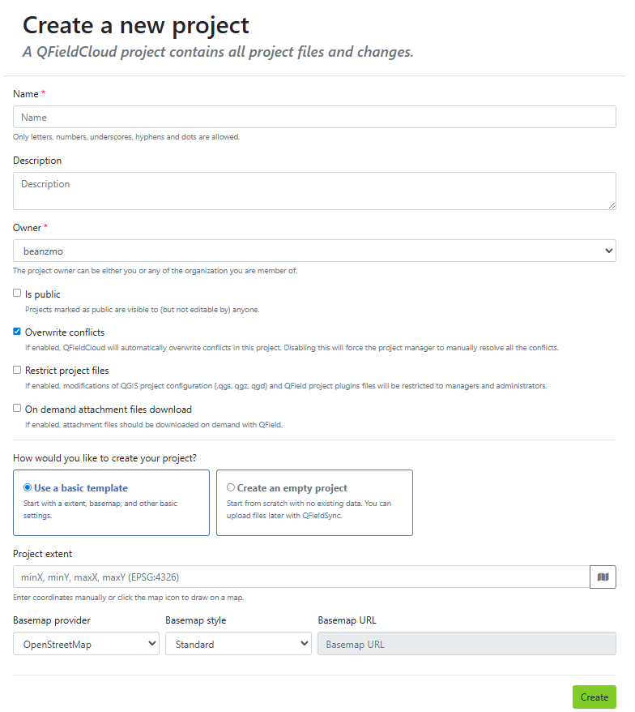
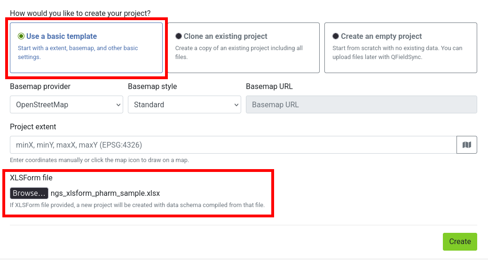

# Creating Projects in QFieldCloud

There are multiple options available to initialize and build a project in QFieldCloud:

- [Using QGIS](my-first-project.md)
- Using QFieldCloud (any method from bellow)
- [Directly from QField](../../how-to/project-setup/create-project.md)


## Option 1: Initialize via Web UI (Blank or Basemap Template)
:material-web: Web Interface

You can provision empty map spaces or simple localized maps directly from the QFieldCloud,
downloading them to your desktop environment for further styling later.

!!! Workflow

    1. Log into your QFieldCloud landing page.
    2. Click the **Create project** button.

        !

    3. Set the project name, descriptive details (optional), visibility scope (public or private),
        conflict resolution parameters, and project file safety restrictions.
    4. Pick your initialization template configuration:

        - **Create an empty project:** Sets up a clean project folder environment without base imagery layers.
        - **Use a basic template:** Allows you to bundle a built-in background layer (OpenStreetMap Standard by default, or a custom tile server URL)
            and customize your target workspace boundaries by selecting a coordinates bounding box via the **Project extent map window**.

        

    5. Click **Create** at the bottom right. The completed skeleton will populate on your profile's project dashboard.

## Option 2: Create from an XLSForm Spreadsheet (Web UI Upload)
:material-web: Web Interface

For deployment workflows relying on spreadsheets for [form configuration](https://xlsform.org/),
QFieldCloud can compile tabular data collection forms directly into structurally complete QGIS projects containing relational data schemas.

!!! note

    **Supported File Types:** QFieldCloud supports forms designed using standard tabular spreadsheet files, accepting
    **.xls, .xlsx, .xlsb, .xlsm, and .ods** file extension validation.

!!! Workflow

    1. Navigate to the **Create project** section within the QFieldCloud Web interface.
    2. Complete the project metadata fields (Name, Extent) and click **Create**.
    3. Chose "Use a basic template" options, and locate the **XLSForm file upload input**.
    4. Choose your spreadsheet template file and press the "Create" button.

    !

QFieldCloud will launch a background worker Job to parse the spreadsheet schema rows, map the variables,
and generate a fully functional **Survey** layer alongside any required selection drop-down lookups.

!!! important

    If the submitted spreadsheet contains structural syntax errors or broken expression references,
    the background creation job will automatically safe-abort to prevent corruption.
    The project generation status will display an `UNABLE_TO_CONTINUE` error code on the backend log dashboard,
    exposing a humanized chain-of-cause error output text file explaining which row or element caused the compilation failure.

## Option 3: Clone an Existing Project
:material-web: Web Interface

Project cloning allows you to duplicate existing active setups to act as templates for alternative workspace regions,
distinct fieldwork teams, or new seasonal collection campaigns.

### How Cloning Works

Cloning creates an isolated, completely independent project space, cleanly replicating:
- The base QGIS mapping project file (`.qgs` or `.qgz`).
- All bundled offline layers and databases (GeoPackages, styles, .etc).
- System execution policies (offline editing conflict rule settings, attachment on-demand configurations).

!!! Workflow

    1. On the QFieldCloud landing page, click the actions context menu icon *(⋮)* next to the project profile you want to duplicate.
    2. Select the **Clone Project** option.
    3. Choose a unique name and pick the target owner profile space (Personal or Organization).
    4. Define a custom bounding box coordinate set inside the **Project extent** setting parameters to update the map's initial zoom area focus.
    5. Click **Create** to start the cloning.

    


### Overriding Project Parameters

While cloning effectively duplicates the source project, you can override specific parameters during the creation process:

- **Project Name:** You must provide a unique name for the new cloned project (e.g., `survey_zone_b`, `survey_zone_n`).
- **Owner:** You can assign the cloned project to a different owner (e.g., a specific organization or user account), with the appropriate permissions.
- **Extent:** By providing new extent for the cloned project (for easy moving the zoom to the new extend zone).

### Constraints and Limitations

To ensure system stability and security, project cloning is subject to the following technical rules:

- **Permissions:** You must have admin, manager role to the source project to be able to clone it.
- **Storage availability:** The target owner account must have enough free storage available to accommodate the entire file size of the source project.
    If the storage limit is exceeded, the clone operation will fail.
- **Seed Configuration:** When cloning, you cannot configure new basemaps via the project seed. The seed data is strictly limited to updating the project's `extent`.
- **Shared Datasets:** The system-level `shared_datasets` project cannot be used as a source for cloning. Attempting to clone it will raise a `NotCloneableProjectError`.

### API Usage

You can easily clone projects using the QFieldCloud API. To clone a project, send a `POST` request to the `/api/v1/projects/` endpoint.
Include the `clone_from_project` parameter with the UUID of the source project.

```bash
curl --location 'https://app.qfield.cloud/api/v1/projects/' \
--header 'Content-Type: application/json' \
--header 'Authorization: Token {MY_TOKEN}' \
--data '{
    "name" : "cloned-fieldwork-zone-b",
    "is_public": false,
    "description": "Duplicated configuration tracking layer for Team B",
    "owner": "{USERNAME}",
    "seed": {
        "extent": "-180, -90, 180, 90"
    },
    "clone_from_project": "{PROJECT_UUID}"
}'
```

!!! note
    The seed object is optional and only accepts the extent field when utilizing the clone functionality.

## Option 5: Change the Ownership of a Project
:material-web: Web Interface

If you have already built a personal project on the cloud and need to distribute it to a corporate workspace, you can transfer the repository ownership directly.

!!! Workflow

    1. Open the project dashboard via the web page and select the **Settings** menu.
    2. Scroll to the actions zone and select **"Transfer ownership of this project"**.
    3. Select your target organization destination from the lookup selection drop-down.
    4. Type the requested text confirmation exactly as written into the confirmation popup dialog box and click **Transfer project**.

    
