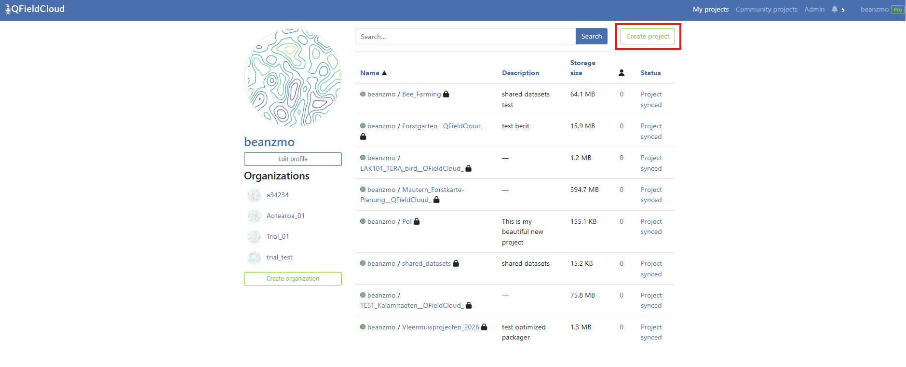
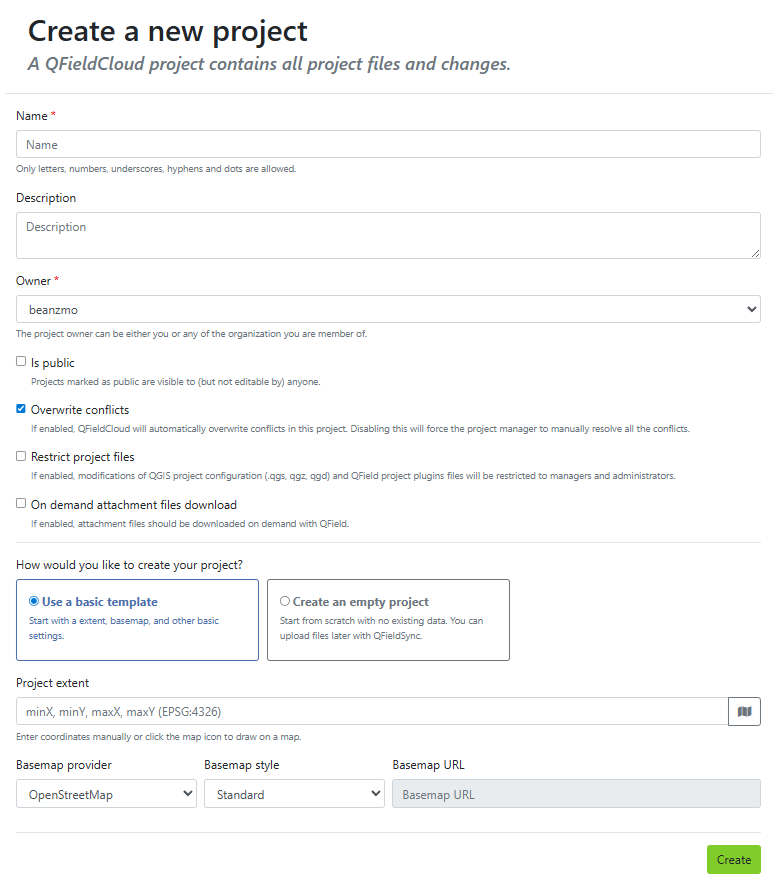
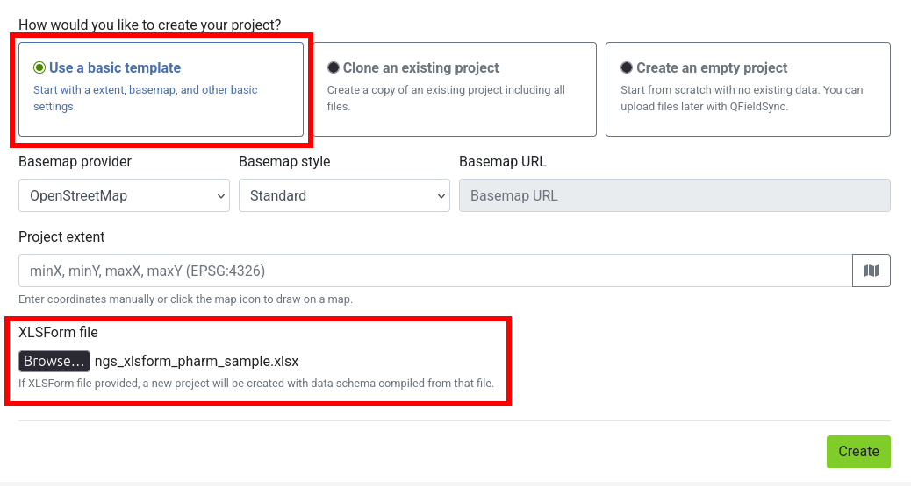

# Creating Projects in QFieldCloud

There are multiple options available to initialize and build a project in QFieldCloud:

- [Using QGIS](my-first-project.md)
- [Using QFieldCloud](#creating-projects)
- [Directly from QField](../../how-to/project-setup/create-project.md)

## Creating Projects

### Option 1: Initialize via Web UI (Blank or Basemap Template)
:material-monitor: Desktop Preparation

You can create empty map spaces or simple localized maps directly from QFieldCloud, downloading them to your desktop for further styling.

!!! Workflow

    1. Navigate to your QFieldCloud landing page.
    2. Click the **"Create project"** button.

        !

    3. Set the project name, optional descriptive details, visibility scope (public or private), conflict resolution parameters, and project file safety restrictions.
    4. Select your **"Project type"**:
        - **"Regular":** Standard project used for field data collection and synchronization.
        - **"Template":** Master blueprint project designed to be cloned by field teams (field synchronization and repackaging are disabled on templates to prevent accidental edits).
    5. Select your initialization template configuration:
        - **"Create an empty project":** Sets up a clean project folder environment without a basemap.
        - **"Use a template":** Allows you to add a built-in background layer (OpenStreetMap Standard by default, or a custom tile server URL) and select your project extent via a bounding box by tapping on the **"Project extent"** map window.

        

    6. Click **"Create"** at the bottom right.
    The completed project structure populates in your profile project list.

### Option 2: Create from an XLSForm Spreadsheet (Web UI Upload)
:material-monitor: Desktop Preparation

For deployment workflows relying on spreadsheets for [form configuration](https://xlsform.org/), QFieldCloud compiles tabular data collection forms directly into complete QGIS projects containing relational data schemas.

!!! Note
    QFieldCloud supports forms designed using standard tabular spreadsheet files, accepting `.xls`, `.xlsx`, `.xlsb`, `.xlsm`, and `.ods` file extensions.

!!! Workflow

    1. Click **"Create project"** on your QFieldCloud landing page.
    2. Complete the project metadata fields (Name, Extent) and click **"Create"**.
    3. Select the **"Use a basic template"** option and locate the XLSForm file upload input.
    4. Choose your spreadsheet template file and click the **"Create"** button.

    QFieldCloud processes the form to generate a fully functioning **Survey** layer with corresponding survey configurations (dropdown lists, radio buttons, and text fields).
    !

!!! Important
    If the submitted spreadsheet contains structural syntax errors or broken expression references, the background creation job automatically aborts to prevent corruption.
    The project generation status displays an `UNABLE_TO_CONTINUE` error code on the Job log, detailing the cause of error and identifying the row or element that failed compilation.

### Option 3: Clone an Existing Project
:material-web: Web Interface

Project cloning allows you to duplicate existing active setups to act as templates for alternative workspace regions, distinct fieldwork teams, or new seasonal collection campaigns.

#### How Cloning Works

Cloning creates an isolated, completely independent project space, cleanly replicating:

- The base QGIS mapping project file (`.qgs` or `.qgz`).
- All bundled offline layers and databases (GeoPackages, styles, etc.).
- System execution policies (offline editing conflict rule settings, attachment on-demand configurations).

!!! Workflow

    1. On the QFieldCloud landing page, click the actions context menu icon *(⋮)* next to the project profile you want to duplicate.
    2. Select the **"Clone Project"** option.
    3. Choose a unique name and select the target owner profile space (Personal or Organization).
    4. Define a custom bounding box coordinate set inside the **"Project extent"** setting parameters to update the initial zoom focus area.
    5. Click **"Create"** to start cloning.

    

### Overriding Project Parameters

While cloning effectively duplicates the source project, you can override specific parameters during the creation process:

- **Project Name:** You must provide a unique name for the new cloned project (e.g., `survey_zone_b` or `survey_zone_n`).
- **Owner:** You can assign the cloned project to a different owner (e.g., a specific organization or user account) if you have appropriate permissions.
- **Extent:** You can specify a new extent for the cloned project to center the map zoom on the new project zone.

### QFieldCloud Project Types

QFieldCloud projects can be assigned one of three project types:

- **Regular (`regular`):** Standard projects used for active fieldwork, data collection, and team synchronization.
- **Template (`template`):** Master blueprint projects used to configure setups once and clone them for new survey campaigns.
- **Shared Datasets (`shared_datasets`):** Dedicated central project hosting shared base layers and localized datasets across multiple projects.

#### Template Projects Details

Template projects act as read-only blueprints for field workers while remaining fully editable for administrators:

- **Master Blueprints:** Project administrators can upload files, edit QGIS configurations, and update layers on a template project.
- **Data Protection:** Field workers cannot push edit deltas or synchronize changes directly to a template project.
    Attempting to do so returns an error (`operation_not_allowed_for_template_project`).
- **Cloning Source:** Both **Regular** and **Template** project types can be used as sources for cloning new projects.

### Constraints and Limitations

To ensure system stability and security, project cloning is subject to the following technical rules:

- **Permissions:** You must have an admin or manager role on the source project to clone it.
- **Storage Availability:** The target owner account must have enough free storage available to accommodate the entire file size of the source project.
    If the storage limit is exceeded, the clone operation fails.
- **Seed Configuration:** When cloning, you cannot configure new basemaps via the project seed.
    The seed data is strictly limited to updating the project `extent`.
- **Shared Datasets:** The system-level `shared_datasets` project cannot be used as a source for cloning.
    Attempting to clone it raises a `NotCloneableProjectError`.

### API Usage

You can easily clone projects using the QFieldCloud API.
To clone a project, send a `POST` request to the `/api/v1/projects/` endpoint.
Include the `clone_from_project` parameter with the UUID of the source project.

```bash
curl --location '[https://app.qfield.cloud/api/v1/projects/](https://app.qfield.cloud/api/v1/projects/)' \
--header 'Content-Type: application/json' \
--header 'Authorization: Token {MY_TOKEN}' \
--data '{
    "name" : "cloned-fieldwork-zone-b",
    "is_public": false,
    "description": "Duplicated configuration tracking layer for Team B",
    "owner": "{USERNAME}",
    "seed": {
        "extent": "-180, -90, 180, 90"
    },
    "clone_from_project": "{PROJECT_UUID}"
}'
```

!!! note
    The seed object is optional and only accepts the extent field when utilizing the clone functionality.

To explicitly create a Template Project via the API, include "project_type": "template" in the request body:

```bash
curl --location 'https://app.qfield.cloud/api/v1/projects/' \
--header 'Content-Type: application/json' \
--header 'Authorization: Token {MY_TOKEN}' \
--data '{
    "name" : "master_survey_template",
    "owner": "{USERNAME}",
    "project_type": "template",
    "description": "Master template for field operations"
}'
```

## Option 4: Change the Ownership of a Project
:material-web: Web Interface

If you have already built a personal project on the cloud and need to transfer ownership to a different user or organization,
you can change the project ownership directly on the project settings page.

!!! Workflow

    1. Open the project overview on the web page and select the **"Settings"** menu.
    2. Scroll to the actions zone and select **"Transfer ownership of this project"**.
    3. Select your target organization destination from the lookup dropdown menu.
    4. Type the requested text confirmation into the confirmation popup dialog box and click **"Transfer project"**.

    
