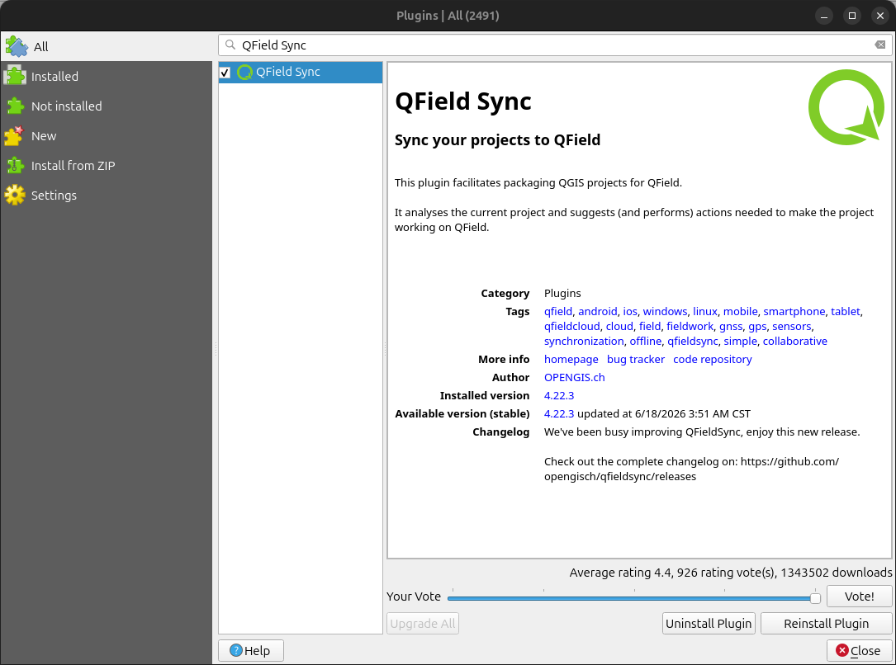
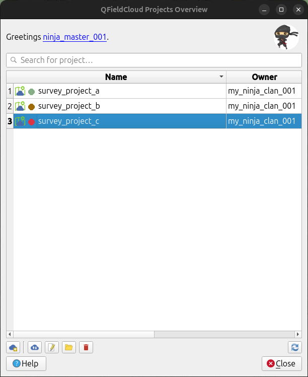
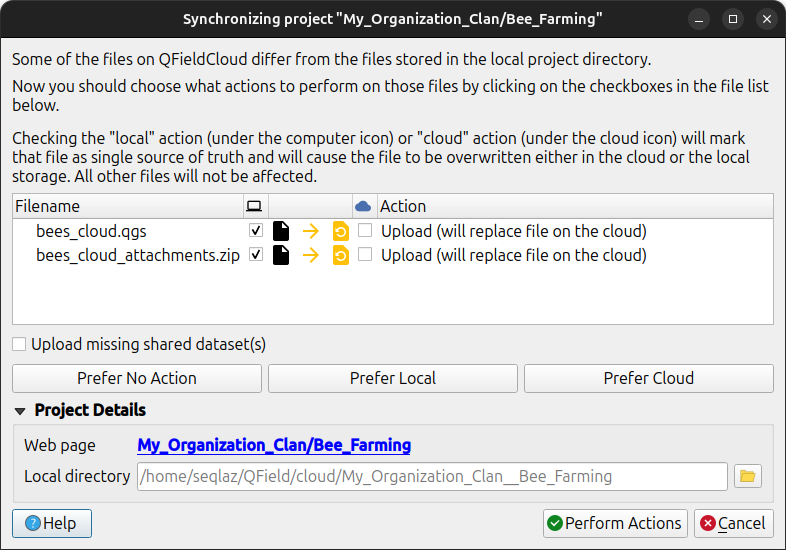
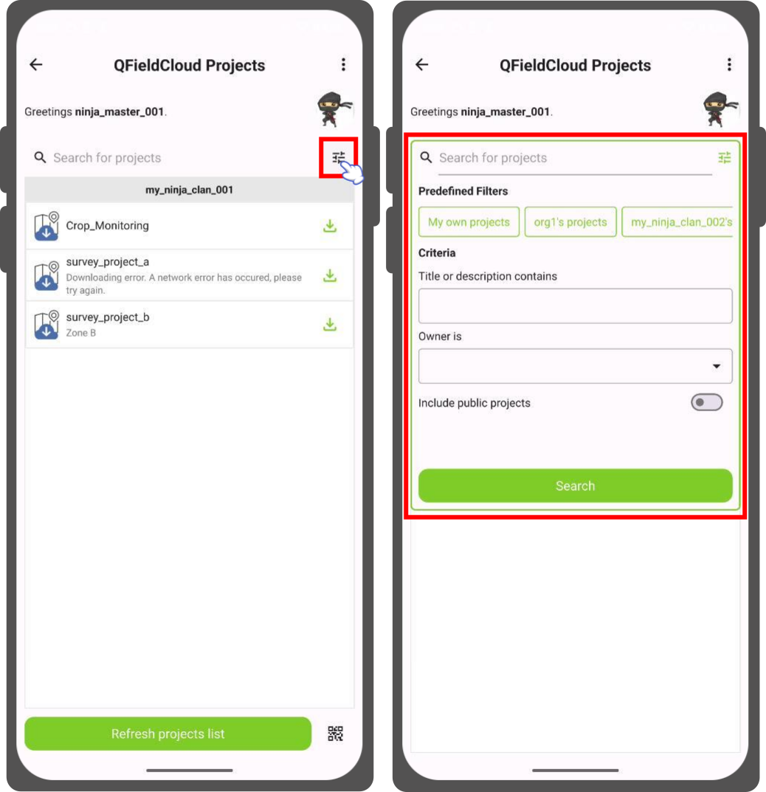

# Get started with QFieldCloud

## What is QFieldCloud

QFieldCloud is the cloud service that allows smoothless synchronisation of your data between your mobile device for fieldwork and your desktop working station.
You can further manage teams, work in organisations, assign different editing permissions and much more.

## Register to [QFieldCloud](https://app.qfield.cloud/accounts/signup/)
:material-monitor: Desktop preparation

!!! Workflow
    1. Go to the [Sign up page](https://app.qfield.cloud/accounts/signup/), enter your details and create a new QFieldCloud account.
    2. (Optionable) If you have a received a referral code, please enter it in the according field.
        !

## QFieldCloud Overview

Once registered your personal QFieldCloud landing page, will show you all the projects that you have access to in the center of the window.
In case that you have many projects, you can search in the search bar at the top of the page.
It is also possible to create a new empty project from this menu.
All further configuration of that project, however needs to be done inside QGIS.
Under your profile name, you are able to edit and manage your account details and get an overview of what organizations you are a member of, as well as what collaborations you have.
Finally, if you have subscribed to a personal plan with [QFieldCloud](https://qfield.cloud/pricing), you can manage it from here.

!!! Tip
    In the project overview page, the two names indicate the "Owner" of the project and the "Name" of the project.
    In case that you are the owner or a member of an organisation, you may find that the name will be different in case that you are not the project. owner.

!

## Project Creation

There are several ways to create and initialize a new project in QFieldCloud depending on your workflow. You can convert an existing QGIS project, start from a blank template on the web, or even clone an existing project.

[Click here to read more about project creation](create-project-qfc.md)

## From QFieldCloud to QGIS Desktop
:material-monitor: Desktop preparation

In order to connect to QFieldCloud, you need the QFieldSync plugin in QGIS. The next steps show you how you can install and synchronize your data to and from QFieldCloud.

!!! Workflow
    1. Open the QGIS plugin manager by going to the *Plugins* > *Manage and install Plugins*.
    2. Under "All" find QFieldSync in the list  and install the latest version by clicking the "Install Plugin" button.
        !
        After successful installation, a new toolbar appears:
        !
    3. Click the cloud icon {Width="20px"} in the QFieldSync toolbar and a new login screen will appear:
        !
    4. Enter your credentials previously created during account registration.

!!! Warning
    If you use a password in QGIS for the first time, it will ask you to set a master password that manages all the other passwords used in QGIS. More information about the master password here: [QGIS documentation](https://docs.qgis.org/latest/en/docs/user_manual/auth_system/auth_overview.html#master-password) <!-- markdown-link-check-disable-line -->

## Project Overview in QFieldSync

The projects overview shows the different projects that your account has access to.
The screen is arranged the following way:

- Current user underlined in blue
- The avatar on the top right leading to the sign out page.
- A cloud button to create a new project
- A refresh button on the right to refresh your project overview to the current stage.

!

Newly registered users will see an empty table.
By double-clicking on a project in the list, you can see and edit the specific project properties.

### Project Status

The icons indicate the cloud and local status of the different projects.

- **Local status**:

    - {Width="20px"} indicates that there is only a remote cloud project existing.

    - {Width="20px"} indicates that the cloud project is also locally stored.

- **Cloud status**: There are three different types of status indicated by a color which show the current status of your cloud project.
The status of each project is shown with a tooltip.
    - **Red Status:** The project is invalid and is not ready-for use in the field.
    There are multiple reasons for this and the status message on your QFieldCloud landing page is the first step to address the issue.
    - **Brown Status:** The project is currently being updated or edited.
    - **Green Status**: The project is ready to be used in the field.
    You can download the project down to QField.

### QField Project Settings

When you have installed the QFieldSync Plugin, a new section will appear under *Project* > *Properties*.
It is also available in the QFieldSync toolbar {Width="20px"} through the Settings icon.
Under these settings you can configure the following:

- How your project layers should be treated in the cloud. See [Get Started guide for QFieldSync](./get-started-qfs.md) to get more details on the different "Packaging Actions".
- Enable ["geofencing"](../../how-to/navigation-and-positioning/geofencing.md)
- Assign a digitizing log layer.
- Specify the layer that will be active for editing after selecting a [Map Theme](../../how-to/qfield-interface/map-themes.md)

We recommend to work with GeoPackages, especially when working in teams. See the [advanced setup guide](advanced-setup-qfc.md) for more information about vector formats.

!!! Important
    If you use experimental data sources without a primary key field (e.g. Shapefiles, GeoJSON etc), you must have a lowercase `fid` field that will be used as a primary key that uniquely identifies each feature.

### Project Upload

Once configured, the project can be uploaded to QFieldCloud.

!!! Workflow
    1. Press the cloud icon with the arrows via the QFieldSync toolbar.
    Here you have to decide what you prefer:
      - **The Local file**: This will replace your cloud file with a new version of the project.
          **Note**: When working with GeoPackages, the current version of the file in the cloud will be replaced with the local version.
      - **The Cloud file**: This will amend your local datasets and replace your project file with the current one.

!

Now you should see your project and files on your project overview page on [QFieldCloud](https://app.qfield.cloud/)

## Mobile Device

### Get Started with QField
:material-tablet: Fieldwork

When you are ready for your fieldwork it is time to setup QField on your mobile device.

!!! Workflow
    1. Download and install the latest version of QField from Google's play store, Apple's app store, or by [downloading the latest release for Windows, Linux, or macos](https://github.com/opengisch/QField/releases).
    2. Direct to *Cloud Projects* and log in to QFieldCloud on your mobile device
        !
        !
    3. Select a project to download on your device:
        !

#### Advanced Project Searching and Filtering

:material-tablet: Fieldwork

To easily manage an abundance of projects, QField features a rich search-and-filter panel directly on the QFieldCloud projects screen.

The **Filter button** sits to the right of the project search bar.

##### 1. Predefined Filter Presets

At the top of the filter panel is a quick preset buttons (such as _My Own Projects_, _{org_name}'s projects_). Tapping any preset instantly populates the criteria form and automatically filters the underlying list.

##### 2. Form-Based Filtering Criteria

You can fine-tune your project queries by filling out distinct fields in the filter pane:

- **Search term:** Filter projects by text matching their title or description.
- **Owner:** An editable dropdown combobox that automatically displays a list of unique project owners available to your account.
- **Include public projects:** A toggle switch that lets you pull in or hide community public projects.

!!! Note

    **Community projects** are projects that are marked as public by any project owner.
    Public projects are available to view to every user of QFieldCloud.
    Edits, however, can only be made in case that you as a project owner adds them as collaborators to your project.
    For this, you do not need to have an organization account.

##### 3. Power-User Search Syntax

The filter panel acts as visual "training wheels," but the main search bar is built for power users. Advanced filter parameters can be typed directly into the search bar using a dedicated key-value syntax.

Key parameters are dynamically recognized and highlighted in a distinct accent color directly inside the text input box.

Supported syntax tokens include:

- `owner:name` — Filters the list to only show projects belonging to a specific user or organization account name.
- `include:public` — Forces public projects to be included in the query evaluation.

> **Example Query:** Typing `owner:My_Organization include:public Forestry` directly into the search field instantly isolates public projects matching the keyword "Forestry" owned by "My_Organization".

!

### Synchronization with QFieldCloud

After you are done you will have to synchronize your changes back to QFieldCloud.
This can either be done manually or automatically if necessary.

!!! Workflow
    1. Open the *Side Dashboard*
    2. Click on the blue cloud (there should be a number indicating how many changes you have made).
        !
    3. Choose an action with the change you made to your data.
        Each of the actions have an explanation what you should expect to happen:
        - **Revert Changes:** All your local changes made since the last synchronization will be deleted.
        - **Push:** Only your local changes will be pushed to QFieldCloud.
        - **Synchronize:** All your changes will be pushed to QFieldCloud and merged with the version in the cloud.
            A new version of the cloud project (including the new changes from other collaborators) will be downloaded to your device.
        !

Your changes are now available to everyone who has access to your project on the cloud.

You can find more information on [Advanced QFieldCloud setup](./advanced-setup-qfc.md) and [QFieldCloud technical reference](../../reference/qfieldcloud/workflow.md).
