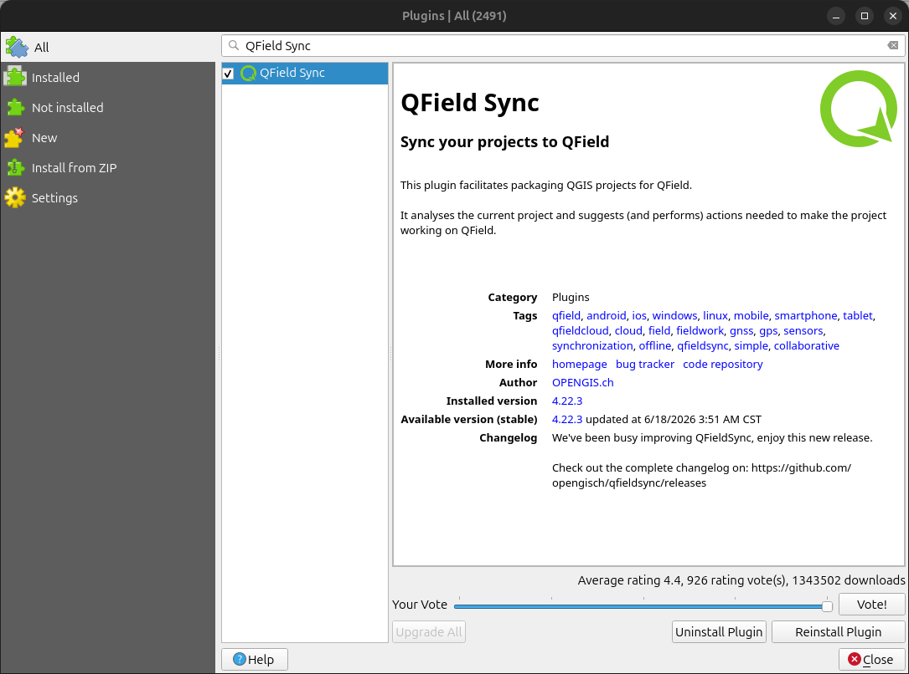
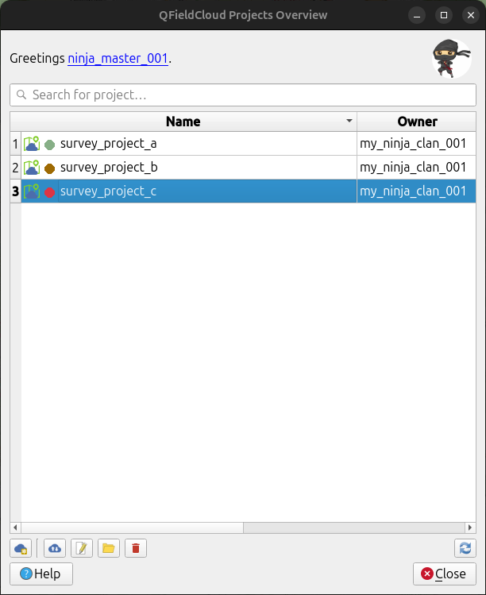
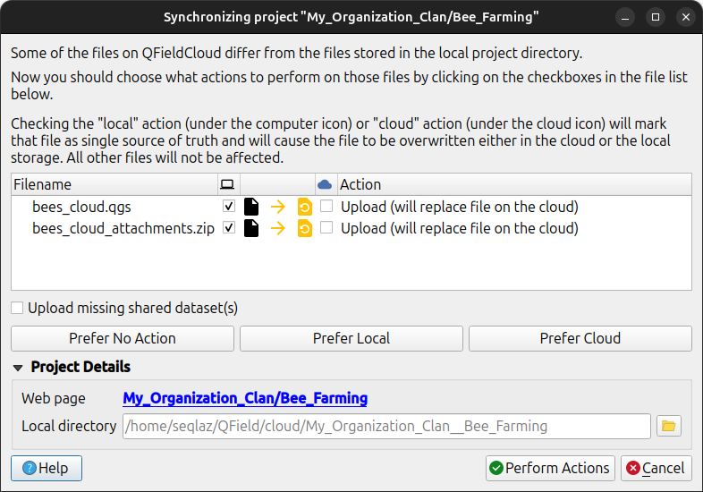
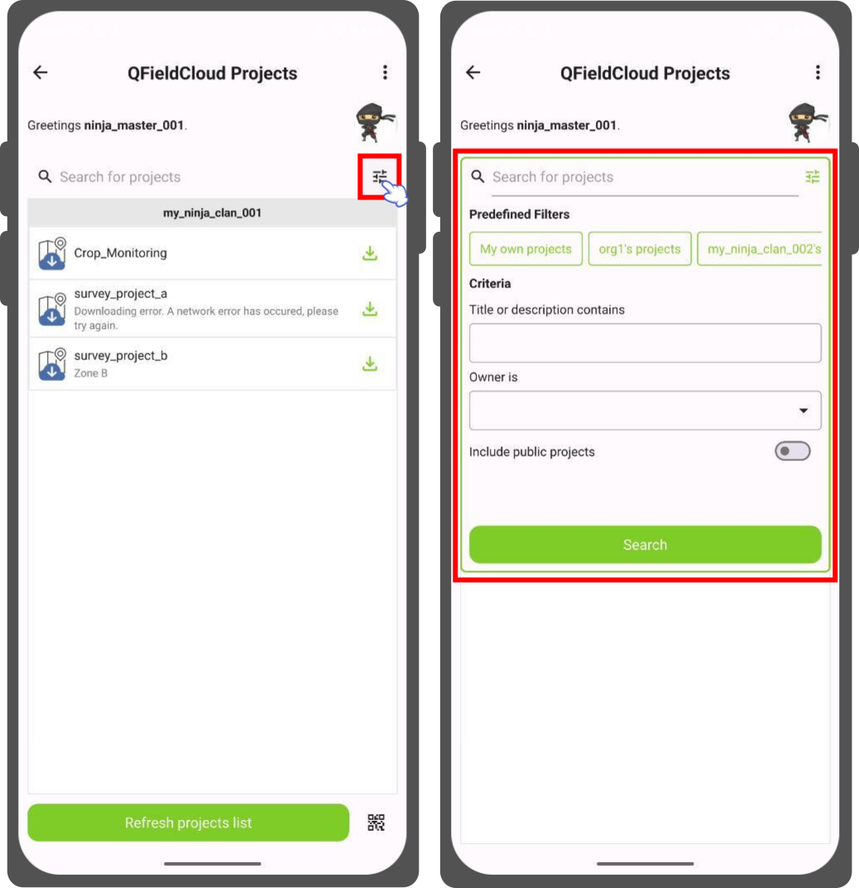

# Get started with QFieldCloud

## What is QFieldCloud

QFieldCloud is the cloud service that allows seamless synchronization of your data between your mobile device for fieldwork and your desktop workstation.
You can manage teams, work in organizations, assign different editing permissions, and much more.

## Register to [QFieldCloud](https://app.qfield.cloud/accounts/signup/)
:material-monitor: Desktop preparation

!!! Workflow
    1. Navigate to the [Sign up page](https://app.qfield.cloud/accounts/signup/), enter your details, and create a new QFieldCloud account.
    2. (Optional) If you received a referral code, enter it in the corresponding field.
        !

## QFieldCloud Overview

Once registered, your personal QFieldCloud landing page shows all projects that you can access in the center of the window.
If you have many projects, search for them in the search bar at the top of the page.
You can also create a new empty project from this menu.
All further project configurations must be completed inside QGIS.
Under your profile name, you can edit account details and view your organization memberships and project collaborations.
If you subscribed to a personal plan with [QFieldCloud](https://qfield.cloud/pricing), manage your plan from this menu.

Before getting started, familiarize yourself with the [basic concepts](../tutorials/concepts.md) of QFieldCloud.

!!! Tip
    In the project overview page, the two names indicate the project "Owner" and the project "Name".

!

### Filtering Projects
:material-monitor: Desktop

When managing a large number of cloud projects, refine your project list using the **"Filters"** dropdown button located next to the search bar.

!

The dropdown menu allows you to filter projects by three primary criteria:

- **Ownership:** *(Personal accounts only)*
    - **"My own projects":** Displays only projects where your account is the primary owner.
    - **"Shared with me":** Displays projects owned by collaborators or organizations where you have been granted access.
- **Project type:**
    - **"Regular projects":** Standard QGIS mapping projects created for field data collection.
    - **"Shared datasets":** Centralized datasets stored in the dedicated `shared_datasets` project repository.
    - **"Template Projects":** Projects locked for fieldworkers and used exclusively as project templates.

When any filter option is active, clicking the **"Clear"** button immediately resets all active filter parameters and restores the full project view.

## Project Creation

There are several ways to create and initialize a new project in QFieldCloud depending on your workflow.
You can convert an existing QGIS project, start from a blank template on the web, or clone an existing project.

[Click here to read more about project creation](create-project-qfc.md)

## From QFieldCloud to QGIS Desktop
:material-monitor: Desktop preparation

In order to connect to QFieldCloud, you need the QFieldSync plugin in QGIS.
The following steps show how to install the plugin and synchronize your data to and from QFieldCloud.

!!! Workflow
    1. Open the QGIS plugin manager by navigating to _Plugins > Manage and Install Plugins..._.
    2. Under **"All"**, find **"QFieldSync"** in the list and install the latest version by clicking the **"Install Plugin"** button.
        !
        After a successful installation, a new toolbar appears:
        !
    3. Click the cloud icon {Width="20px"} in the QFieldSync toolbar to display the login screen:
        !
    4. Enter your account credentials created during registration.

!!! Warning
    If you use a password in QGIS for the first time, QGIS prompts you to set a master password to manage all stored passwords.
    Read more about the master password in the [QGIS documentation](https://docs.qgis.org/latest/en/docs/user_manual/auth_system/auth_overview.html#master-password). <!-- markdown-link-check-disable-line -->

## Project Overview in QFieldSync

The project overview shows the projects that your account can access.
The screen contains the following elements:

- Current user underlined in blue
- The avatar on the top right leading to the sign-out page
- A cloud button to create a new project
- A refresh button on the right to update your project overview

!

Newly registered users will see an empty table.
Double-click a project in the list to view and edit project properties.

### Project Status

The icons indicate the cloud and local status of each project.

- **Local status:**
    - {Width="20px"} Indicates that only a remote cloud project exists.
    - {Width="20px"} Indicates that the cloud project is also stored locally.
- **Cloud status:** Three color-coded statuses display the current state of your cloud project.
    A tooltip shows the status of each project.
    - **Red Status:** The project is invalid and not ready for field use.
        The status message on your QFieldCloud landing page provides details to address the issue.
    - **Brown Status:** The project is currently being updated or edited.
    - **Green Status:** The project is ready for field use.
        You can download the project to QField.

### QField Project Settings

After installing the QFieldSync plugin, a new section appears under _Project > Properties..._.
Access these settings from the QFieldSync toolbar {Width="20px"} using the **"Settings"** icon.

Configure the following parameters in these settings:

- Define how project layers are treated in the cloud (see the [QFieldSync Get Started Guide](./get-started-qfs.md) for details on **"Packaging Actions"**).
- Enable ["geofencing"](../../how-to/navigation-and-positioning/geofencing.md).
- Assign a digitizing log layer.
- Specify the active layer for editing after selecting a [Map Theme](../../how-to/qfield-interface/map-themes.md).

We recommend using GeoPackages, especially when collaborating in teams.
See the [Advanced Setup Guide](advanced-setup-qfc.md) for more information about vector formats.

!!! Important
    If you use experimental data sources without a primary key field (such as Shapefiles or GeoJSON), you must include a lowercase `fid` field as a primary key to uniquely identify each feature.

### Project Upload

Once configured, upload the project to QFieldCloud.

!!! Workflow
    1. Click the cloud icon with arrows in the QFieldSync toolbar.
    Select your preferred upload method:
      - **"The Local file":** Replaces your cloud file with the new local version of the project.
          When working with GeoPackages, the cloud file version is replaced by your local file version.
      - **"The Cloud file":** Amends your local datasets and replaces your local project file with the current cloud version.

!

You can now view your project and files on your [QFieldCloud project overview page](https://app.qfield.cloud/).

## Mobile Device

### Get Started with QField
:material-tablet: Fieldwork

When you are ready for fieldwork, set up QField on your mobile device.

!!! Workflow
    1. Download and install the latest version of QField from the Google Play Store, Apple App Store, or [download the latest release](https://github.com/opengisch/QField/releases) for Windows, Linux, or macOS.
    2. Navigate to **"Cloud Projects"** and log in to your QFieldCloud account on your mobile device.
        !
        !
    3. Tap a project to download it to your device.
        !

#### Advanced Project Searching and Filtering

:material-tablet: Fieldwork

To manage a large number of projects, QField features a search-and-filter panel directly on the QFieldCloud projects screen.
The **"Filter"** button is located to the right of the project search bar.

##### 1. Predefined Filter Presets

Quick preset buttons appear at the top of the filter panel (such as **"My Own Projects"** or **"{org_name}'s projects"**).
Tapping a preset populates the criteria form and automatically filters the underlying list.

##### 2. Form-Based Filtering Criteria

Fine-tune your project queries by filling out fields in the filter pane:

- **Search term:** Selects every project title or description containing the provided term.
- **Owner:** Displays a list of unique project owners available to your account in an editable dropdown menu.
- **Include public projects:** Toggles community public projects on or off.

!!! Note
    **Community projects** are projects marked as public by any project owner.
    Public projects are viewable by all QFieldCloud users.
    However, users can only edit public projects if the project owner adds them as project collaborators.
    You do not need an organization account to collaborate on public projects.

##### 3. Power-User Search Syntax

The main search bar allows power users to type advanced filter parameters directly using key-value syntax.
Key parameters are dynamically recognized and highlighted inside the text input box.

Supported syntax tokens include:

- `owner:name` — Filters the list to show projects belonging to a specific user or organization account name.
- `include:public` — Forces public projects to be included in the query evaluation.

> **Example Query:** Typing `owner:My_Organization include:public Forestry` into the search field isolates public projects matching the keyword "Forestry" owned by "My_Organization".

!

### Synchronization with QFieldCloud

After completing field data collection, synchronize your changes back to QFieldCloud.

!!! Workflow
    1. Open the **Side Dashboard** in QField.
    2. Tap the cloud icon (a badge indicates your number of pending local changes).
        !
    3. Tap the appropriate action card for your data:
        - **"Upload local changes":** Sends your edits and attachments to the cloud without downloading updates from other collaborators.
        This option is fast and saves internet bandwidth.
        - **"Synchronize project":** Uploads your local edits, then downloads the latest project version from QFieldCloud to keep everything up to date.
        - **"Upload history":** Tap this button below the main action cards to view a log of past uploads, including timestamps and statuses (such as **"Applied"**, **"Pending"**, **"Conflict"**, or **"Error"**).
        - **"Danger zone":** Tap this button to access options for discarding un-uploaded local changes or restoring the cloud version of the project.
        Tap **"Discard local changes"** to remove un-uploaded local edits, or tap **"Reset project"** to re-download the cloud project if your local copy becomes corrupted.

        !

Your changes are now available to all users with project access on the cloud.

Find more information in the [Advanced QFieldCloud Setup Guide](./advanced-setup-qfc.md) and [QFieldCloud Technical Reference](../../reference/qfieldcloud/workflow.md).
