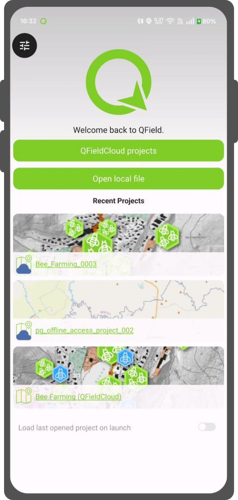
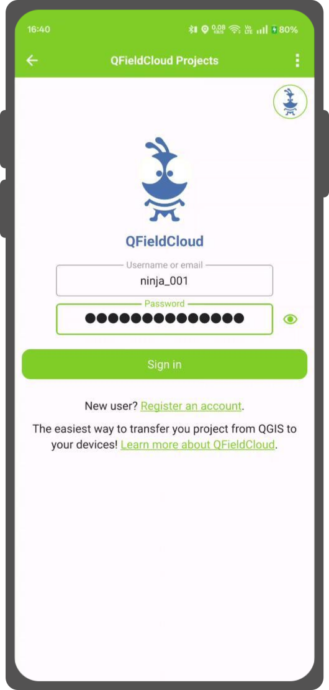
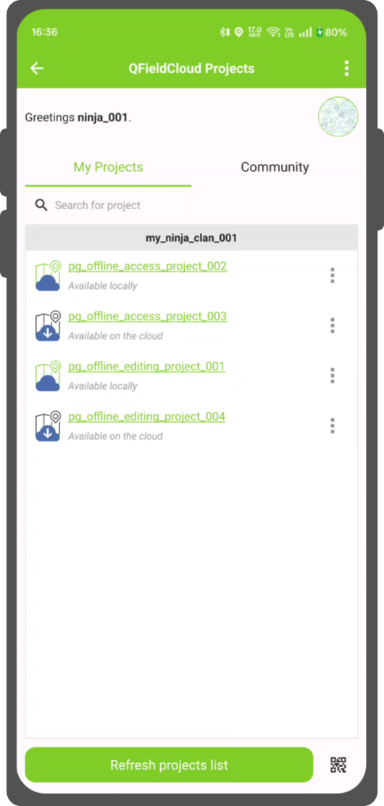

# Getting started guide

!!! help
    We have a [community discussion platform](https://github.com/opengisch/qfield/discussions) to discuss your questions, doubts and ideas. Do not hesitate to check it out.

## Get a QFieldCloud account

## Desktop

### Install QFieldSync
Enable experimental plugins in QGIS by going to the `Plugins -> Manage and install Plugins…` menu. Then click the `Settings` with the yellow icon on the left. Mark the second checkbox `Show also experimental plugins` as checked.

!
Find QFieldSync in the list of plugins and install the latest experimental version by clicking the `Upgrade Experimental Plugin` button.

!!! note
    Since QFieldSync is still in beta phase, there are regular updates and fixes at least once a week. Please upgrade your experimental QFieldSync at least once a week. In case of an issue, please try upgrading to the latest experimental release before reporting.

After successful installation, a new toolbar appears:

### Login to QFieldCloud

Click the cloud icon in the QFieldSync toolbar.
A new login screen will appear:

Explore the projects overview screen: your current user underlined and blue, a logout button down-left, a cloud button to create a new project and, on the right, a refresh button to grab the freshest project list. Newly registered users will see an empty table and as soon as they create new projects, the list will grow. The projects overview screen looks like this:

### Create and configure your project

Create a new project by clicking the cloud button, down-left. First, you will need to choose how to create the new project between

* "Convert currently open project to cloud project"
A new QFieldCloud-compatible project is created from the currently opened QGIS project. In order to do so, datasets will be copied into an export directory that will act as your local mirror. Vector datasets will be converted to geopackage format to facilitate data synchronization from multiple devices while other dataset types will be copied to the new project lotation.

To convert a current project, a completely empty directory is mandatory.

* "Create a new empty QFieldCloud project".
A new blank QFieldCloud project will be created. You will be responsible to move all the project-related files within the selected local directory, with the project file at its root. Project files will only be uploaded when you click the synchronize button. Make sure the selected contains no more than one QGIS project file.

A form will ask you for project name, description and local directory. In the local directory you can get different situations:

* The entered path does not contain a QGIS project file yet.
* The entered path contains one QGIS project file.
* Please select local directory where the project to be stored.
* The entered path is a relative path. Please enter an absolute directory path.
* The entered path is not an directory. Please enter a valid directory path.
* The entered path is not an existing directory. It will be created after you submit this form.
* Multiple project files have been found in the directory. Please leave exactly one QGIS project in the root directory.

Configure the project layers by clicking the fifth icon in the QFieldSync toolbar. Here you can configure QFieldCloud layer actions. Most of the time you need to configure a preference either to online or offline layers. For more fine grained control, in the advanced settings you can configure the action layer by layer.

It is recommended to use GeoPackage layers for collaborative editing. See the [advanced setup guide](advanced-setup.md) for more information about vector formats support.

Any QField supported raster and vector layer formats may be used as read-only data.

### Upload a project
Once configured, you can press the cloud button to open the synchronization dialog. Here you have to decide what do you prefer: the local file or the file on the cloud.

Now you should see your project and files on [QFieldCloud](https://app.qfield.cloud/)

## Field device

### Install QField
Download and install the latest version of [QField from the play store](https://play.google.com/store/apps/details?id=ch.opengis.qfield_dev). Scroll to the bottom and enable beta testing.
Do not use this version in production!

!!! note
    Since QField 2.0 is still in beta phase, there are regular updates and fixes at least on a weekly basis. Please upgrade your experimental QField at least once a week. In case of an issue, please try to reproduce on the latest release before reporting.

### Start working on your project

Login with your username and password

Select a project to download on your device:

### Synchronise your changes
Make a change to your project. Either create a new feature, delete a feature, or modify the geometry or attributes.
Open the blue cloud button on the top left of the screen:

Choose an action with the change you made to your project. Each of the actions have an explanation what you should expect to happen:

Your changes are now available to everyone who has access to your project.
