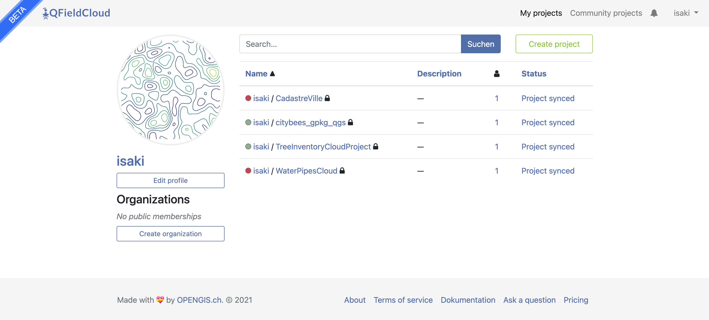
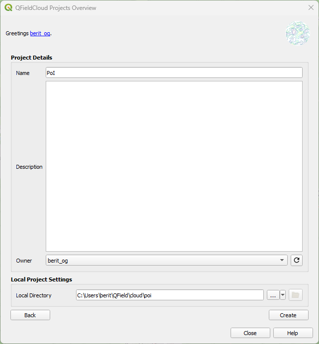
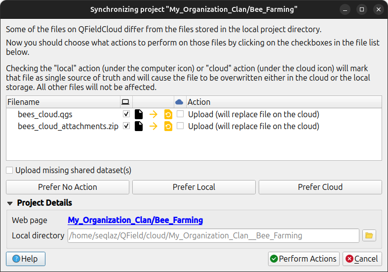

# Get started with QFieldCloud

## What is QFieldCloud

QFieldCloud is the cloud service that allows smoothless synchronisation of your data between your mobile device for fieldwork and your desktop working station.
You can further manage teams, work in organisations, assign different editing permissions and much more.

## Register with QFieldCloud [QFieldCloud account](https://app.qfield.cloud/accounts/signup/)
:material-monitor: Desktop preparation

!!! Workflow
    1. Go to the [Sign up page](https://app.qfield.cloud/accounts/signup/), enter your details and create a new QFieldCloud account.

    2. (Optionable) If you have a received a referral code, please enter it in the according field.

        !

## QFieldCloud Overview

Once registered your personal QFieldCloud landing page, will show you all the projects that you have access to in the center of the window.
In case that you have many projects, you can search in the search bar at the top of the page.
It is also possible to create a new empty project from this menu.
All further configuration of that project, however needs to be done inside QGIS.
Under your profile name, you are able to edit and manage your account details and get an overview of what organizations you are a member of, as well as what collaborations you have.
Finally, if you have subscribed to a personal plan with [QFieldCloud](https://qfield.cloud/pricing), you can manage it from here.

!!! Tip
    In the project overview page, the two names indicate the "Owner" of the project and the "Name" of the project.
    In case that you are the owner or a member of an organisation, you may find that the name will be different in case that you are not the project. owner.

!

## From QFieldCloud to QGIS Desktop
:material-monitor: Desktop preparation

In order to connect to QFieldCloud, you need the QFieldSync plugin in QGIS. The next steps show you how you can install and synchronize your data to and from QFieldCloud.

### Install QFieldSync

Open the QGIS plugin manager by going to the `Plugins -> Manage and install Plugins…` menu.

Find QFieldSync in the list of plugins and install the latest version by clicking the `Install Plugin` button.

!!! note
    Since QFieldCloud is still in beta phase, there are frequent updates and fixes. Please upgrade your QFieldSync plugin often. In case of an issue, please try upgrading to the latest release before reporting.

        !

        After successful installation, a new toolbar appears:

        !

    3. Click the cloud icon {Width="20px"} in the QFieldSync toolbar and a new login screen will appear:

        

    4. Enter your credentials previously created during account registration.

Enter your credentials previously created during account registration.

!!! note
    If you use a password in QGIS for the first time, it will ask you to set a master password that manages all the other passwords used in QGIS. More information about the master password here: [QGIS documentation](https://docs.qgis.org/3.4/en/docs/user_manual/auth_system/auth_overview.html#master-password)

## Project Overview in QFieldSync

The projects overview shows the different projects that your account has access to.
The screen is arranged the following way:

- Current user underlined in blue
- A logout button at the bottom left
- A cloud button to create a new project
- A refresh button on the right to refresh your project overview to the current stage.

!

Newly registered users will see an empty table.
By double-clicking on a project in the list, you can see and edit the specific project properties.

### Project Status

The icons indicate the cloud and local status of the different projects.

- **Local status**:

    - {Width="20px"} indicates that there is only a remote cloud project existing.

    - {Width="20px"} indicates that the cloud project is also locally stored.

Red: status failed —> the project is invalid and is not understood by the cloud. The user needs to fix/upload their .qgs/.qgz project.
Brown: status busy —> we are working on your project, please be patient. You cannot do much with the project in the meanwhile.
Green: status ok —> the project is successfully undestood by the cloud. You can try to download on QField, but the success is not guaranteed.

The status of each project is shown with a tooltip.

By double-clicking on a project in the list, you can see and edit the specific project properties.

!

## Create and configure your cloud project

Create a new project by clicking the cloud button, down-left. First, you will need to choose how to create the new project between

* "Convert currently open project to cloud project"
  A new QFieldCloud-compatible project is created from the currently opened QGIS project. In order to do so, datasets will be copied into an export directory that will act as your local mirror. Vector datasets will be converted to geopackage format to facilitate data synchronization from multiple devices while other dataset types will be copied to the new project lotation.

To convert a current project, a completely empty directory is mandatory.

* "Create a new empty QFieldCloud project"
  A new blank QFieldCloud project will be created. You will be responsible to move all the project-related files within the selected local directory, with the project file at its root. Project files will only be uploaded when you click the synchronize button. Make sure the selected contains no more than one QGIS project file.

        !

    4. A form will ask you for project name, description and local directory.
        In the local directory you can get different situations:

        * "The entered path does not contain a QGIS project file yet"
        * The entered path contains one QGIS project file.
        * Please select local directory where the project to be stored.
        * The entered path is a relative path. Please enter an absolute directory path.
        * The entered path is not an directory. Please enter a valid directory path.
        * The entered path is not an existing directory. It will be created after you submit this form.
        * Multiple project files have been found in the directory. Please leave exactly one QGIS project in the root directory.
        !

### QField Project Settings

When you have installed the QFieldSync Plugin, a new section will appear under *Project* > *Properties*.
It is also available in the QFieldSync toolbar {Width="20px"} through the Settings icon.
Under these settings you can configure the following:

- How your project layers should be treated in the cloud. See [Get Started guide for QFieldSync](./get-started-qfs.md) to get more details on the different "Packaging Actions".
- Enable ["geofencing"](../../how-to/geofencing.en.md)<!-- markdown-link-check-disable-line -->
- Assign a digitizing log layer.
- Specify the layer that will be active for editing after selecting a [Map Theme](../../how-to/map-themes.en.md) <!-- markdown-link-check-disable-line -->

It is recommended to use GeoPackage layers for collaborative editing. See the [advanced setup guide](advanced-setup-qfc.md) for more information about vector formats support.

!!! Important
    If you use experimental data sources without a primary key field (e.g. Shapefiles, GeoJSON etc), you must have a lowercase `fid` field that will be used as a primary key that uniquely identifies each feature.

### Project Upload

Once configured, the project can be uploaded to QFieldCloud.

!

### Upload a project

Once configured, you can press the cloud button to open the synchronization dialog. Here you have to decide what do you prefer: the local file or the file on the cloud.

!

Now you should see your project and files on your project overview page on [QFieldCloud](https://app.qfield.cloud/)

## Mobile Device

### Get Started with QField
:material-tablet: Fieldwork

When you are ready for your fieldwork it is time to setup QField on your mobile device.

Download and install the latest version of QField from Google's play store, Apple's app store, or by [downloading the lastest release for Windows, Linux, or macos](https://github.com/opengisch/QField/releases).

    2. Direct to *Cloud Projects* and log in to QFieldCloud on your mobile device

        !

        !

    3. Select a project to download on your device:

        !

### Synchronization with QFieldCloud

After you are done you will have to synchronize your changes back to QFieldCloud.
This can either be done manually or automatically if necessary.

!!! Workflow
    1. Open the *Side Dashboard*
    2. Click on the blue cloud (there should be a number indicating how many changes you have made).

        !

    3. Choose an action with the change you made to your data.
        Each of the actions have an explanation what you should expect to happen:

        - **Revert Changes:** All your local changes made since the last synchronization will be deleted.
        - **Push:** Only your local changes will be pushed to QFieldCloud.
        - **Synchronize:** All your changes will be pushed to QFieldCloud and merged with the version in the cloud.
            A new version of the cloud project (including the new changes from other collaborators) will be downloaded to your device.

        !

Your changes are now available to everyone who has access to your project on the cloud.

You can find more information on [Advanced QFieldCloud setup](./advanced-setup-qfc.md) and [QFieldCloud technical reference](../../reference/qfieldcloud/concepts.md).
