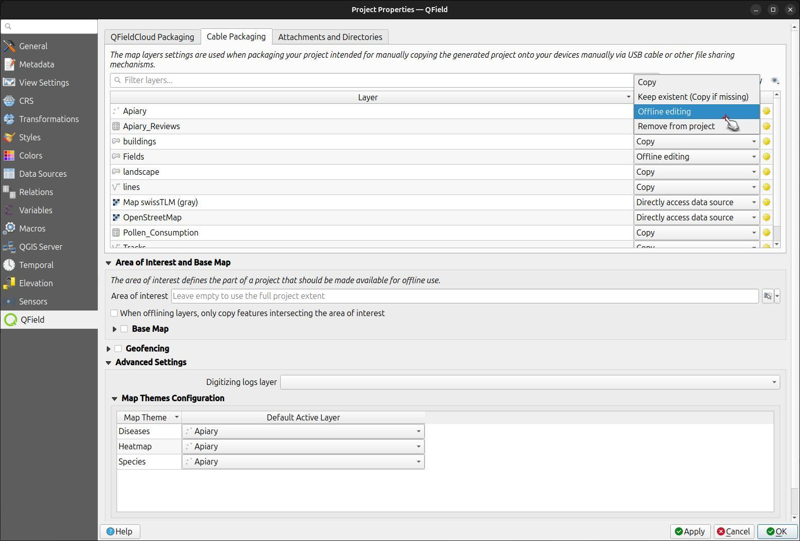
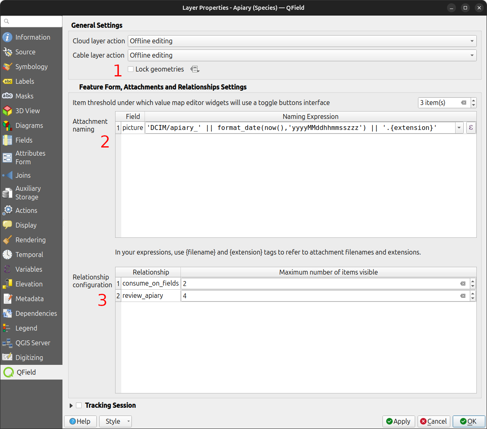
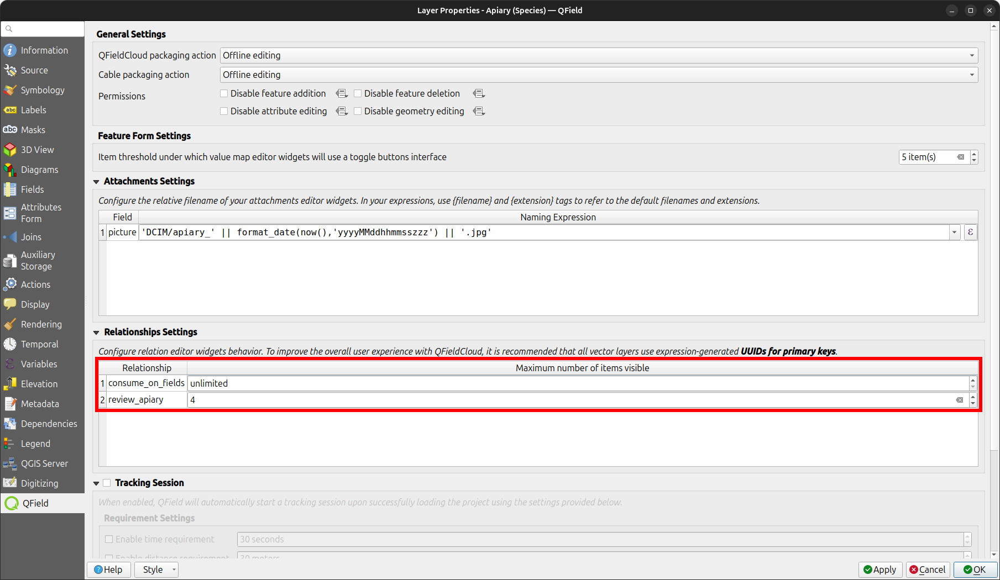
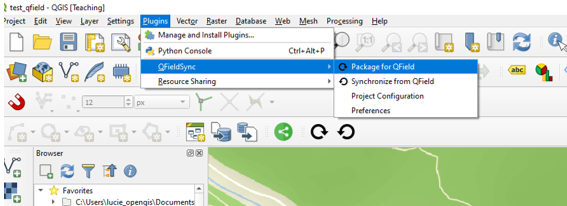
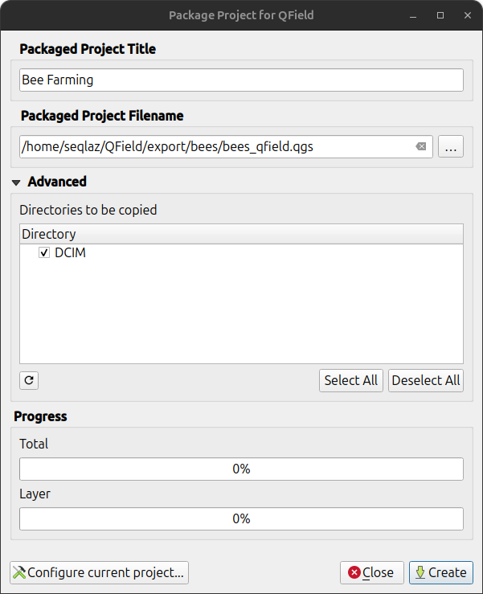
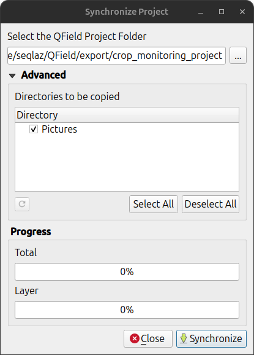

# QFieldSync

The [QFieldSync plugin for QGIS](https://plugins.qgis.org/plugins/qfieldsync/) helps preparing and packaging QGIS projects for
QField.

QFieldSync supports your project preparation with automating the
following:

-   Required steps for project setup (e.g.
    `portable_project`)
-   Creating basemaps from a single raster layer or from a style defined
    in a map theme.
-   Configuring the offline editing functionality and synchronizing
    changes back.

## Workflow

To get a quick overview of the process, here is a list of typical steps:

1.  Create a QField package. This is a working copy in a separate
    folder.
2.  Copy the QField package to the target device.
3.  Go out and collect data.
4.  Copy the modified data back to your desktop computer.
5.  Synchronize the modified data with your database or files.

## Installation

In QGIS, open the plugin library and search for **qfield sync**. Select
the plugin in the list and click on **Install**.

!

## Configuration

The project configuration is saved in the master .qgs project file. This
way it is possible to pre-configure a project once and use it
repeatedly.

!

### Layer configuration

!

In the project configuration dialog, an *action* can be defined for each
layer individually. Depending on the layer type, different types of
actions are available.

Copy

:   The layer will be copied to the package folder. This is only
    available for file-based layers.

No action

:   The layer source will be left untouched. This is only available for
    non-file-based layers like WMS, WFS, Postgis\...

Offline editing

:   A working copy of the layer is copied into the package folder. Every
    change which is done in the packaged project during work is recorded
    in a changelog. When synchronizing the changes back later on, this
    log will be replayed and all changes also be applied to the main
    data base. There is no conflict handling in place.

Remove

:   The layer will be removed from the working copy. This is useful if a
    layer is used in the basemap and will not be available in the
    packaged project.

Properties

:   There are some additional options to fine tune your QField project in the properties

1. Lock geometries: do not allow changing geometries and only allow changing attributes on this layer.

2. Set up the attachment default naming, please refer to the [Configurable picture path](../../how-to/pictures.md#configurable-attachment-path)

3. Set up the maximum number of items shown in the relation editor widget

!

#### Configuring maximum items visibility for QField

To adjust the maximum number of visible items in a relationship within QField, follow these steps:

1. **Access Layer Properties Dialog**:
   - Open the layer properties dialog in QGIS where the relation editor is displayed.

2. **Navigate to QField Tab**:
   - Locate the QField tab, typically located at the bottom of the layer properties dialog.

3. **Modify Relationship Configuration**:
   - In the "Relationship configuration" section, locate the section corresponding to the relationship you want to modify.

4. **Adjust Visibility Limit**:
   - Within the row for the desired relationship, find the "Maximum number of items visible" column.
   - Delete the existing numerical value to set the visibility to "unlimited", the field will transform from a number (default 4) to "unlimited".
   - Click "Apply" to save the changes to the layer properties.

!

!

### Base map configuration

A base map is a raster layer which is added as the bottommost layer to
the packaged project file.

If the base map option is enabled, a base map will be rendered, whenever
the project is packaged. The area of interest - the extent which will be
rendered -will be chosen at packaging time.

There are two possible sources for a base map:

Layer

:   A raster layer. This is useful to take an offline copy of an online
    layer like a WMS or to take a working copy of an unsupported format
    like an ECW or MrSID layer.

Map Theme

:   A map theme. This is useful to create a base map based on a
    combination of several layers with styling. These layers can then be
    removed from the working package and do not need to be rendered on
    the device. This can save some disk space and battery on the device.

The tile size defines the spatial resolution. It determines the number
of map units per pixel. If the map canvas CRS has meters as units and
tile size is set to 1, each raster pixel will have a spatial extent of
1x1 m, if it is set to 1000, each raster pixel will have a spatial
extent of 1 square kilometer.

!!! note
    Base map generation is disabled on QFieldCloud. You can still manually add your basemaps by running "Generate XYZ tiles (MBTiles)" or "Convert map to raster" algorithms in the processing framework.

### Offline editing configuration

If *only synchronize features in area of interest* is checked, only
features which are within the extent of the map canvas as packaging time
will be copied to the offline editing working copy.

## Package for QField

To package your project, click on Plugins > QFieldSync > Package for QField. Once the project is configured, proceed to package it into a folder. This folder will contain both the QGIS project file (`.qgs`) and the associated data.

!

Even though QFieldSync doesn't display packaging options by default in the Toolbar panel, you can still access them through Plugins > QFieldSync > Preferences.

!

Simply activate the checkbox labeled "Show the packaging options in the toolbar."

!

!

!

Copy the folder on your device. Open QField, open the project and start
collecting data.

Make also sure to save the QGIS project using the regular Save As of
QGIS as you'll have to re-open it later when you want to synchronize
the changes.

During packaging your project you can select which subdirectories to be copied by checking the directories in `Advanced` -> `Directories to be copied`.

!

## How to sync from/to iOS device without QFieldCloud

Use iTunes' File Sharing function to import into the QField root folder.

1. Open the iTunes app and click on the iPhone button near the top-left of the iTunes window.
2. Click on the *File Sharing* option in the left sidebar.
3. Select the app QField and click on *Add File*. This will open the file browser.
4. Select the file.

## Synchronize from QField

When you want to synchronize what you have collected, re-open the
project in QGIS (the one you saved with a regular Save As).

Copy the project folder from your device to your computer and use the
**Synchronize from QField** menu to synchronize your changes from the
protable project to the main project.

!

Make sure that you synchronize your data back only once. That means, if
you go out again to collect more data, you should create a new QField
package before to avoid sync problems later on (like e.g. duplicates).
