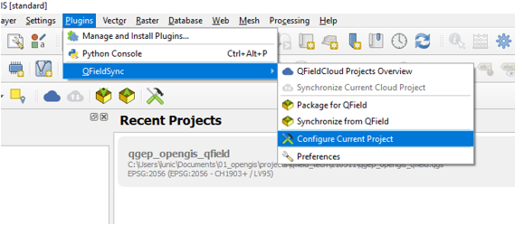
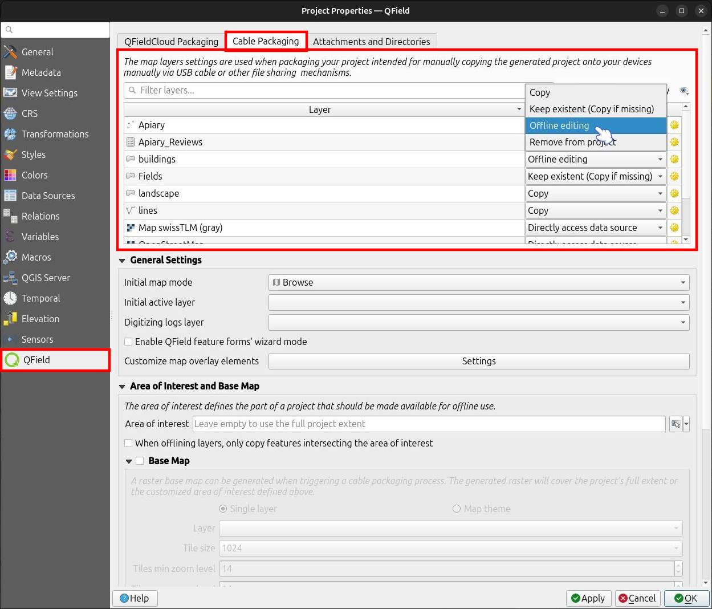
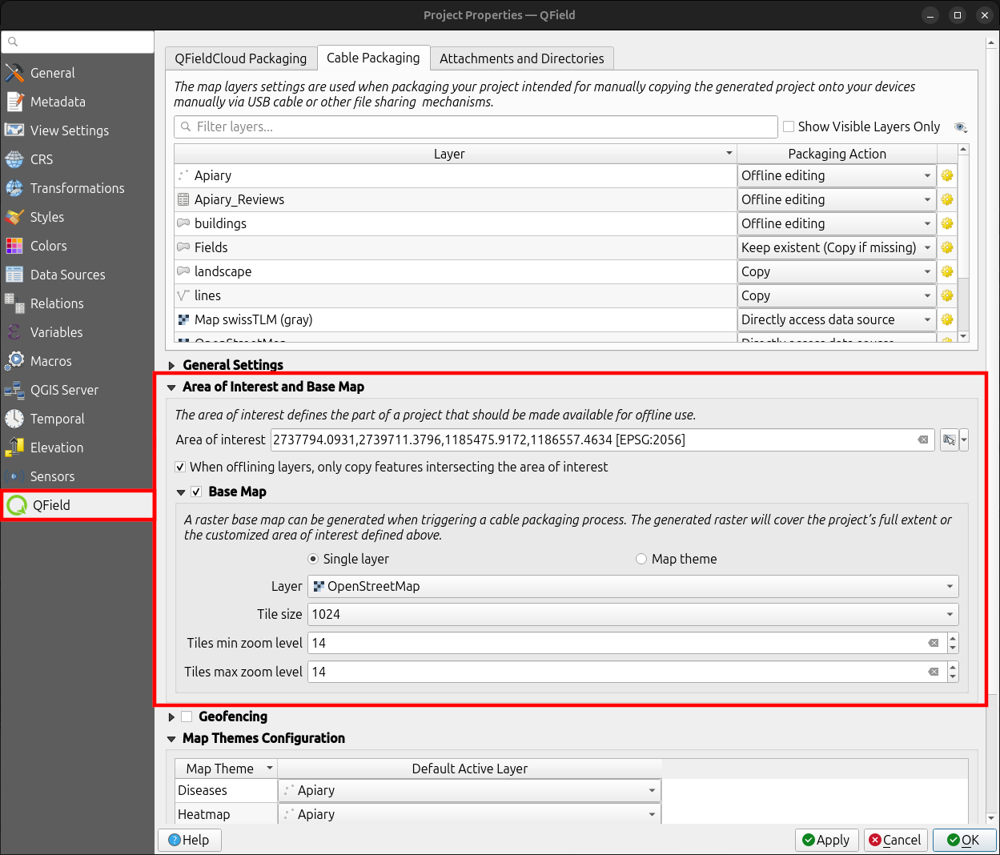
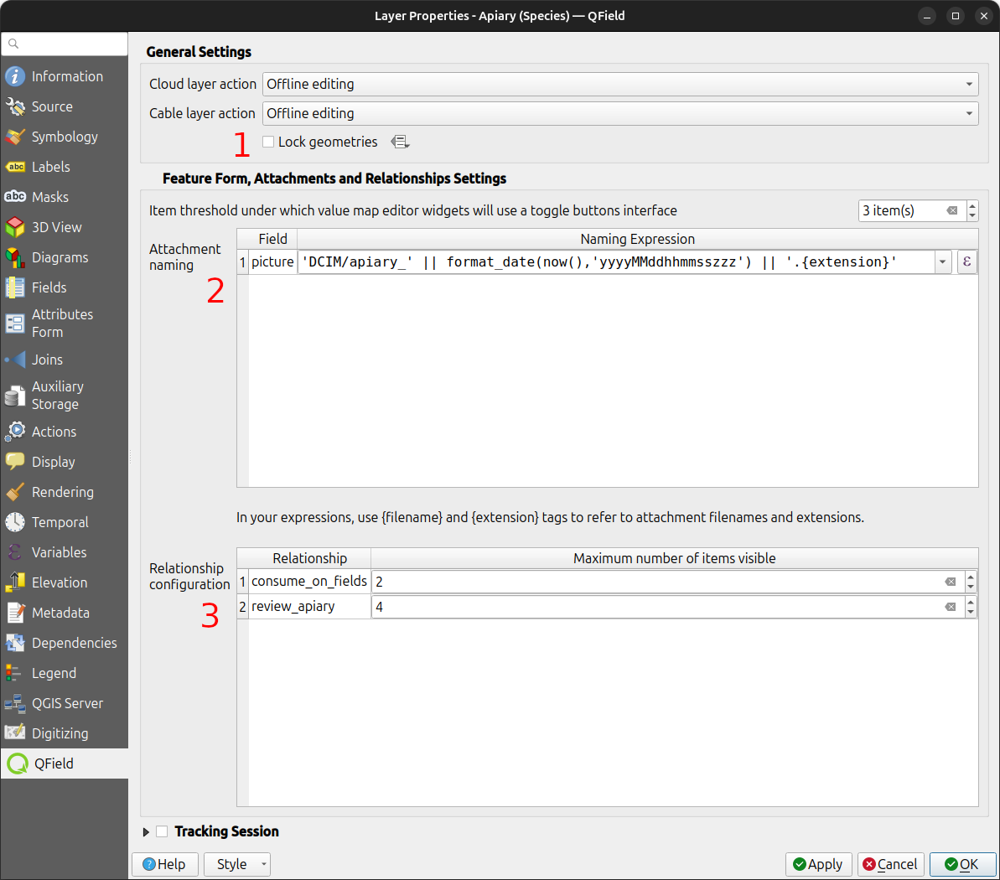
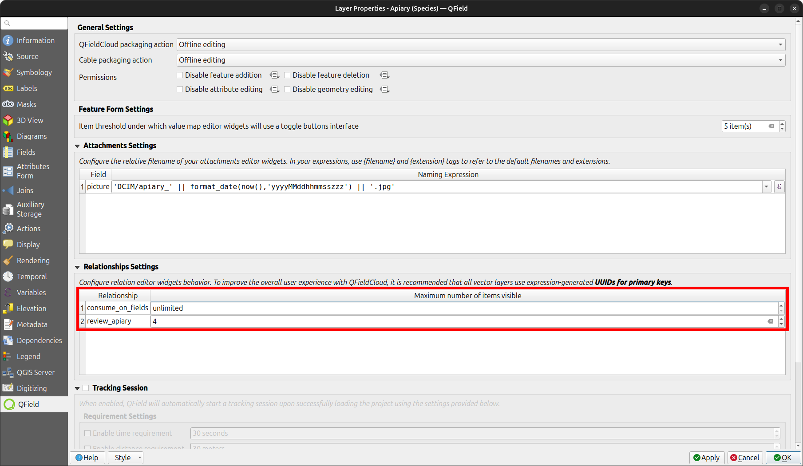
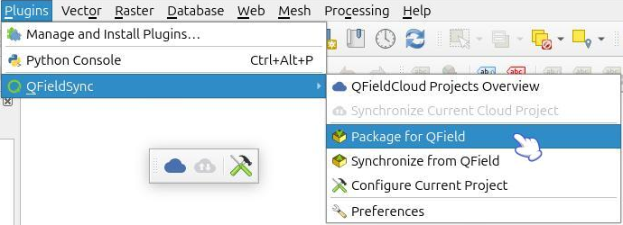
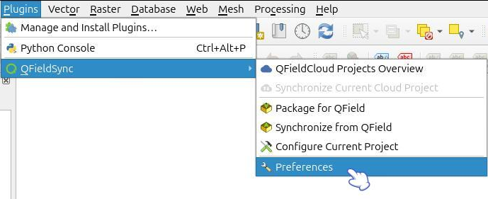

# QFieldSync for Cable Packaging

[QFieldSync (QFS)](https://plugins.qgis.org/plugins/qfieldsync/) <!-- markdown-link-check-disable-line -->
is the QGIS plugin used to package your projects for QField and make them available for field collection.
You also use this plugin to connect to [QFieldCloud](advanced-setup-qfc.md).

QFieldSync performs the following tasks:

- Packages your project into a QField-readable format (such as a portable project directory).
- Creates basemaps from a single raster layer or from a style defined in a map theme.
- Sets project layers to **"Offline editing"** by default.
- Synchronizes changes made in the field back to the desktop project.

A typical workflow involves the following steps:

!!! Workflow
    1. Create a QField package as a working copy in a separate folder.
    2. Copy the QField package folder to the target device.
    3. Collect data in the field using QField.
    4. Copy the modified data folder back to your desktop computer.
    5. Synchronize the modified data with your local QGIS project or database.

## Installation

Before using QField, install the QFieldSync plugin through the QGIS plugin repository.

!!! Workflow
    1. In QGIS, navigate to _Plugins > Manage and Install Plugins..._.
    2. Search for **"QFieldSync"**.
    3. Select the plugin from the list and click **"Install Plugin"**.

       !

## QFieldSync Settings

Prepare your QGIS project according to your requirements and save it as a `.qgs` or `.qgz` file.
Save the project in a dedicated folder to reuse it for future packaging.

!

### Layer Packaging for Manual Cable Transfer

To synchronize your QField projects with QGIS via QFieldSync, convert each layer into a supported format.
Set the required action for each layer in the project configuration dialog.
An action defines whether QFieldSync tracks layer changes, directly accesses an online data source, or treats the layer as read-only.

!

Depending on the layer type, the following actions are available:

- **"Copy"** (available only for file-based layers such as GeoPackage, Shapefile, or TIFF): Copies the layer to the packaged project folder without tracking changes.
If a GeoPackage contains multiple layers, QFieldSync packages all layers in that file even if only one layer is included in the QGIS project.
Save one layer per GeoPackage file unless multiple layers per file are strictly necessary.
Refer to [best practices](../../get-started/tutorials/tips-tricks-qfc.md#project-configuration-best-practices) for additional recommendations.
- **"Keep existing (copy if missing)":** Leaves the layer source untouched.
Use this option for long-term projects with frequent synchronization to avoid repackaging the file during every export.
- **"Offline editing":** Copies the layer into the packaged project folder and tracks changes in a changelog database.
When synchronizing changes back to the desktop project, QFieldSync applies recorded changes to the original source layer.
This option allows you to track modifications and collaborate with multiple users.
- **"Directly access data source"** (available only for non-file-based layers): Accesses online data directly without copying files.
This option applies to online services such as WMS, WFS, or PostGIS layers.
When using online PostGIS layers, copy your database credentials to QField.
Read more in the [PostgreSQL documentation](../../how-to/project-setup/pg-service.md#configuration-on-mobile-device).
- **"Remove":** Excludes the layer from the packaged project.

### Area of Interest and Basemap

A basemap is a raster layer added as the bottom layer of the packaged project file.
When working offline with QField, add a raster layer or configure a map theme as a basemap.

!!! Note
    The settings in this section do not apply when using QFieldCloud.
    Prepare offline layers on desktop before starting fieldwork.

**Area of Interest**

Define an area of interest when packaging your project for QField.
When you select a layer or spatial extent, QFieldSync exports only features intersecting that area of interest.

**Basemap**

Select one of two options to configure a basemap:

- **"Single Layer":** Uses a single raster layer, which is useful for creating an offline copy of an online service (such as WMS) or an unsupported raster format (such as ECW or MrSID).
- **"Map Theme":** Uses a QGIS map theme to combine and render multiple styled layers into a single background raster.
Rendered layers can then be excluded from the package folder to save storage space and device battery power.

**Tile Size**

Tile size defines the spatial resolution in map units per pixel.
For example, if your map canvas CRS uses meters and you set the tile size to `1`, each raster pixel represents a `1x1 m` spatial area.

**Zoom Level**

Set minimum and maximum zoom levels to control the level of detail available when zooming in and out on the device:

- **Tiles min zoom level:** Defines the minimum zoom level for raster tiles.
A lower value covers a larger spatial area with lower resolution. *(Default: 14)*
- **Tiles max zoom level:** Defines the maximum zoom level for raster tiles.
A higher value provides greater detail but requires more storage space and increases export processing time. *(Default: 14)*

!

## Additional Properties

Configure advanced layer properties based on your project requirements:

- **"Permissions":** Disables options for adding features, deleting features, editing attributes, or modifying geometries.
- **"Attachment default names":** Modifies default file naming expressions for saved media attachments.
Refer to the [Attachment Path Configuration](../../how-to/project-setup/pictures.md#configurable-attachment-path) guide for details.
- **"Maximum number of items available from a relation":** Sets the maximum number of related records displayed in the relation editor widget.

!

**Configuring Maximum Items Visibility for QField**

!!! Workflow
    1. Navigate to _Vector Layer Properties... > QField_.
    2. Under **"Relationship Settings"**, set **"Maximum number of items visible"**.

        !!! Note
            - The default value is set to `4`.
            - Leaving the field empty displays an unlimited number of items.

    !

    !

## Package for QField

Once you finish configuring your project, layers, and styles, package your project for QField.

!!! Workflow
    1. Navigate to _Plugins > QFieldSync > Package for QField_ or click the **"Package for QField"** icon in the QFieldSync toolbar.
        !
    2. Select additional subdirectories to copy to the packaged project folder.
        !
        By default, QFieldSync selects a standard export file path.
        Modify default export directories by navigating to _Plugins > QFieldSync > Preferences_.
        !
        Toggle packaging icons on the QFieldSync toolbar in the preferences window.
        !
        !
        !
    3. Copy the exported project folder to your target mobile device directory.
    Refer to the [Storage Guide](../../how-to/project-setup/storage.md#2-copying-project-over-to-the-qfield-target-device) for OS-specific directory details (Android, iOS, or Windows).
    Typical file paths use the following structure:
    `<drive>:/Android/data/ch.opengis.qfield/files/QField/...`

!!! Tip
    Save your QGIS project using the standard **"Save As..."** command in QGIS because you will re-open this desktop project later to synchronize field changes.

## Synchronize from QField

After completing field data collection, synchronize edits back to your desktop QGIS project.

!!! Workflow
    1. Open the original desktop project in QGIS (saved previously using **"Save As..."**).
    2. Copy the modified project folder from your mobile device back to your computer.
    3. Navigate to _Plugins > QFieldSync > Synchronize from QField_ to apply changes to the desktop project.
        !

!!! Attention
    Synchronize field changes back to your desktop project only once per export.
    To collect additional data in the field, create a new QField package to prevent synchronization conflicts or duplicate features.
