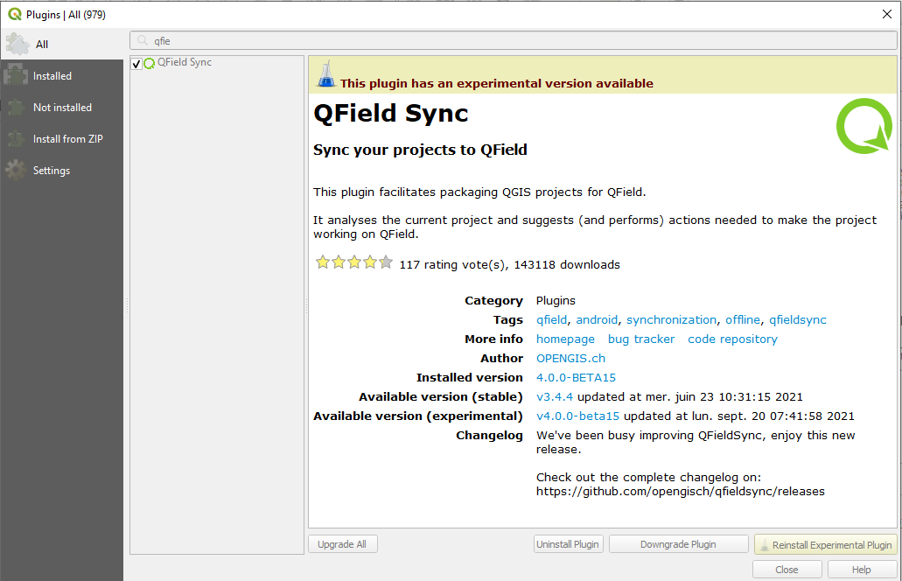
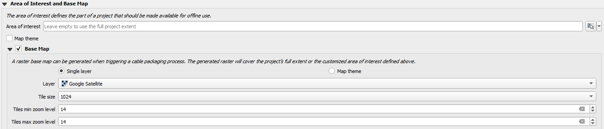
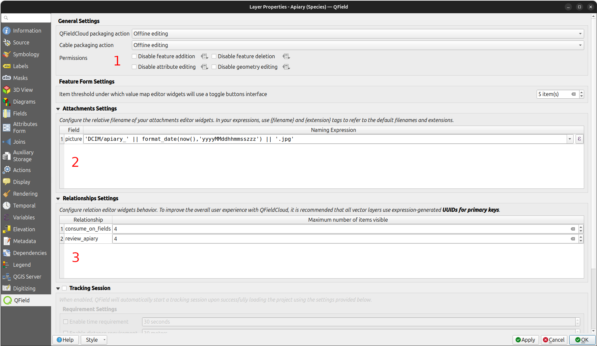

# QFieldSync

[QFieldSync (QFS))](https://plugins.qgis.org/plugins/qfieldsync/) <!-- markdown-link-check-disable-line --> is the QGIS plugin, which you should use to "package" your projects for QField, which means to make your project available for QField.
It is also this plugin you need to use when connecting to [QFieldCloud](advanced-setup-qfc.md).

QFieldSync will do the following:

- It packages your project into a 'QField readable' format (e.g. `portable_project`).
- It (can) create(s) basemaps from a single raster layer or from a style defined in a map theme.
- By default QFS will set your project to "offline editing".
- It is used to synchronize your changes made in the field to the Desktop project.

To get a quick overview of the process, here is a list of typical steps:

1. Create a QField package. This is a working copy in a separate folder.
2. Copy the QField package to the target device.
3. Go out and collect data.
4. Copy the modified data back to your desktop computer.
5. Synchronize the modified data with your database or files.

## Installation

Before you get started with QField you will have to download the plugin through the plugin repository.

!!! Workflow

    1. In QGIS direct to *Plugins* > *Manage and install plugins*.
    2. Search for "QFieldSync".
    3. Select the plugin in the list and click on "Install".

       !

## QFieldSync Settings

You will prepare your QGIS project depending on your requirements and save it as a `.qgs`.
You can save it in a dedicated folder and use it repeatedly.

!

### Layer Packaging

To synchronize your QField projects with the Desktop via QFS, each layer needs to be converted into a format that QFieldSync can understand.
These conversions are achieved via "Layer Actions".
Under the project configuration dialog you can set the required "Action" for each layer.
An action defines whether QFS should "track" the changes made to your layer, directly access it (in the case of a WMS or Postgres layer) or whether it should treat it as a read-only layer.

!

Depending on the layer type, different types of actions are available:

- ***Copy*** (only available for file-based layers (eg. Gpkg, Shp, Tiff)): The layer will be copied to the packaged project folder but **not be tracked**.
A new copy in the packaged project folder will be made.

- ***Keep existing (copy if missing)**: The layer source will be left untouched.
In the case of a long-term project, where synchronization is frequently happening, it is advisable to use this option to not re-package the file every time.

- ***Offline editing***: The layer is copied into the packaged project folder.
This layer is traced and the changes made are recorded in a changelog, which QFS will use later for the synchronization.
When synchronizing the changes back, this log will be replaced and all changes also be applied to the original source layer.
This allows you to keep track of the changes and also to work with multiple users.
**Note:** There is no conflict handling in place.

- **Directly access data source: (non-file-based only)** The data will directly be accessed.
This option is only available for online data such as WMS/WFS or Postgres layers.
In the case of the latter, if you want to work online, you need to copy the the postgres credentials (database information) to QField as well.
See more information in the [PostgreSQL](../../how-to/pg-service.md#configuration-on-mobile-device)

- ***Remove***: The layer will not be copied to your packaged project.

### Area of Interest and Basemap

A basemap is a raster layer which is added as the bottom most layer to the packaged project file.
When working offline with QField, you have to add a raster layer or set a map theme.

!!! note
    The settings of this section are not applicable when using QFieldCloud.
    Offline layers need to be prepared before the fieldwork.

**Area of interest**

When packaging your project for QField you can define an area of interest.
When setting an area or a layer, only copy features intersecting this area of interest" will be 'packaged' when exporting the project to QField.

**Basemap:**

There are two possible options to set a basemap:

- ***Single Layer:*** A raster layer is useful for taking an offline copy of an online layer like a WMS or to take a working copy of an unsupported format like an ECW or MrSID layer.

- ***Map Theme:*** A map theme is useful for creating a base map based on a combination of several layers with styling.
These layers can then be removed from the working package and do not need to be rendered on the device.
This can save some disk space and battery on the device.

**Tile size**

The tile size defines the spatial resolution meaning the number of map units per pixel.
Eg. if the map canvas CRS has meters as units and you set the tile size is set to 1, each raster pixel will have a spatial extent of 1x1 m.

**Zoom level**:

By setting the minimum and maximum zoom levels you define the level of detail that you will see when zooming in and out.

- **Tiles min zoom level**: Defines the **minimum** zoom level for the raster tiles.
A lower value increases the spatial coverage but the spatial resolution is limited. *(Default: 14)*
- **Tiles max zoom level**: Defines the **maximum** zoom level for the raster tiles.
A higher value increases detail but may require more storage space, as well as increase the duration of the offline export. *(Default: 14)*

!

## Package for QField

Once you are done with configuring your project, layers and styles you are ready to package your project.

!!! Workflow

     1. Direct to *Plugins* > *QFieldSync* > *Package for QField* or click on the according symbol in the QFieldSync Toolbar.

        !

     2. Select the folders which also should be copied to QField.

        !

        By default, QFieldSync chooses the filepath for exporting a project.
        It is however possible to change those defaults by directing to *Plugins* > *QFieldSync* > *Preferences*.

        !

        In this window you can also manage whether the packaging options are shown in the QFieldSync toolbar.

        !

        !

        !

     3. To start working in QField, copy the whole folder on your device.
     Check the [Storage section](../../get-started/storage.en.md#2-copying-project-over-to-the-qfield-target-device) for the directory specification, depending on your system (Android, IOS, Windows).
     Typically the filepath will look something like this:
     `Android/data/ch.opengis.qfield/files/QField/...`

    !!! Tip
        Make sure to save the QGIS project using the regular Save As of QGIS as you'll have to re-open it later when you want to synchronize the changes.

## Synchronize from QField

Once done with your collection, it is time to synchronize the data with your Desktop project.

!!! Workflow

    1. Re-open the project in QGIS (the one you saved with a regular Save As) previously.
    2. Copy the project folder from your device to your computer.
    3. Direct to *Plugins* > *QFieldSync* > *Synchronize from QField* menu to synchronize your changes from the QField project to the Desktop project.

        !

        !!! Attention
            Make sure that you synchronize your data back only once.
            That means, if you go out again to collect more data, you should create a new QField package before to avoid sync problems later on (like e.g. duplicates).

## Additional Properties

There are some more advanced properties options which may be relevant to you depending on your domain:

- ***Permissions:*** Disable options for feature addition, feature deletion, attribute editing, or geometry editing.

- ***Attachment default names***: If you wish to save attachments within your data, you can modify the set default names.
Please refer to [How to configure your attachment path](../../how-to/pictures.md#configurable-attachment-path).

- ***Maximum number of items available from a relation***: When working with relations you can set the maximum number of items shown in the relation editor widget.

!

**Configuring maximum items visibility for QField**

To adjust the maximum number of visible items in a relationship within QField, follow these steps:

1. Direct to Vector Layer *Properties...* > *QField*.

2. Under "Relationship Settings" set the "Maximum number of items visible".

!!! Note
    - The default number is set to 4.
    - If empty, the number is unlimited.

!

!
