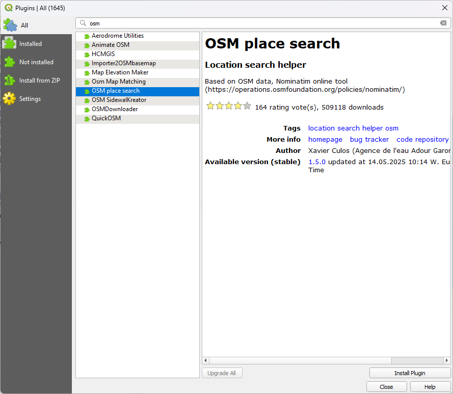
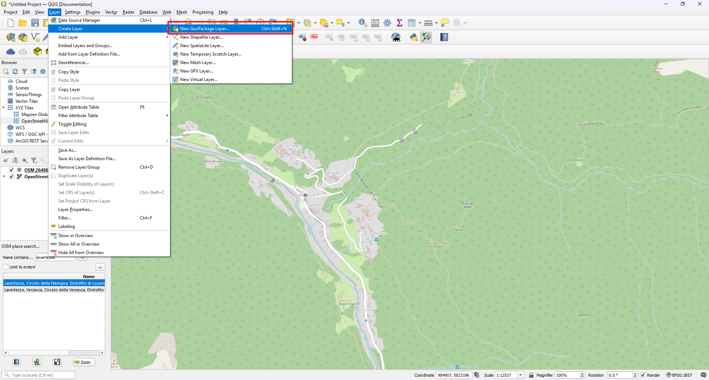
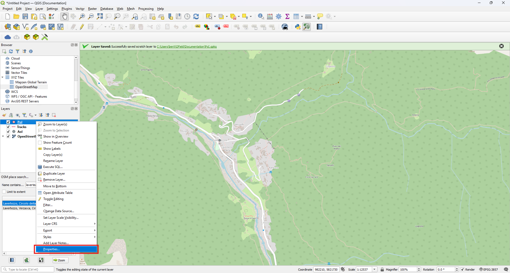
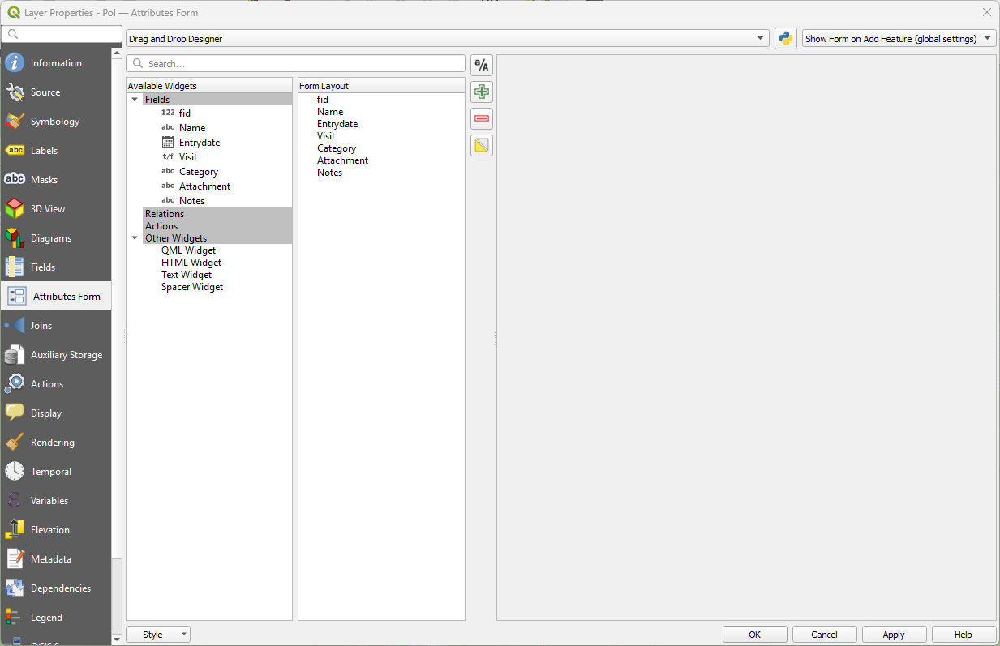
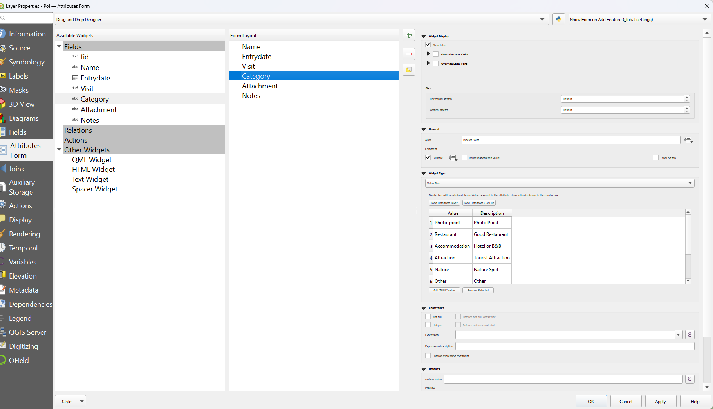

# My first project

This page will go through a step by step example of how to prepare a simple QField project containing a points layer, a line layer and a basemap.
It will include the configuration of a simple attribute form and the styling of the feature layer.
As an alternative if you are familiar with the XLSForm standard  and want to re-use an existing forms, you can also use our [XLSForm Converter](../../how-to/advanced-how-tos/xlsforms-plugin.md) to convert forms into QField-ready projects.

## Step-by-step Example

**Used case**

!

*Hi, my name is Maya Mielena, I am a retired GIS Specialist and I will show you how to prepare a simple QGIS project so that you can use it inside the QField application*
*We will create a GeoPackage (.gpkg) containing a point layer and a line layer.*
*This will allow you to go out into nature and record your personal points of interests and track yourself using the line layer.*

*Let's get started!*

### QGIS Project - Adding new data

1. Open a new QGIS Project on your desktop.
2. Add a basemap of your choice to the project.

     - Under the browser on the top left of the QGIS window you will find the dropdown *XYZ Tiles*.
     - From there you can add the OpenStreetMap basemap, which is the most commonly used basemap.

    !

3. We will now locate our area of interest.
There exists a very useful QGIS plugin called *OSM Place Search*, which allows you to browse through the different place features available in the OpenStreetMap data.

    1. Under *Plugins* in the Menu toolbar direct to *Manage and Install Plugins*
    2. In the search bar type *OSM Place Search* and install the plugin
    !
    3. A new window should appear in the side panel where you can enter your place of interest
    4. Add it to your project as a feature by clicking on the middle button at the bottom of the plugin interface.
    !
    5. A new feature layer will be available as a temporary layer in your project.
4. Adding a new layer:
    1. Click on *Layer* and  create a new *Vector Layer*
    !
    2. Give your GeoPackage a general name.
    Additionally give a name to the table (which we are about to create).
    **To Note**: A GeoPackage can consist of several layers, including points, lines, polygons and raster layers.
    3. Select ***Point*** as your geometry type and select the *EPSG:3857 WGS84/Pseudo-Mercator* as your coordinate system.
    We will add a few fields to our layer including a name, a date, a field for a photo, a field for categorizing the point and a boolean field, which we will use to indicate whether it is worth to revisit the point or not.
    Finally, we will add another field where you can add general notes.
    4. Add the following:

        | Attribute | Data type|
        | --- | ---|
        | Name | *string* |
        | Entrydate | *date*|
        | Visit | *Boolean*|
        | Category | *string* --- We will use this to create a dropdown list from which you can select the point of interest category|
        | Attachment | *string* |
        | Notes | *string* |

5. Adding a Line layer

    We will create another layer within the GeoPackage corresponding to a line layer.
    You can use it to track yourself when going into the field.

     1. Add a new layer as previously
     2. Select the same GeoPackage as *file name* but give the *table* a different name.
    !
     3. Add the following fields:

        | Attribute | Data type|
        | --- | ---|
        | Name | *string* |
        |Date | *date* |

6. Saving the temporary layer in GeoPackage

    Remember that we have added our area of interest as a ***temporary layer*** meaning that after closing the project we will not be able to access the layer anymore.
    Therefore, we will save the layer within the just newly created GeoPackage.
    !

    1. Right-click on the layer and select ***Make Permanent***
    2. Find the GeoPackage file that you just created and add an appropriate name to the PoI layer.
    Watch out: QGIS will ask you whether you wish to ***add new*** or to ***overwrite*** the layer.
    Of course, you choose to ***add new*** the layer.

### QGIS Project - Attribute configuration

#### Form Configuration of the PoI Layer

Now we have all the essential data in the QGIS project that we need for the data collection.
However, in order to have a well structured form we need to configure the attribute form, via the file properties.

1. Direct to PoIs layer *Properties* > *Attribute Form*
!
2. Select *Drag and Drop Designer* from the dropdown.
    From here you can control the appearance of your form.
!
We do not need to edit the *fid* field.
QGIS creates this for every GeoPackage by default.

3. Remove the *fid* field from the visible fields by pressing the *red minus* on the window
4. *Name*: Click on *Name* and look at the Widget Display options on the right-hand side.
!
    The widget display let`s you customise the appearance of your form.
    You can keep it simple or set complex rules and constraints depending on your use case.
    Today, we will keep it simple.
    1. Here you can decide whether you want to display the name of your field inside the attribute form.
    2. If you have a technical fieldname with underscores or other special characters you can add an ***Alias*** to make it nicer for the data user.
    3. There exist several types of [widgets](how-to/attributes-form.md). <!-- markdown-link-check-disable-line -->
*Maya does not want to enter the date new every time.*
*What a good thing one can set default values in QGIS*
5. Open the widget display of the ***Entrydate*** attribute.
    1. If not already done, change the widget type to date/time.
    You can customise the appearance of your date by changing the custom display format.
    2. To not have to add a new date every time, add a default value using the following expression ***format_date(now(),'dd MMMM yyyy')***.
    This will populate the field with the time when the data point is created.
    !
6. For the field ***Visit*** you can just change the Alias name to something more readable like *"Worth the visit?"*

    *The **Category** field is a bit more interesting.*
    *Maya wants to have a dropdown list from which she can select what type of location it is.*
    *Luckily, there is a widget type called value map, where we can enter some categories.*

7. Open the widget display for the ***Category*** field and change the widget type to ***Value map***
8. Enter some relevant categories to the value map

    | Key | Description|
    | ---| ---|
    |Photo_point| Photo point |
    |Restaurant| Good Restaurant|
    |Accommodation| Hotel |
    |Attraction| Tourist Spot|
    |Nature| Nature Spot|
    | Other | Other |

    !

9. Change the widget type of the ***Attachment*** field to ***Attachment***.
This will save the path of the where the image is stored.
You can also set the preferred document type under the integrated file viewer.
This will not only display the attachment directly in the form, but it will also set the default attachment type to the one you have selected.
**NOTE:** Change the path to *relative path* so that it is relative to the project folder that you are working in and not the *absolute path*.

10. For the ***Notes*** field you can just use the widget type to ***Text Edit***.

#### Form Configuration and Tracking Enabling of Tracks layer

*Fantastic, we have successfully configured the form of the PoI layer.
Maya wants to track herself immediately when starting to walk rather than having to set it up manually. Luckily this can be done by setting up the tracking session in the QGIS project file*

1. Direct to the **Tracks** *Properties* > *QField*
2. Enable the Tracking session and set the required parameter.
You can decide whether you want to add vertices based on a temporal value or based on distance.
We will use the latter option for this purpose.
You will configure the attribute form in such a way that it automatically populates the attribute fields when starting a new session.
Furthermore, you will ***hide*** the attribute form so that the tracking just runs in the background.

3. Direct to the *Attribute Form*
4. Choose the ***Drag and Drop Designer*** again from the dropdown
5. Configure the attribute form accordingly
     - `fid`: Remove this field
     - `Name`: Set a default value to '@cloud_username'
     - `Entrydate` : Set a default value to 'now()'
6. Finally, once done from the top right of the window, change the dropdown option from ***Show form on add feature*** to ***Hide Form on Add Feature***.
7. Click 'Ok'

!

### Connecting to QFieldCloud

*Maya does not want to copy the QGIS project manually to her mobile device.
Instead she wants to make use of QFieldCloud, which allows her to simply synchronize her QGIS project into the cloud and then download it via the cloud to her smartphone.
For this she has downloaded the QFieldSync Plugin, which she describes as the portal to QFieldCloud.
In fact, it is a plugin that can be used to package and transform a QGIS project into a readable format that QField can read.*

#### Installing QFieldSync

1. Direct to *Plugins* > *Manage and Install Plugins* > *Not Installed*
2. Search for QFieldSync and install it

     

3. In QGIS a new toolbar should appear 
4. When clicking on the blue cloud a new window will open where you can login to QFieldCloud with your username and password.
If you have no username you can directly register following the link.
5. Once you have successfully logged into QFieldCloud a new window will appear showing all available projects that are stored and available to your profile.
**Note:** If you just registered, the list will, of course, be empty.

#### Creating QFieldCloud Project

*Now it is time to create your first QFieldCloudProject*

1. Open the QFieldCloud Window.
2. Click on the Blue Cloud with the star on the bottom left of the window.
3. Decide on how the new project should be created.
     - **First Option:** *QFieldCloud will either take the current content of the opened project and create another copy under the default `QField/cloud` directory.*
     - **Second Option:** *When using the second option, QFieldSync will take the project path as the right path and you have to make sure hat all the data you want to be uploaded are stored in this folder.*
**Note:** *If you are working with a Postgres database you have to choose the second option to not loose the connection to the database.*
!
For this case, use the first option.
3. Give your project a name and a description.
4. By default you will be set as the owner of the project.
*In case that you were member of an organisation, you could assign a different entity with this dropdown list.*
5. Finally, you can choose the project directory where the project path will be placed.
By default QFieldSync chooses the default project directory.
6. Click "Create" and QFieldSync will package your project for the cloud.

!

If everything is alright, a new window will appear with the message *The locally stored cloud project is already synchronized with QFieldCloud, no action is required.

*Congratulations!!! you have successfully created your first project and are now ready to map with QField*

#### Opening on QField

1. On your mobile device open the QField Application
2. Click on **QFieldCloud Projects** and sign in with the same credentials as before.
 !

3. Your project should already be available.
4. Click on it and download the project.

*Now you are good to go and can start mapping.
It will ask you to turn on your location in case you have not done that yet.
Remember that we have set up the tracking layer.*

*Maya is very happy, she will use this project very frequently as she loves nature and wants to spend every spare minute that she has outside, like all of the OPENGIS.ch team. We hope that you find this useful and will start to use QField and make use of QFieldCloud.*
