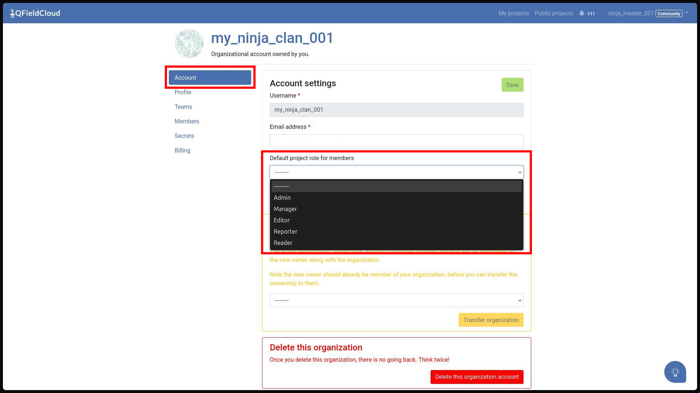
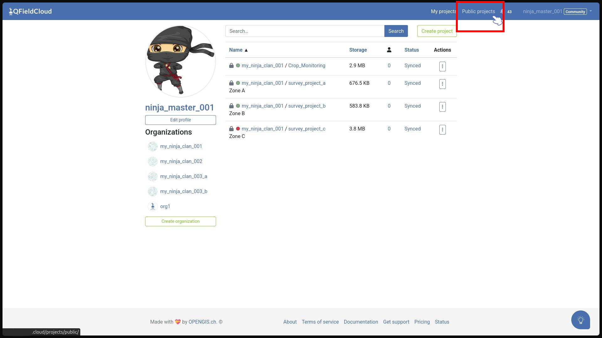

# Permissions and Roles

QFieldCloud provides fine-grained access control over projects and organizations using **Project Collaborator** roles and **Organization Member** roles.

Access permissions follow a strict hierarchy: **a higher role automatically inherits all capabilities of lower roles.**

!!! Tip
    **Core Concepts Overview**

    If you are new to QFieldCloud management, ensure you are familiar with these core concepts:

    - **[Projects](../../get-started/tutorials/concepts.md#projects):** The central repositories storing QGIS project files, layer datasets, styles, and field edits.
    - **[Organizations](../../get-started/tutorials/concepts.md#organizations):** Shared accounts that own storage quotas, manage member subscriptions, and centralize project management.
    - **[Members](../../get-started/tutorials/concepts.md#organization-members):** User accounts added to an organization with defined organization-level administrative roles.
    - **[Collaborators](../../get-started/tutorials/concepts.md#project-collaborators):** Individual user accounts granted specific access permissions to a single project.

## Project Collaborator Roles

Project roles determine what an individual user can do within a specific project.

| Role              | Summary                                                                                                                                |
|:------------------|:---------------------------------------------------------------------------------------------------------------------------------------|
| **Owner / Admin** | Full control over the project, including renaming, deleting, managing secrets, and modifying restricted project files (`.qgz`/`.qgs`). |
| **Manager**       | Can manage project collaborators and dataset files. *(Organization projects only)*                                                     |
| **Editor**        | Can create, update, and delete features and their attributes in the field. *(Organization projects only)*                              |
| **Reporter**      | Can download the project and collect **new** features in the field, but cannot edit or delete existing features.                       |
| **Reader**        | Read-only access to view and download the project. Cannot upload edits or changes.                                                     |

### Project Capabilities

The following table details what each project role can do:

| Capability \ Role                                                                                                       | Reader | Reporter | Editor | Manager | Admin / Owner |
|:------------------------------------------------------------------------------------------------------------------------|:------:|:--------:|:------:|:-------:|:-------------:|
| **View and download project files**                                                                                     |   ✅    |    ✅     |   ✅    |    ✅    |       ✅       |
| **Collect NEW features in the field**                                                                                   |   ❌    |    ✅     |   ✅    |    ✅    |       ✅       |
| **UPDATE or DELETE existing features**                                                                                  |   ❌    |    ❌     |   ✅    |    ✅    |       ✅       |
| **Upload datasets (e.g., GeoPackages)**                                                                                 |   ❌    |    ❌     |   ✅    |    ✅    |       ✅       |
| **Manage project collaborators**                                                                                        |   ❌    |    ❌     |   ❌    |    ✅    |       ✅       |
| **Manage project secrets & service credentials**                                                                        |   ❌    |    ❌     |   ❌    |    ❌    |       ✅       |
| **Upload [restricted project files](../../get-started/tutorials/tips-tricks-qfc.md#restricted-files) (`.qgz`, styles)** |   ❌    |    ❌     |   ❌    |    ❌    |       ✅       |
| **Rename or delete the project**                                                                                        |   ❌    |    ❌     |   ❌    |    ❌    |       ✅       |

## Organization Member Roles

Organization member roles govern administrative access to the organization itself, its member directory, billing details, and all projects owned by that organization.

| Role        | Summary                                                                                                                                                                                                                                                               |
|:------------|:----------------------------------------------------------------------------------------------------------------------------------------------------------------------------------------------------------------------------------------------------------------------|
| **Owner**   | Primary administrative authority. Full access over organization billing, subscription plans, ownership transfers, member management, and all organization projects.                                                                                                   |
| **Admin**   | Administrative manager. Can manage organization members, structure teams, and manage all organization projects.                                                                                                                                                       |
| **Creator** | Project creation specialist. Can create new projects under the organization and manage projects they have created, without administrative access to organization billing or member lists. They are automatically set as administrators of the newly created projects. |
| **Member**  | Standard organization user. Assigned to specific organization projects as a collaborator. Membership distinction primarily serves organizational visibility and billing seat allocations.                                                                             |

### Organization Capabilities Matrix

The following table details what each organization role can do:

| Capability \ Role                                     | Member | Creator | Admin | Owner |
|:------------------------------------------------------|:------:|:-------:|:-----:|:-----:|
| **View organization member directory & teams**        |   ✅    |    ✅    |   ✅   |   ✅   |
| **Access assigned organization projects**             |   ✅    |    ✅    |   ✅   |   ✅   |
| **Create new projects under the organization**        |   ❌    |    ✅    |   ✅   |   ✅   |
| **Add, remove, or modify organization members**       |   ❌    |    ✅    |   ✅   |   ✅   |
| **Manage organization teams & team roles**            |   ❌    |    ❌    |   ✅   |   ✅   |
| **View billing, active users, and invoices**          |   ❌    |    ❌    |   ❌   |   ✅   |
| **Modify plan subscriptions & payment details**       |   ❌    |    ❌    |   ❌   |   ✅   |
| **Delete organization or transfer primary ownership** |   ❌    |    ❌    |   ❌   |   ✅   |

### Default Project Role for Organization Members

Organizations Admins can configure a **Default Project Role for Members** setting in their account profile settings.

When organization members are added to newly created organization projects, QFieldCloud assigns this default role automatically (for instance, **Editor** or **Reader**), streamlining project permissions across team members without requiring manual assignment for each new project.

!

## Key Security & Visibility Features

### Restricted Project Files

When the **Restrict project files** setting is enabled on a project, standard **Editors** and **Managers** can continue updating datasets (such as GeoPackages), but they are blocked from modifying or replacing core project files (such as `.qgz` or `.qgs` project files and style templates).

Only **Admins** and **Owners** can modify restricted files.

### Private vs. Public Projects

QFieldCloud Projects can be marked as **Private** or **Public**.

- A **Public Project** implies that every user on app.qfield.cloud can access the project and load the project onto its device.
The project or organization owner as well as organization admins (if applicable) will receive an **Admin** project role.
All other users who load the project will receive the role that has been assigned under the [**Public Collaborator Role**](#public-collaborator-role).

- A **Private Project** is only visible to the users that have been granted access to it.
The project or organization owner as well as organization admins automatically receive an **Admin** project role.
Other users that are not within the collaborator list of the project will not be able to access it..

  !!! Note
      To assign collaborators on **Private** projects owned by an organization, all users must be part of that organization.
      In addition, the total number of collaborators cannot exceed the owner's active subscription plan limit for private projects (`max_premium_collaborators_per_private_project`)

You can set the project to **Public** or **Private** in two ways.

- While creating a new project.
- Under the project settings on QFieldCloud

!!! Workflow

   **Changing Project to Public - in QFieldCloud**

    1. Log into QFieldCloud and select the project you want to mark as **Public** from your project overview.
    2. Navigate to **Settings** in the project menu.
    3. Check **Public project**.

In QFieldCloud, the **Privacy Status** is indicated by the status icon next to the project name: a lock icon (🔒) represents a **Private project**, while an unadorned project title represents a **Public project**.

!

### Public Collaborator Role

When marking a project as **Public**, a **Public collaborator role** field below the checkbox will appear.

Now it depends on whether the owner of the project is a **personal user** or an **organization**.

<u>**Personal Public Project**</u>

You can choose between the roles **Reader** (read-only access) or higher roles (such as **Reporter** or **Editor**) depending on your crowdsourcing requirements
<u>**Organization Public Project **

- If you have set a [**Default Project Role for Members**](#default-project-role-for-organization-members) the same role will automatically be set if a project is marked as **Public**
- If you want to add externals (not a member of your organization) to a **Public Project** you can add them as collaborators with custom roles.
These will not be counted as active members of your organization

### Converting Public Projects to Private

When converting a **Public** project to **Private**, QFieldCloud enforces validation checks before saving the setting change:

1. **Non-Organization Collaborators Check:** If an organization-owned project has collaborators who are not members of the organization, you must either remove them or add them as organization members before setting the project to private.
2. **Subscription Plan Limits Check:** The total number of collaborators cannot exceed what the owner's subscription plan allows for private projects. Remove excess collaborators before changing visibility to private.

!!! Note
    If a subscription downgrade occurs on an existing private project that exceeds the plan limit, the project remains private but shifts to a locked status until collaborator counts are brought within plan limits or the plan is upgraded.
