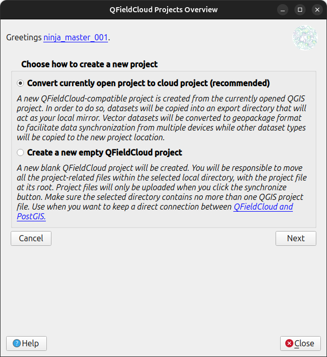
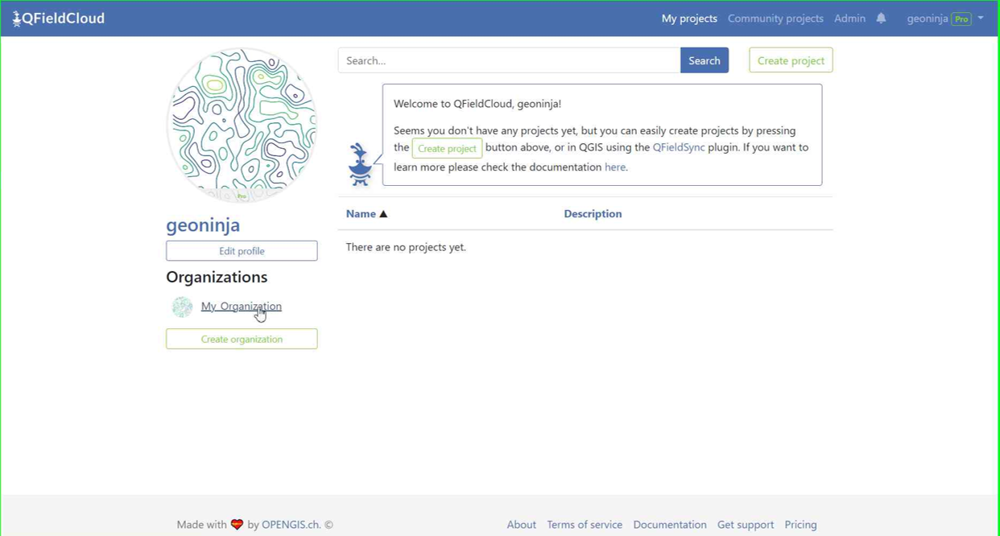
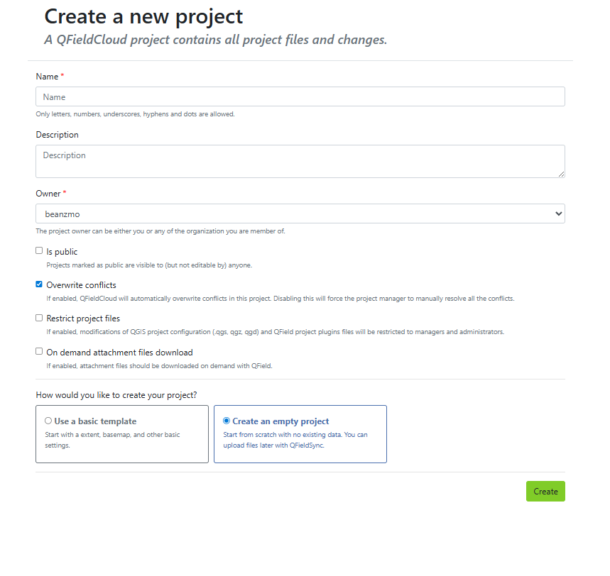
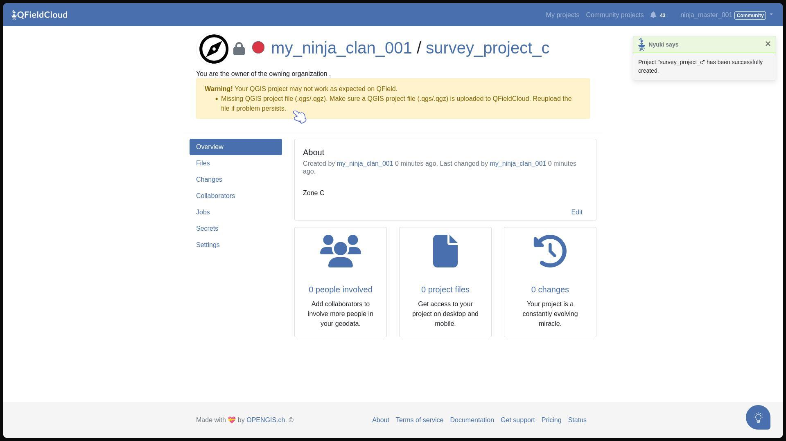
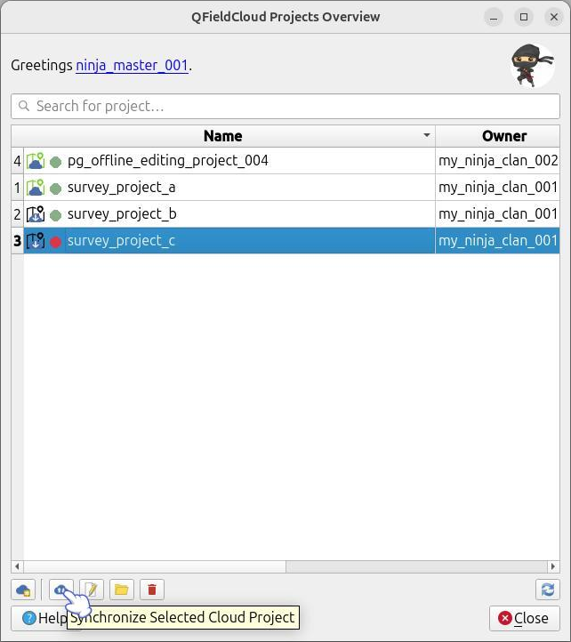
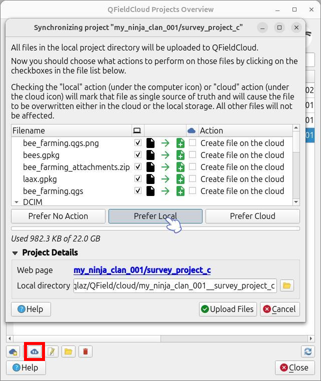
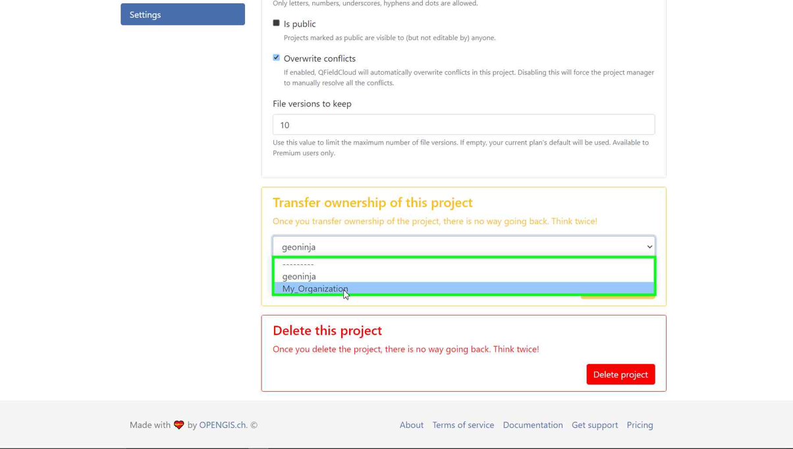
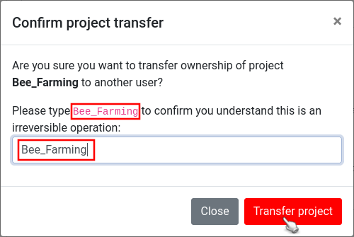

# Creating Projects in QFieldCloud

There are several ways to create and upload a project to QFieldCloud.
Depending on your workflow, you can create projects directly from your QGIS desktop using QFieldSync,
from the QFieldCloud web interface (including templates), by transferring existing projects to an organization,
or by cloning an existing project via the API.

## Option 1: Using QFieldSync (Desktop)
:material-monitor: Desktop preparation

The most common way to create a project is directly from within QGIS using the QFieldSync plugin.

!!! Workflow

    1. In QGIS, open the QFieldSync toolbar and click the cloud button on the bottom-left of the projects overview.
    2. Choose how to create the new project:

        - **Convert currently open project to cloud project**: A new project is created from the currently opened QGIS project.
            The project files will be copied to an export directory.
            Vector datasets will be converted to one single GeoPackage to facilitate data synchronization from multiple devices.
            Other data types will also be copied to the new project location.
        - **Create a new empty QFieldCloud project**: Your current project location will be converted to the QFieldCloud project.
            All files available in the project need to be stored in the same directory.
            The location of the project file is the project root.
            Make sure the selected folder contains no more than one QGIS project file.

            !

    3. A form will ask you for a project name, description, and local directory.
    4. **(Optional) Assign to an Organization:** In the "Project details" step, you can change the owner of the project to your Organization if you are creating this for a team.
    5. Click on "Create" to start the conversion and synchronization.

    When finished, the project will appear in your project list in QFieldCloud (or your Organization's list, if assigned there).

    

## Option 2: Using the QFieldCloud Web Interface
:material-web: Web Interface

You can also initialize an empty or template-based project directly from the QFieldCloud website and pull it down to QGIS later.

!!! Workflow

    1. On the QFieldCloud landing page, select your personal account or direct to your organization.

        

    2. Click on **"Create a project"**.

        

    3. Add your project name, give a description, and select the required settings regarding conflict management and project file restrictions.
    4. Choose your preferred project creation method:
        - **Create an empty project:** This will create a completely empty project without any basemap.
        - **Use a basic template:** This will allow you to select a dedicated basemap provider (OpenStreetMap by default, or a custom URL)
            and define your project extent. You can define the extent by clicking on the map icon on the right of the "Project extent" line.

        

    5. Click **Create** at the bottom right of the screen. You can now see the new project in the overview.

        

    6. **Sync to Desktop:** Open QGIS and QFieldSync. You will see the new project listed. Click on "Edit Selected Cloud Project".

        

    7. Choose the local folder where you want to save the project. In that folder, you can either paste an already worked-on project or save a new one.
    8. Once the folder contains the project, you can synchronize and push the changes back to the cloud.

        

## Option 3: Changing the Ownership of a Project
:material-web: Web Interface

If you already have a personal project and want to convert it into an organizational project, you can transfer ownership.

!!! Workflow

    1. On the QFieldCloud landing page, click on your project of concern.
    2. Direct to the **Settings** and select **"Transfer ownership of this project"**. Choose the desired Organization for the transfer.

        

    3. A pop-up window will appear to confirm the transfer. To proceed, type the requested text and click **"Transfer project"**.

        

    

## Option 4: Cloning Projects

QFieldCloud allows you to duplicate existing projects through its cloning functionality.
This feature is highly useful when you need to establish project templates, duplicate a survey project for a different team,
or start a new data collection campaign using an identical QGIS configuration to a previous successful project.

### How Cloning Works

When you clone a project, QFieldCloud creates a brand new project and duplicates the following elements from the source project:

- The QGIS project file (e.g., `.qgs` or `.qgz`).
- All associated project files and datasets (GeoPackages, images, etc.).
- Project settings, including description, public status, offline editing configurations, conflict resolution, and attachment download policies.

The newly cloned project is completely independent. Any subsequent changes, file uploads,
or data collection done within the cloned project will not affect the original source project.

### Overriding Project Parameters

While cloning effectively duplicates the source project, you can override specific parameters during the creation process:

- **Project Name:** You must provide a unique name for the new cloned project (e.g., `survey_zone_b`, `survey_zone_n`).
- **Owner:** You can assign the cloned project to a different owner (e.g., a specific organization or user account), with the appropriate permissions.
- **Extent:** You can provide a new extent for the cloned project (useful for easily moving the initial zoom to a new survey zone).

### Constraints and Limitations

To ensure system stability and security, project cloning is subject to the following technical rules:

- **Permissions:** You must have the *admin* or *manager* role in the source project to be able to clone it.
- **Storage Quotas:** The target owner account must have enough free storage quota available to accommodate the entire file size of the source project.
    If the storage limit is exceeded, the clone operation will fail.
- **XLSForms:** Project cloning is mutually exclusive with XLSForm project creation. You cannot provide an XLSForm file and clone an existing project simultaneously.
- **Seed Configuration:** When cloning, you cannot configure new basemaps via the project seed. The seed data is strictly limited to updating the project's `extent`.
- **Shared Datasets:** The system-level `shared_datasets` project cannot be used as a source for cloning. Attempting to clone it will raise a `NotCloneableProjectError`.

### API Usage

Users and developers can easily clone projects using the QFieldCloud API. To clone a project, send a `POST` request to the `/api/v1/projects/` endpoint. Include the `clone_from_project` parameter with the UUID of the source project.

**Example Request:**

```bash
curl --location 'https://app.qfield.cloud/api/v1/projects/' \
--header 'Content-Type: application/json' \
--header 'Authorization: Token {MY_TOKEN}' \
--data '{
    "name" : "clone-me-public",
    "is_public": true,
    "description": "Hello from the cloned public project",
    "owner": "{USERNAME}",
    "seed": {
        "extent": "-180, -90, 180, 90"
    },
    "clone_from_project": "{PROJECT_UUID}"
}'

```

!!! note
    The `seed` object is optional and only accepts the `extent` field when utilizing the clone functionality.
