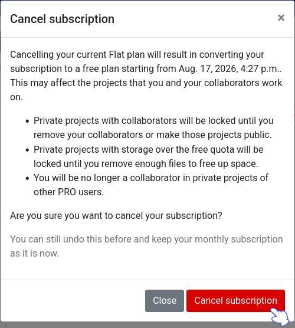
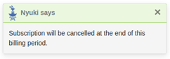

# QFieldCloud Plans and Additional Storage

When registering for QFieldCloud, you have to create a general user account.
By default you will get a free **Community Plan**.
The **Community Plan** allows you to work independently on QGIS projects and sync changes up to a 100 Mb storage limit.
If you require additional storage or multi-user collaboration, you can upgrade your plan.

You can choose in between

- A **Flat Plan** providing a fixed price per user per month; or
- A **Flex Plan** allowing organizations to pay per active users.

The billing information necessary for both Flat and Flex plans and can be accessed through the **Billing section** under your account settings OR the organization account settings.
At any point, you can modify your plans according to your needs.

It is also possible to have a yearly subscription, where you will receive an annual invoice with a fixed amount of users and storage.
For this option, please get in touch with [sales](mailto:sales@qfield.cloud)

All pricing information is available <a href="https://qfield.cloud/pricing" target="_blank">on the Pricing page</a>.

## Choosing a plan

To upgrade to an **organization plan**, follow these steps:

!!! Workflow
    1. Click on the username at the top-right of the page.
    2. Click on "Create organization".
    3. Choose your preferred payment option:
    !
        - **Monthly Payment:** You can choose between a **Flat** subscription or a **Flex** Subscription.
             - **Flat**: You select your number of seats (users in the organization) and pay each month for every seat.
             - **Flex**: You can add members directly to the organization and only pay for the active ones.
                A minimum of 1 member is always needed.
        - **Yearly Payment**: You select your number of seats and pay once for every seat at the beginning of the subscription.

    4. Click on "Create".
    5. Choose a name for your organization using fewer than 150 characters, letters, digits, and `@/./+/-/_`.
    6. Click on "Create".
    7. In the "Billing Address" section, fill in the required fields and click "Next".
    An overview page will show the plan layout and the billing details.
    8. If you would like to add additional storage, you can add as many storage packages as you need.
        !
    9. (Optional) If you have received a promotion code, please enter it at the bottom of the billing window.
    10. Under the summary page, verify your current subscription and upcoming payment.
    Add your billing details and click on **Pay** to activate your plan.

### Active Users Under Flex Plans

Under the **Flex Plan**, at least one member must belong to the organization and is marked active by default.
Total subscription costs per billing cycle depend on the number of active users during that cycle.
An active user corresponds to any member who performs at least one server job inside an organization project during an invoice cycle.

To monitor active organization users, navigate to _Organization Settings > Billing > Active users_.

!

!!! Note
    A single user account can only log into one device at a time.
    If the account `ninja_001` logs into QField on a new device, QField automatically logs out their previous session on other devices.
    Sharing a single account across multiple devices causes synchronization errors, data loss, or data corruption.
    Concurrent multi-device use on a single account also blocks field teams from uploading collected data to QFieldCloud.

    To enable multiple field workers to collaborate safely on a project, use an **Organization Plan**.
    An **Organization Plan** allows administrators to invite unique user accounts (such as `ninja_001`, `ninja_002`, `ninja_003`) as project collaborators.
    Administrators can manage user roles and permissions across organizations and specific projects.

You can add additional storage packages or adjust user seats at any time in QFieldCloud.
Subscription increases take effect immediately, while plan decreases take effect at the start of the next billing cycle.
Additional storage is available in packages of 3 GB.

!!! Workflow

    1. To add more storage to your organization, direct to the *Settings* section of your organization.
    2. Click on the **billing section** and click on *Change*.
        !

    3. From there, you can either cancel your subscription or modify the subscription.  Click on **Modify subscription**.
        !

    4. Adjust the number of seats and the modified storage packages depending on your needs. The reflected changes to the upcoming subscription will be indicated below the current subscription with either a green (increasing seats/storage) or red (decreasing seats/storage) color.
        !

!!! Note
    - Included storage corresponds to storage allocated per user seat.
    - Additional storage is added in 3 GB packages.
    - Increased storage and seats become available immediately.
    - Decreased storage or seat allocations take effect during the next billing cycle.

## Transferring Organization Ownership

Primary ownership of an organization account can be transferred to any existing member.

!!! Warning
    Transferring organization ownership does not alter subscription statuses or billing payment methods.
    Stored credit card details remain active on the organization billing page after ownership transfers.
    The new owner must manually update the organization payment details if card details need to be replaced.

!!! Workflow

    1. Ensure the user you intend to appoint as the new primary owner is already a member of the organization.
    If not add them to the organization first.
    2. Navigate to your organization's overview page and click on **Edit organization**.
    3. Change **Owner** on the **Transfer ownership of this organization** section, and select the user intended to transfer from the dropdown list.
        !

## Canceling Subscriptions

You can cancel subscriptions at any time.
Personal **Pro** plans and **Organization** plans must be canceled separately.

!!! Workflow
    1. Navigate to your account settings:

        - For **Pro Plans:** Click **Edit Profile** on your personal account landing page.
        - For **Organization Plans:** Click **Edit Organization** on your organization landing page.

    2. Navigate to the **Billing** section.
    3. Click **Change**, then click **Cancel subscription**.

        

    4. Confirm the cancellation in the popup window.

        

        
  

        

You can access past invoices at the bottom of the billing section.

!!! Workflow
    1. Navigate to your account settings:

        Click on **Edit Profile**/**Edit Organization** on your (organization) landing page.

    2. Navigate to the **Billing** section.
    3. Scroll down to the bottom of the page to view and download past or current account invoices.

        !
