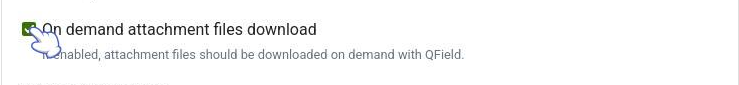
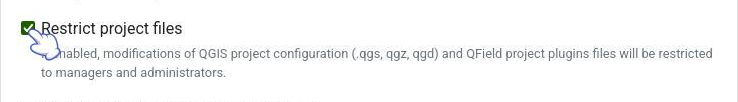
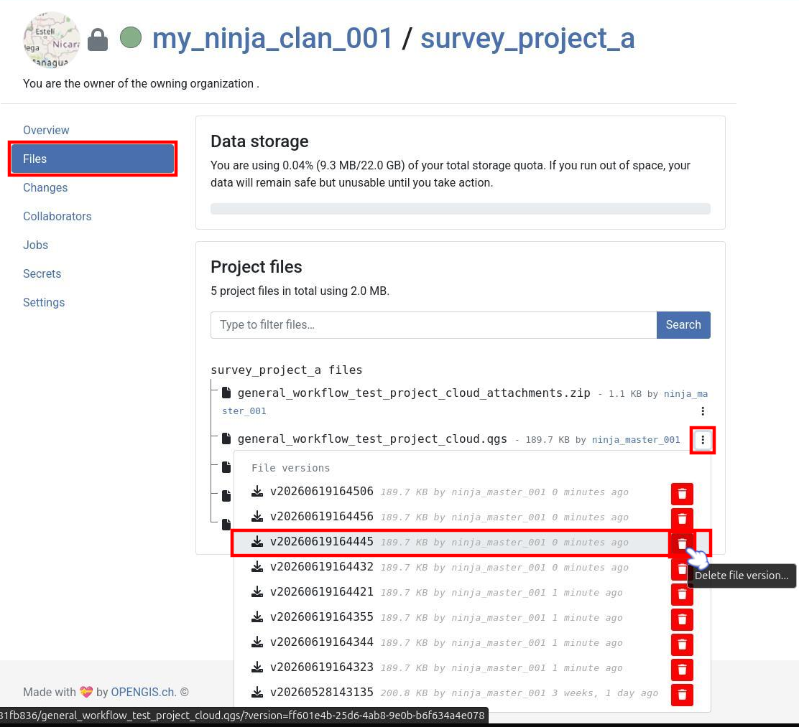
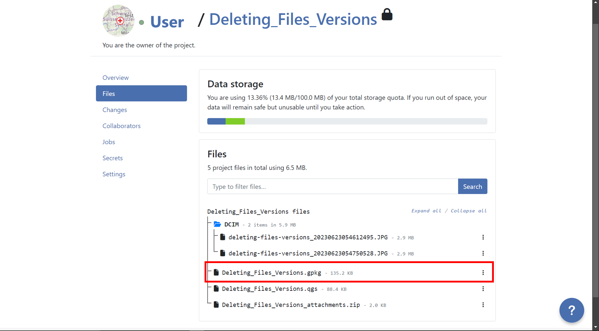
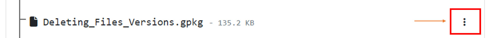
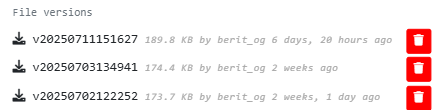
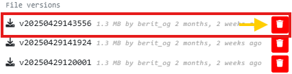
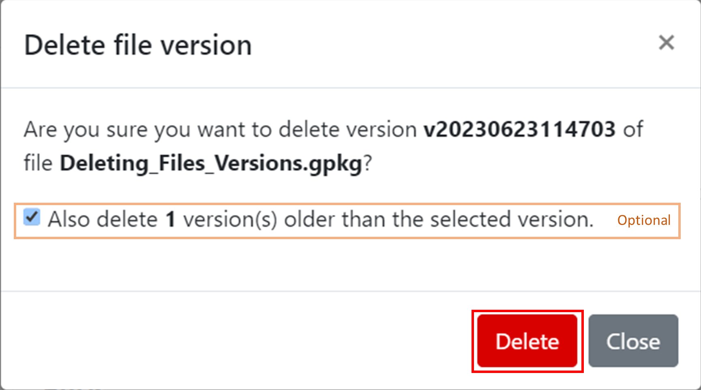
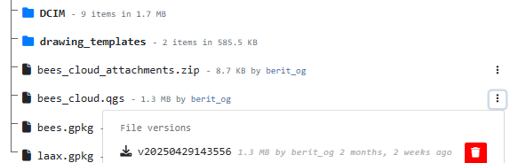

# Tips and Tricks for your QGIS project

This page will give you an overview of all the tips and tricks you can apply to your project and general workflow to minimize synchronization errors, work efficiently and save storage.

## Project Configuration Best Practices

To ensure a smooth synchronization process between QGIS, QField and QFieldCloud, follow these recommendations.

**1. Centralized Data Storage - Add all data in the same folder as your .qgs project file**

Before uploading your project, ensure all relevant data sources (GeoPackages, rasters, etc.) are located in the same directory as your project file (`.qgs/.qgz`)
or in a subdirectory (e.g., `./data`, `./assets`).
If files are spread across different drives or folders on your computer, QFieldSync and QFieldCloud may fail to package them correctly for the mobile device.

**2. Managing Unique IDs - Add a unique ID to your layers**

When multiple users collect data offline simultaneously, standard auto-incrementing IDs (1, 2, 3...) will result in conflict errors when applying the deltas changes data on QFieldCloud.

- **For Relations**: Create a specific text field (e.g., `survey_uuid`) and use `uuid()` or `uuid('WithoutBraces')` as the default value.
Use this field for all foreign keys and for primary key if the layer is from PostgreSQL/PostGIS.
- **For the `fid` (Feature ID)**: If you are working with GeoPackages, you can reduce conflicts on the internal `fid` integer column
by setting the "Default Value" to the expression `epoch(now())`.
This generates a unique integer based on the current timestamp.

!!! Tip
    To set this up, go to **Layer Properties > Attributes Form**, select the `fid` field, and set the **Default Value** to:
    ```sql
    epoch(now())
    ```
    Ensure the "Apply default value on update" box is **unchecked** so the ID remains constant after creation.

**3. Relative Paths - Ensure that all attachment paths are relative**

Absolute paths (e.g., `C:\Users\{username}\Downloads\photo_001.jpg`) will break when the project is transferred to a mobile device (Android/iOS),
as the file system structure is different.

!!! Workflow

    1. Navigate to **Project** > **Properties...** > **General**.
    2. Set **Save paths** to `Relative`.

**4. Stable Layer References in Expressions - Use the Layer Name in expressions, not the Layer ID**

When writing expressions (for example, inside `aggregate()` or `relation_aggregate()`) functions,
QGIS allows you to reference layers by their internal ID (e.g., `places_2348274...`) or their Name (e.g., `Places`).
Always use the **Layer Name** (e.g., `Places`).

**Why?**
The internal Layer ID changes if you remove and re-add a layer or internally in QFieldCloud when a packaging job is triggered could change,
which breaks your expressions.
The Layer Name remains stable as long as you do not rename it in the layer tree.

**5. Preferred File Formats - Convert your layers to GeoPackage**

QField and QFieldCloud are optimized for the **GeoPackage (.gpkg)** format.
While QField and QFieldCloud support others formats like Shapefiles (`.shp`), GeoJSON, and KML, etc., is strongly recommend converting these layers to GeoPackage before starting your project.

**How to Convert to GeoPackage?**

!!! Workflow

    1. In QGIS, right-click your layer in the layer tree.
    2. Select **Export** > **Save Features As...**
    3. Set **Format** to `GeoPackage`
    4. In **File name**, click `...` and navigate to your project folder. Give the new database a name (e.g., notes_points.gpkg`)
    5. In **Layer name**, give your layer a simple name (e.g., `notes_points`)
    6. Click **OK**
    7. The new layer will load into your project.
    You can now remove the old layer

**6. Modular File Structure - Store one layer per GeoPackage**

QFieldCloud manages versions and backups at the **file level**. Every time changes are synchronized, a backup of the modified file is created.

- **The Risk:** If you store multiple layers in a single GeoPackage (e.g., `survey_data.gpkg` containing *Trees*, *Roads*, and *Buildings*), restoring a backup to fix an error in the *Trees* layer will also roll back valid work done on *Roads* and *Buildings* during that same period.
- **The Solution:** Save each layer in its own separate GeoPackage (e.g., `trees.gpkg`, `roads.gpkg`).
    This allows you to restore a previous version of one specific layer without losing data in others.

## Common Configuration Errors

If you are experiencing synchronization issues, check for these common configuration errors:

| Issue | Cause | Solution |
| :--- | :--- | :--- |
| **Missing Images** | Paths are set to "Absolute" | Go to Project Properties and set paths to "Relative". |
| **Sync Failures** | Data is outside the project folder | Move all .gpkg and raster files into the same folder as the project file (`.qgz/.qgs`). |
| **Expression Errors** | Layer ID used in expression | Update expressions to use `'Layer Name'` instead of `'Layer_ID_123'`. |
| **Duplicate Keys** | Using default 1, 2, 3 IDs | Implement `uuid()` or `epoch(now())` for unique identification.

## Download attachments only on demand

In the QFieldCloud settings you can set your attachments to be only downloaded on demand.
This is particularly useful when you work with an abundance of photos and do not need all your attachments at once.

!!! Workflow

    To enable this feature:

     1. From the QFieldCloud landing page, select your project.
     2. Direct to *Settings*.
     3. Enable the "On demand attachment files download" option.
    !

!!! note
    This feature can be activated during project creation or enabled at any time for existing projects.
    You need to be online to download the attachments on demand.
    If you work offline, it will only show a blank screen.

## Restriction of Project Files

If you work in field operations which involves a lot of users, it may be useful to restrict the QGIS project file to prevent all users with editor rights to download the project and make changes to the configuration.
To prevent any modification to the core QGIS project file, **the project administrator** can restrict the access to these files.
This can be achieved under the settings section in QFieldCloud.

!!! Workflow

    1. From the QFieldCloud homepage direct to *Settings*
    2. Enable the **`Restrict project files`** button
    !

Once set, only administrators and managers will be able to push changes to the files listed above.
Other project collaborators can still upload and modify other project files, such as data in GeoPackages, but they cannot alter the main project file or its core components.

### Restricted Files

When enabled, the following files can only be modified or uploaded by a user with an "admin" or "manager" role for the project:

- The primary **QGIS project file** (e.g., `my_project.qgz`).
- The **attachments zip archive** associated with the project (e.g., `my_project_attachments.zip`).
- **QGIS auxiliary data files** that store information like label positions (e.g., `my_project.qgd`).
- **QField style files** (`.qml`) that share the same name as the project file.

## Saving storage

### Deleting old file versions

You can reduce the number of versions you want to keep of any given file to reduce the amount of storage needed by accounts.
One can manually delete file versions from the project's **File** section.
Each file and version can be linked to a specific QFieldCloud user who uploaded it.

!!! Workflow
    1. Go to the "Files" section of your project.
    2. Locate the layer for which you want to delete versions.
    3. Click on the 3-dotted menu *(⋮)* next to the layer name.
    4. You will see a list of versions for that specific layer.
    5. Identify the version you want to delete and click on the red trash bin icon next to it.
    6. Confirm the deletion when prompted, if you want to delete all versions before a specific version, you can do it activating the option "Also delete `n` version(s) older than the selected version.".
    7. After deleting a pop up message will appear with the success and the list of versions will show just the versions that was not selected for deletion.

### Set maximum pixel size of attachment

If you want to further save space and you are working with attachments, you can reduce the pixel size.
This will lead to lower image quality but take less storage on QFieldCloud.
You can direct to the How-To of  the [Attachment Widget](../../how-to/project-setup/pictures.md#maximum-picture-size) to see the step-by-step instructions.
