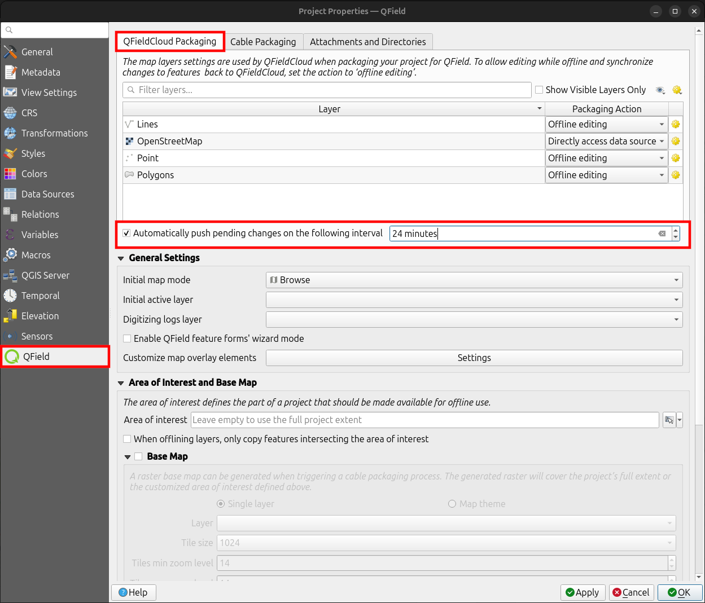
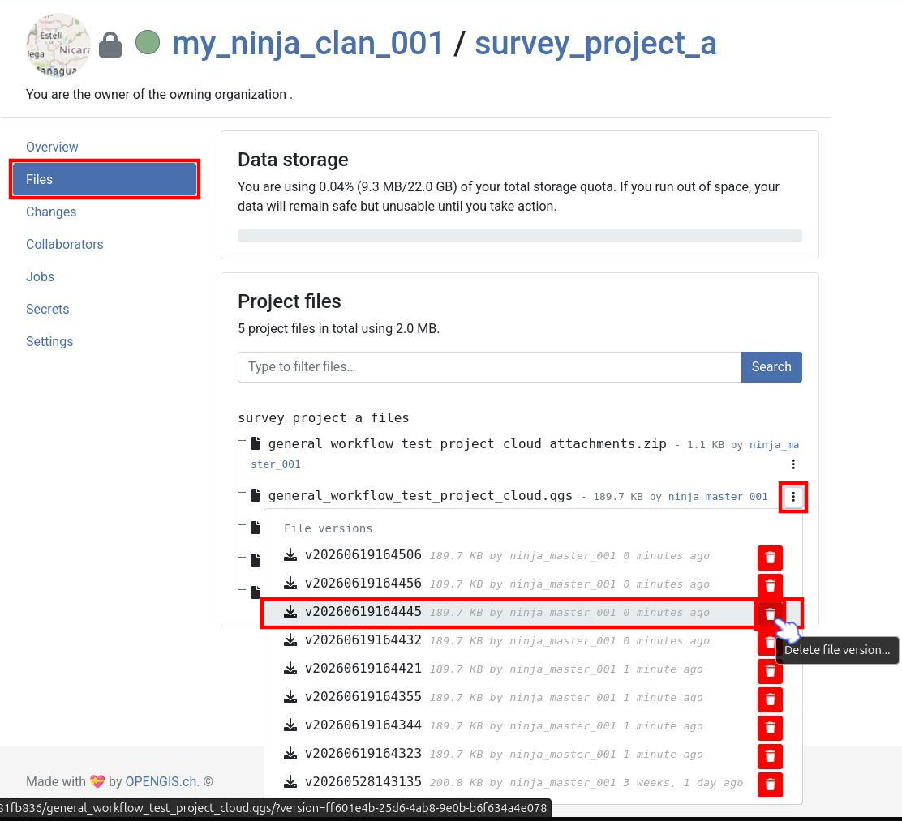
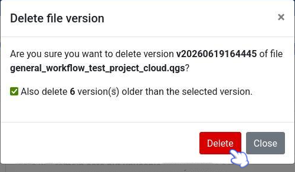
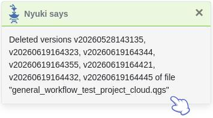

# Tips and Tricks for Your QGIS Project

This page provides an overview of tips and tricks for your project and workflow to minimize synchronization errors, work efficiently, and save storage.

## Project Configuration Best Practices

Follow these recommendations to ensure a smooth synchronization process between QGIS, QField, and QFieldCloud.

### 1. Centralized Data Storage

Before uploading your project, ensure all relevant data sources (GeoPackages, rasters, etc.) are located in the same directory as your project file (`.qgs/.qgz`) or in a subdirectory (e.g., `./data`, `./assets`).
If files are spread across different drives or folders on your computer, QFieldSync and QFieldCloud may fail to package them correctly for the mobile device.

### 2. Managing Unique IDs

When multiple users collect data offline simultaneously, standard auto-incrementing IDs (1, 2, 3...) result in conflict errors when applying delta changes on QFieldCloud.

- **For Relations:** Create a specific text field (e.g., `survey_uuid`) and use `uuid()` or `uuid('WithoutBraces')` as the default value.
Use this field for all foreign keys and for the primary key if the layer originates from PostgreSQL/PostGIS.
- **For the `fid` (Feature ID):** When working with GeoPackages, reduce conflicts on the internal `fid` integer column by setting the **"Default Value"** to the expression `epoch(now())`.
This generates a unique integer based on the current timestamp.

!!! Tip
    To set this up, navigate to _Layer Properties > Attributes Form_, select the `fid` field, and set **"Default Value"** to `epoch(now())`.
    Ensure **"Apply default value on update"** is unchecked so the ID remains constant after creation.

### 3. Relative Paths

Absolute paths (e.g., `C:\Users\{username}\Downloads\photo_001.jpg`) break when transferring the project to a mobile device (Android/iOS) because the file system structure differs.

!!! Workflow
    1. Navigate to _Project > Properties... > General_.
    2. Set **"Save paths"** to **"Relative"**.

### 4. Stable Layer References in Expressions

When writing expressions (such as inside `aggregate()` or `relation_aggregate()` functions), QGIS allows you to reference layers by internal ID (e.g., `places_2348274...`) or Layer Name (e.g., `Places`).
Always use the **Layer Name** (e.g., `'Places'`).

The internal Layer ID changes if you remove and re-add a layer, or when QFieldCloud triggers a packaging job.
The Layer Name remains stable as long as you do not rename it in the layer tree.

### 5. Preferred File Formats

QField and QFieldCloud are optimized for the **GeoPackage (.gpkg)** format.
While QField and QFieldCloud support other formats like Shapefiles (`.shp`), GeoJSON, and KML, we strongly recommend converting these layers to GeoPackage before starting your project.

!!! Workflow
    1. In QGIS, right-click your layer in the layer tree.
    2. Select _Export > Save Features As..._.
    3. Set **"Format"** to **"GeoPackage"**.
    4. Click **"..."** next to **"File name"** and navigate to your project folder.
    5. Enter a database name (e.g., `notes_points.gpkg`).
    6. In **"Layer name"**, enter a simple layer name (e.g., `notes_points`).
    7. Click **"OK"**.
    8. Remove the old layer from your project once the new layer loads.

### 6. Modular File Structure

QFieldCloud manages versions and backups at the file level.
Every time changes synchronize, QFieldCloud creates a backup of the modified file.

- **The Risk:** Storing multiple layers in a single GeoPackage (e.g., `survey_data.gpkg` containing *Trees*, *Roads*, and *Buildings*) means restoring a backup to fix an error in one layer rolls back valid work done in other layers.
- **The Solution:** Save each layer in its own separate GeoPackage file (e.g., `trees.gpkg`, `roads.gpkg`).
This allows you to restore a previous version of a specific layer without losing data in other layers.

## Common Configuration Errors

If you experience synchronization issues, check for these common configuration errors:

| Issue | Cause | Solution |
| :--- | :--- | :--- |
| **Missing Images** | Paths are set to "Absolute" | Navigate to _Project > Properties... > General_ and set paths to **"Relative"**. |
| **Sync Failures** | Data is outside the project folder | Move all `.gpkg` and raster files into the same folder as the project file (`.qgz/.qgs`). |
| **Expression Errors** | Layer ID used in expression | Update expressions to use `'Layer Name'` instead of `'Layer_ID_123'`. |
| **Duplicate Keys** | Using default 1, 2, 3 IDs | Implement `uuid()` or `epoch(now())` for unique identification. |

## Download Attachments Only on Demand

In QFieldCloud settings, configure attachments to download on demand.
This feature is useful when working with many photos without needing all attachments locally.

!!! Workflow
    1. Select your project on the QFieldCloud landing page.
    2. Navigate to _Settings_.
    3. Enable the **"On demand attachment files download"** option.

!

!!! Note
    You can activate this feature during project creation or enable it for existing projects.
    You must be online to download attachments on demand.
    Offline viewing displays a blank screen for un-downloaded attachments.

## Automatic Push to QFieldCloud

When making frequent field changes with attachments, synchronize to the cloud as often as possible to prevent data loss.
Enforce automatic pushing of pending changes from QField devices in the field and specify the automated push interval.
Configure this remote functionality in the project settings.

:material-monitor: Desktop preparation

!!! Workflow
    1. Navigate to _Project > Properties... > QField > QFieldCloud Packaging_.
    2. Enable the **"Automatically push pending changes on the following interval"** option and establish your preferred interval.

!

:material-tablet: Fieldwork

!!! Workflow
    1. Open the **Side Dashboard** and tap the cloud icon.
    2. Enable the automatic push setting (defaults to 30 minutes if unconfigured in the project).

!

!!! Note
    - **Benefits:**
        - **Real-Time Updates:** Ensures prompt synchronization of field data with the QFieldCloud project.
        - **Streamlined Workflow:** Minimizes manual intervention so surveyors can focus on data quality.
    - **Considerations:**
        - **Network Stability:** Requires stable internet connectivity for auto-push functionality.
        - **Battery Optimization:** Plan strategies to manage battery consumption on mobile devices during prolonged fieldwork.

## Restriction of Project Files

Restrict QGIS project files in field operations to prevent users with editor rights from modifying project configurations.
Project administrators can restrict access to these files in QFieldCloud.

!!! Workflow
    :material-monitor: Desktop preparation

    1. Navigate to _Settings_ on the QFieldCloud homepage.
    2. Enable the **"Restrict project files"** option.

!

### Restricted Files

When enabled, only users with **Admin** or **Manager** roles can modify or upload the following files:

- The primary **QGIS project file** (e.g., `my_project.qgz`)
- The **attachments zip archive** associated with the project (e.g., `my_project_attachments.zip`)
- **QGIS auxiliary data files** storing information like label positions (e.g., `my_project.qgd`)
- **QField style files** (`.qml`) sharing the same name as the project file

## Saving Storage

### Deleting Old File Versions

Reduce the number of stored file versions to free up account storage space.
Manually delete file versions from the project **"Files"** section.
Each file version links to the user who uploaded it.

!!! Workflow
    1. Navigate to the **"Files"** section of your project.
    2. Locate the file containing versions you want to delete.
    3. Click the three-dotted menu *(⋮)* on the right side of the file name.
    4. Review the list of versions for that file.
    5. Click the red trash bin icon next to the version you want to delete.
        
    6. Confirm the deletion when prompted.
        Optionally, enable **"Also delete `n` version(s) older than the selected version"** to remove all older versions.
        
    7. A confirmation message displays, and the list updates to show remaining file versions.
        

### Set Maximum Pixel Size of Attachments

Reduce image attachment pixel sizes to save storage space.
This reduces image quality while using less QFieldCloud storage.
Refer to the [Attachment Widget](../../how-to/project-setup/pictures.md#maximum-picture-size) documentation for step-by-step instructions.

### Automating File Deletion with QFieldCloud SDK

Use the **QFieldCloud SDK** to automate attachment deletion and free up storage space without manual web interface tasks.
Set up a script or scheduled task using the QFieldCloud SDK to periodically purge specific file types (such as `.jpg` or `.mp4`).
For complete details and code snippets, see the [QFieldCloud SDK Documentation](https://opengisch.github.io/qfieldcloud-sdk-python/).

Delete unnecessary files using glob patterns to free up storage quota on QFieldCloud:

=== ":material-language-python: Python"

    ```python
    client.delete_files(
        project_id="123e4567-e89b-12d3-a456-426614174000",
        glob_patterns=["*.csv", "*.jpg"],
        throw_on_error=True
    )
    ```

=== ":material-bash: Bash"

    ```bash
    qfieldcloud-cli delete-files '123e4567-e89b-12d3-a456-426614174000' '*.jpg'
    ```

=== ":material-powershell: PowerShell"

    ```powershell
    qfieldcloud-cli delete-files "123e4567-e89b-12d3-a456-426614174000" "*.jpg"
    ```
