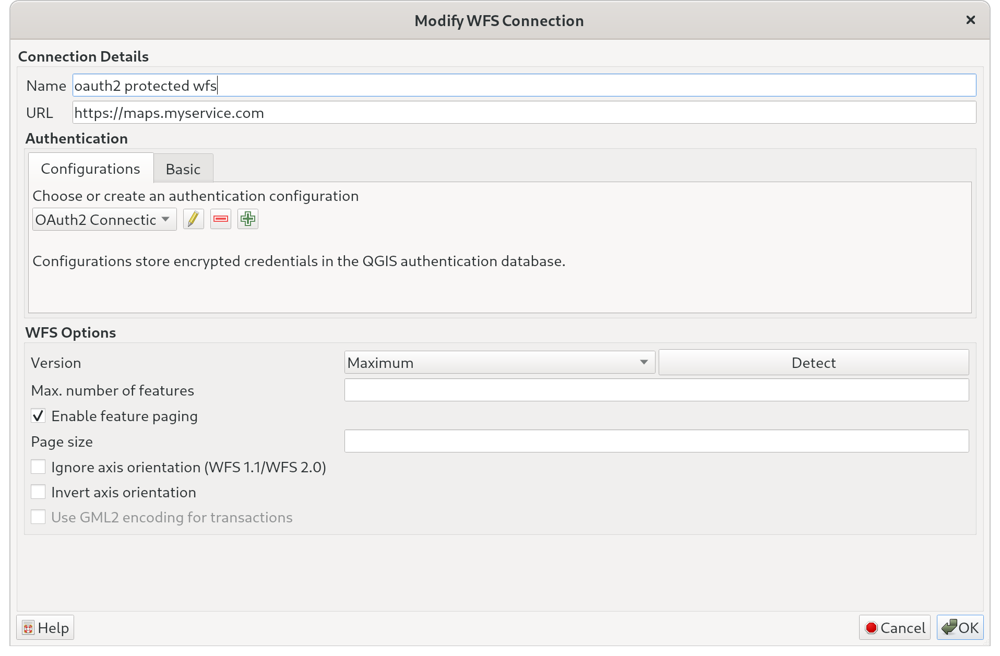
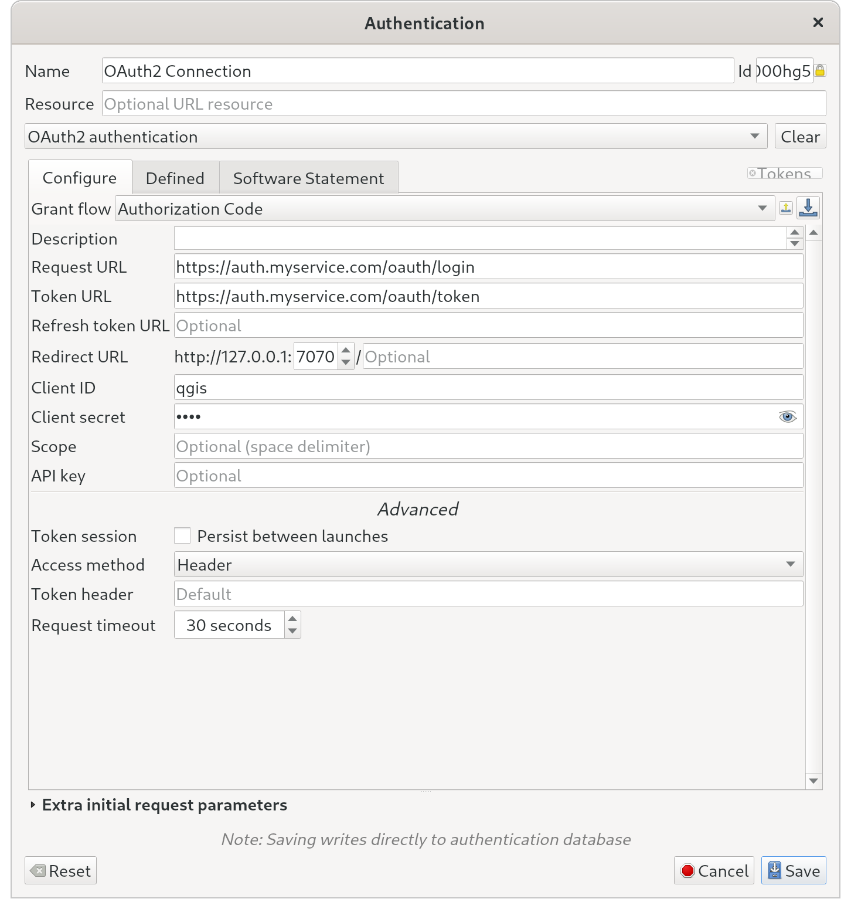
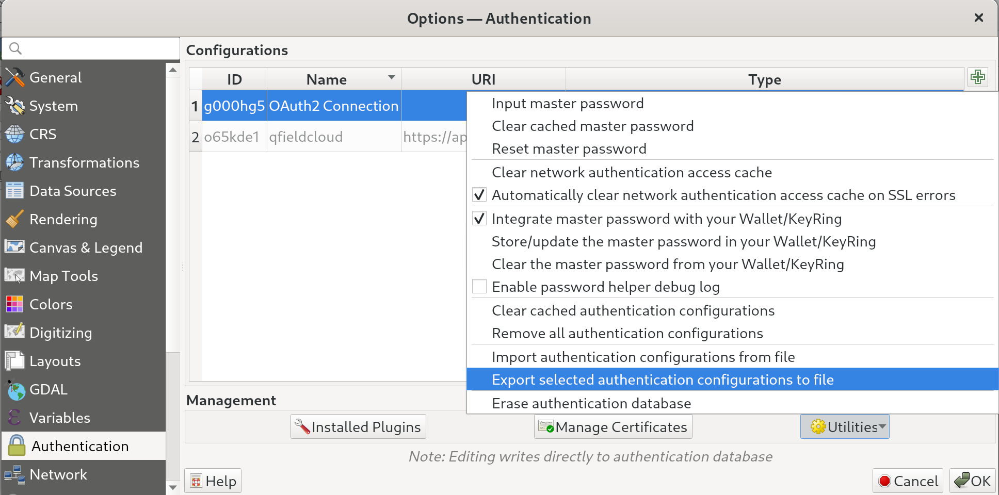

# Authentication

QField supports connecting to web services requiring user or token authentication.
This page details configuring OAuth2 services in QGIS and exporting authentication configurations to QField mobile devices.

## OAuth2-Protected Web Services in QGIS
:material-monitor: Desktop preparation

Before loading the OAuth2-protected web layers (such as WFS or WMS) into QField you need to configure  them accordingly in in QGIS.

!!! Workflow
    1. In QGIS, navigate to _Layer > Add Layer > Add WFS / OGC API Feature Layer..._.
    2. Click **New** or select an existing service connection and click **Edit**.
    3. Under the **Authentication** section, click the green plus (**+**) button to add a new authentication configuration.
    4. Set **Type** to **OAuth2** and adjust parameters to match your OAuth2 provider server setup.
    5. Save the configuration and verify that layers load correctly on the QGIS canvas.

!

!

## Export Authentication Configurations from QGIS to QField
:material-monitor: Desktop preparation

In order to view the layers in QField you need to export the authentication configurations from QGIS.

!!! Workflow
    1. In QGIS, navigate to _Settings > Options... > Authentication_.
    2. Select target configuration entries in the configurations table.
    3. Click **Utilities** and select **Export selected authentication configurations to file...**.
    4. When prompted for an encryption password, leave the password field **blank**.

!

!!! Warning
    Leaving authentication export passwords blank stores credentials in plain text inside the output XML file.
    Keep exported XML files secure and delete them after completing device deployment.

## Import Authentication Configurations into QField

:material-tablet: Fieldwork

Now youi have to transfer the exported authentication configuration XML file directly into the QField application directory on your mobile device.

!!! Workflow
    1. Copy the authentication configuration XML file from wherever you saved it during export.
    2. Connect to your mobile device (eg. via cable / cloud folder).
    3. Once connected copy the exported XML file into the `QField/Auth` directory on your device [App Directory](../../how-to/project-setup/storage.md#5-qfield-app-directory).
    4. Launch QField and open your project.

!!! Tip
    For interactive authentication methods (such as OAuth2), QField opens an in-app browser dialog prompting for user credentials, passwords, or two-factor authentication (2FA) verification codes when connecting to services.
