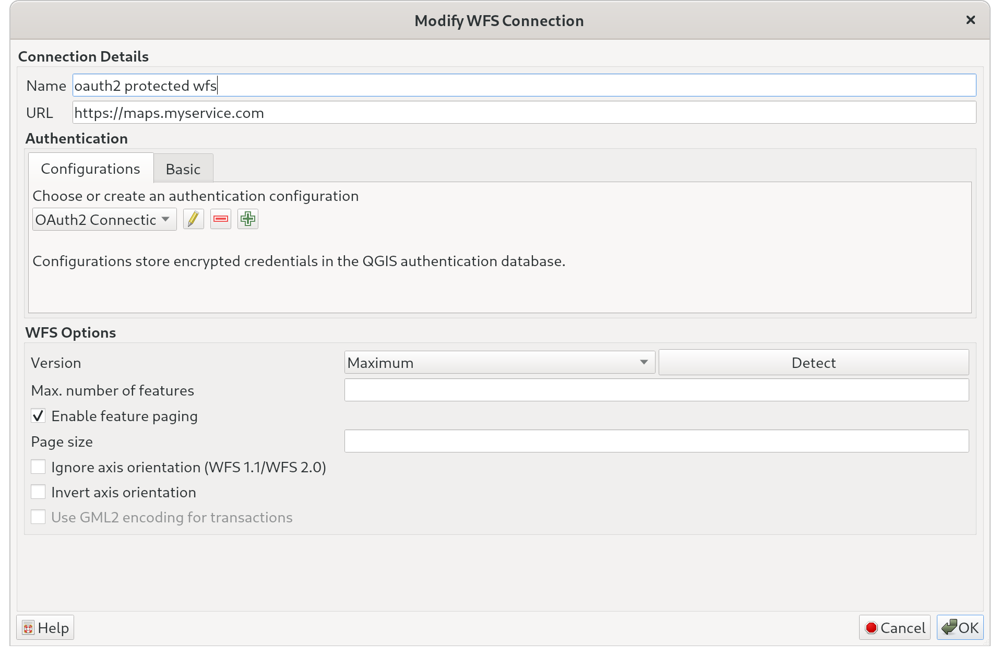
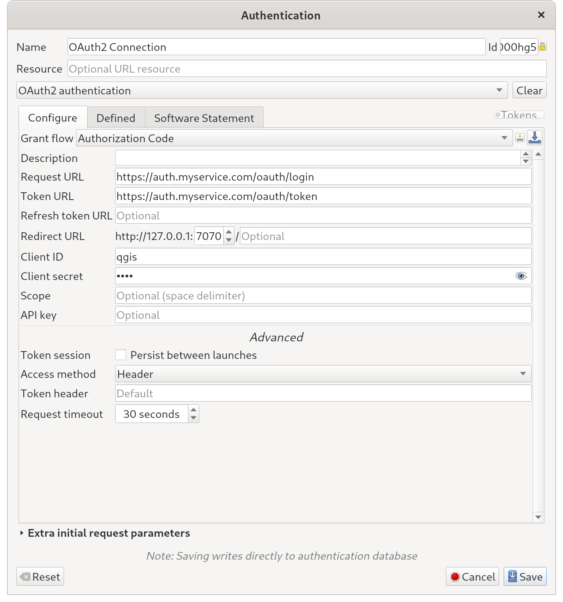

# Authentication

QField supports connecting to services requiring access authentication.
This page will go through authentication examples as well as demonstrating how to export authentication configuration from QGIS into QField

## OAuth2-protected web services in QGIS
:material-monitor: Desktop preparation

To successfully load OAuth2-protected layers in QField, these layers must be setup to use OAuth2 in QGIS.
To setup a WFS with OAuth2 in QGIS follow these steps.

!!! Workflow

    1. Direct to *Layer* > *Add Layer* > *Add WFS / OGC API Feature Service*
    2. Click on "New" or "edit" your existing service.
    3. Add a new authentication type by clicking the green cross and adjust the parameters to match your OAuth2 server setup.
    4. Once the layer's authentication configuration is set, add some layers into your project to test that they are rendering correctly.

    !

    !

## Export authentication configurations from QGIS
:material-monitor: Desktop preparation

Prior to exporting authentication configurations, it is always good to verify that you are able to properly connect to relevant services using QGIS.

!!! Workflow

    1. Direct to *Settings* > *Options* > *Authentication*

    2. Select one or more rows in the configurations table widget.
    3. Click on "Utilities" and select "export selected authentication configurations to file".
    4. When prompted for a password, *leave it blank*.

    !

    !!! Warning

        You will be warned that you might be leaking sensitive information, which is a good reminder to treat the resulting XML with caution.

## Import authentication configurations into QField
:material-monitor: Desktop preparation

In order for a service that requires authentication to run in QField, after configuring the required credentials in QGIS, the information needs to be added into QField as well.

!!! Workflow

    1. Export the authentication configuration file from QGIS (see above)
    2. On your device direct to the QField *[App Directory](../../how-to/project-setup/storage.en.md#5-qfield-app-directory)* > *Auth*
    3. Once copied, the service should be rendered correctly and provide access.

    !!! Tip

        For authentication methods requiring user input such as OAuth2, QField will provide a browser or dialog to prompting for the required details such as user, password, or 2-step authentication code.
