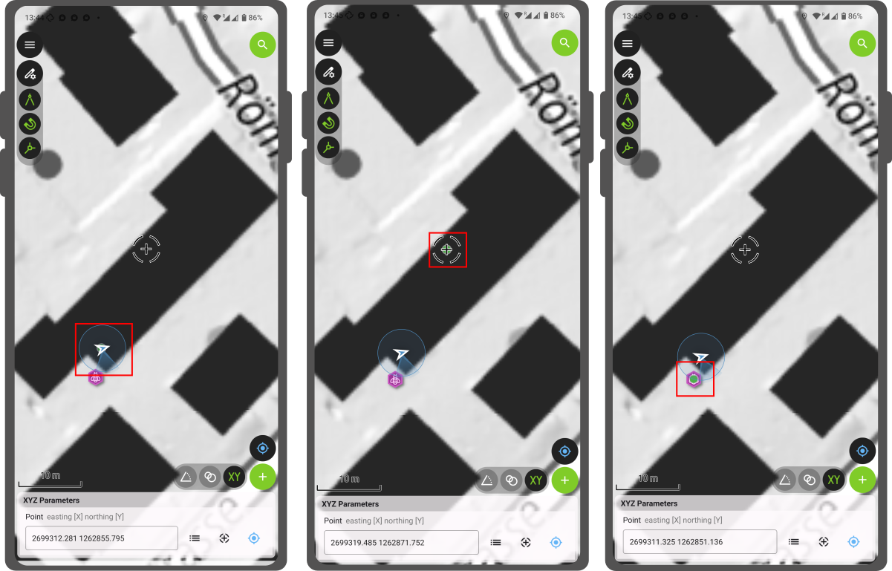

# COGO - Framework Coordinate Geometry

## What is COGO?
COGO is a framework that allows you to define a precise location of any spatial feature, making use of mathematical functions and measurements.
By precisely providing QField with the coordinates, the bearing, or the distance to where the next point or vertex should be,
it is possible to add highly accurate positioning information without actually having to physically go there.

!!! note
    Across all COGO tools, QField provides **dynamic visual guides**.
    As you enter parameters, lines, circles, and points are drawn directly on the map in real-time to help you verify your inputs before committing the feature.

!!! Example

    Presume you want to map your property.
    However, parts of the property are covered in boysenberry bushes and you are unable to walk on one side of the property boundary.
    Instead, you can use QField and activate the COGO framework to draw the exact boundary.

## COGO in QField

In QField there exist three COGO operations which can be activated only while being in editing mode.
The user can create new vertices or point features using the following three options:

- Point by XY[Z]
- Point at intersection of two circles
- Point by distance/angle [to another point]

!!! Prepare Workflow

    1. Open the QField project.
    2. Select digitize mode from the active QField project settings and layers view to enable editing tools within the selected layer of the QField project.
    3. Dismiss the active QField project settings and layers view to access the QField project map view.
    4. Expand the editing tools menu overlay from the active QField project map view by tapping on the pencil-and-gear icon.
    5. Enable visibility of the Coordinate Geometry (COGO) tool overlay by selecting the 'drafting compass icon' button from the editing tools menu overlay.

In the following sections, each option will be described as continuing the above Prepare Workflow steps and a detailed step-by-step introduction will be outlined.

### Point by XY[Z]

It may be useful to add points in the field using an exact coordinate reference,
for instance when receiving precise coordinates from an external source or to direct to a point of interest while being on holiday.

!!! Workflow

    6. Select the XYZ Parameters COGO tools variant by the 'XY icon' button from the COGO tools overlay located lower-right of the digitize mode map view.
    7. In the COGO tool variant overlay choose between three Point entry options:
        - Make a point from the Point Feature Picker 'dotted hamburger list of items icon' button following the Point text entry area.
        - Make a point wherever the crosshair is located on the map.
        - Make a point at the current location. For this, the positioning has to be turned on.
       *(Note: If your target layer supports Z-dimensions (3D geometries), an additional input for **Elevation** will be available).*
    8. Confirm the Point data entry - a virtual green point will appear where a new feature may be added.
    9. Click on the green plus sign to confirm and add the new feature.

    

### Point at intersection of two circles

You can also draw two circles with a set radius and decide on which point they intersect to create a point.
This is particularly useful if you want to add a feature that you cannot reach physically.
A surveyor needs to digitize the centre of fields.
Instead of walking in the centre of each of them, it is possible to draw two circles and then use the point where they intersect to add the feature.

!!! Workflow

    6. Click on Circles Intersection COGO tools variant by the 'two circles icon' button from the COGO tools overlay located lower-right of the digitize mode map view.
    7. In the COGO tool variant overlay enter the center points and radii of two circles the same way as outlined in the [XYZ Paramaters COGO tools variant](#adding-point-using-xyz)
    8. Select a preference for either of two points labelled **"A"** and **"B"** coincident with the intersection of circles as described above.
    9. Click on the green plus sign to confirm the new feature at the preferred point.

    !

### Point by distance/angle [to another point]

It is also possible to add a new feature set from a bearing and a specific distance.
This can be particularly useful when working in the infrastructure domain,
wanting to measure precisely the property boundary or the length of your pipes, cables, or other crucial assets.

!!! Workflow

    6. Click on Distance/Angle from Point COGO tools variant by the 'angle symbol icon' button from the COGO tools overlay located lower-right of the digitize mode map view.
    7. In the COGO tool variant overlay use the same data entry method as outlined in the [XYZ Paramaters COGO tools variant](#adding-point-using-xyz) to enter the origin location from which you want to offset by a distance and relative-north angle measurement.
    8. Set the distance and the bearing relative to north to where the feature should be added.
        *(Note: If your target layer supports Z-dimensions, an **Elevation** offset parameter will also be available).*
    9. The origin location will be drawn as connected by virtual dashed line to where a green point indicates the exact location of where the new feature may be added.
    10. Click on the green plus sign to confirm the new feature.

    !
