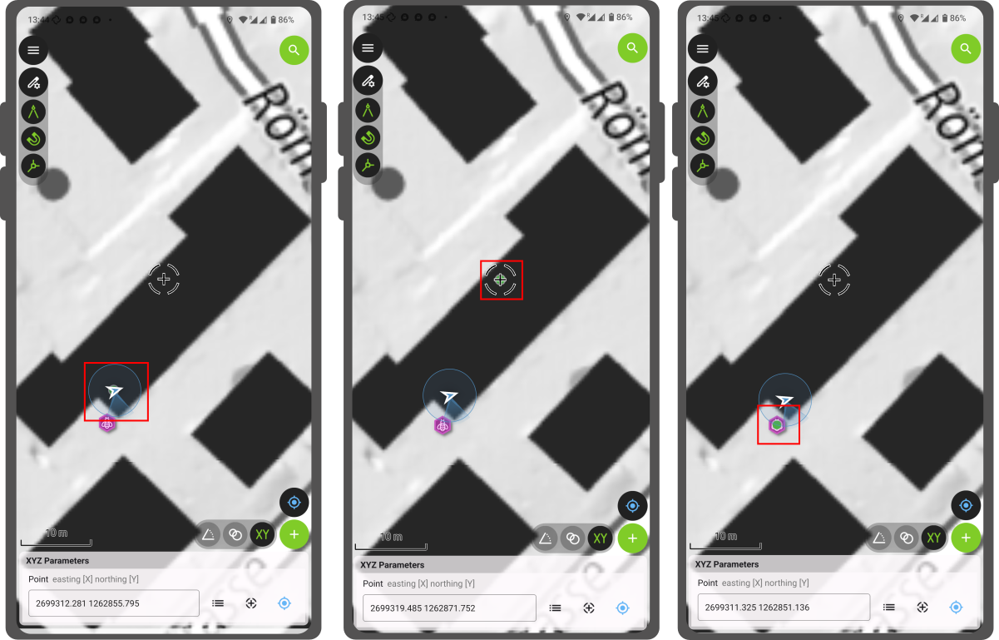

# COGO Framework - Coordinate Geometry

The Coordinate Geometry (COGO) framework defines spatial feature locations using mathematical functions and precise measurements.
By entering coordinates, bearings, or distances, QField calculates accurate vertex and feature positions without requiring physical presence at the target location.

!!! Note
    QField renders dynamic visual guides (lines, circles, and point previews) on the map canvas in real time as you enter parameters, allowing you to verify inputs before creating features.

### Example Use Case

Mapping a property boundary where physical access is obstructed (for instance, by dense vegetation or fence lines).
COGO tools allow digitizing boundary corners by measuring offsets from accessible locations.

## Enabling COGO in QField
:material-tablet: Fieldwork

COGO operations are available in digitize mode.

!!! Workflow
    1. Open your project in QField and enable digitize mode by tapping the pencil icon in the **Side Dashboard**.
    2. Select the target layer to edit.
    3. Tap the pencil-and-gear editing tools overlay icon on the map canvas.
    4. Tap the drafting compass icon to enable the COGO tools overlay.

Once active, choose from three COGO operations:

- **Point by XY[Z]**
- **Point at intersection of two circles**
- **Point by distance/angle [to another point]**

## COGO Operations

### Point by XY[Z]

Construct points using exact coordinate values.
This is useful when entering precise coordinates received from external surveys or spatial data sources.

!!! Workflow
    1. Tap the **"XY"** icon on the COGO tools overlay.
    2. Select a coordinate source method:
        - Select a feature location using the feature picker button.
        - Use the map crosshair location.
        - Use your current GNSS location (positioning must be active).
        *(Note: If the target layer supports 3D geometries, enter an **Elevation** value).*
    3. Confirm coordinate values. A green preview vertex displays on the map canvas.
    4. Tap the green plus button (**"+"**) to save the new feature.

### Point at Intersection of Two Circles

Construct points at the intersection of two circle radii drawn from reference origin points.
This is useful when digitizing unreachable features (such as measuring offsets from two known survey points).

!!! Workflow
    1. Tap the two circles icon on the COGO tools overlay.
    2. Set origin center points and radii for two circles using feature picker, crosshair, or GNSS location options.
    3. Select preferred intersection point **"A"** or **"B"** displayed on the map canvas.
    4. Tap the green plus button (**"+"**) to save the feature at the selected intersection point.

!

### Point by Distance/Angle [to Another Point]

Construct points using distance offsets and bearing angles from an origin point.
This is useful for utility and cadastral surveys measuring precise property boundaries or pipeline offsets.

!!! Workflow
    1. Tap the angle icon on the COGO tools overlay.
    2. Set an origin point using feature picker, crosshair, or GNSS location options.
    3. Enter distance and bearing relative to North.
        *(Note: If the target layer supports 3D geometries, enter an **Elevation** offset value).*
    4. Inspect the virtual dashed line and green preview point connecting the origin to the target location.
    5. Tap the green plus button (**"+"**) to save the feature.

!
