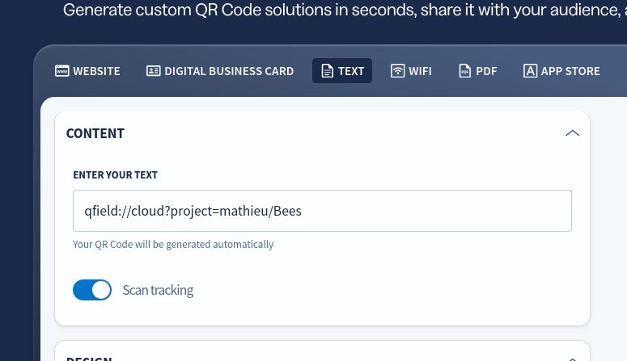
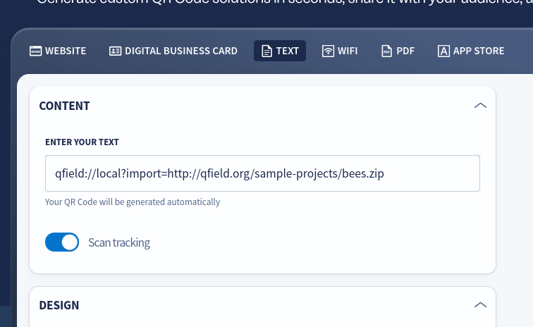

# QR Codes in QField

QField can leverage QR codes in multiple ways.
This page lists a couple of ways in which you can easily share your projects and plugins through these.

## Projects

QR codes can be generated for users to scan them on their devices and automatically open QField to initiate a project download.

### Cloud projects hosted on QFieldCloud

The easiest way to share a project with your co-workers or the public is through QFieldCloud.

QR codes for cloud projects hosted on QFieldCloud allow you to automatically launch QField and immediately open the project details page where you can access information such as the title and the description as well as the author name.
You also can immediately download and open the project.

!!! Workflow

    **Create QR Code for cloud project**

    1. To generate a QR code, use your favorite generator app or simply go to the web and search for QR generator.
    2. Choose one and switch from "website" to "text"
    3. Enter the following:

                    `qfield://cloud?project=username/project_name`

         Simply replace "username" with a QFieldCloud user account and "project_name" with an actual project name tied to that user account.

     !

     **Note**: If the project is ***public***, it can be downloaded by any user account.
     If the project is set to ***private*** when scanning scanning the QR code, QFieldCloud will determine whether a given project is available for download for the logged-in user.

### Compressed projects uploaded on the web

The importing of compressed projects uploaded on the web into QField can be simplified through QR codes.
When scanning such a code, QField will automatically launch and immediately open a project import permission dialog.

!!! Workflow

    **Create QR Code for compressed projects**

    1. To generate a QR code go to the web and find your preferred QR generator.
    2. Choose one and switch from "website" to "text"
    3. Enter the following:

     `qfield://local?import=https://www.public.com/project.zip`

     Simply replace the https:// part of the URI with a publicly available web hyperlink.
     Once imported, the project will be located in the local projects and datasets' "Imported Projects" folder.

     !

     **Note**: The hyperlink used must be directing directly to the ZIP file.
     It will fail if it is a link to a download landing page.

## Application plugin QR codes

QField's comes with a plugin framework, which add additional functionalities to the app.
You can find further information about it on the dedicated [plugin page](../advanced-how-tos/plugins.md).
There are several ways in which plugins can be installed.
One way is through the QR code button inside the plugin installation dialog.

!!! Workflow

    1. In QField, direct to the QField Settings by opening the Side Dashboard panel *> three-dotted menu > settings*
    2. In the general section scroll down and open the plugin manager
    3. Tap on *Install plugin from URL*
    4. In the dialog, tap on the QR code button.
    QField will install the plugin without the need to further type in anything.
    

    **Note**: The hyperlink used must be directing directly to the ZIP file.
     It will fail if it is a link to a download landing page.
