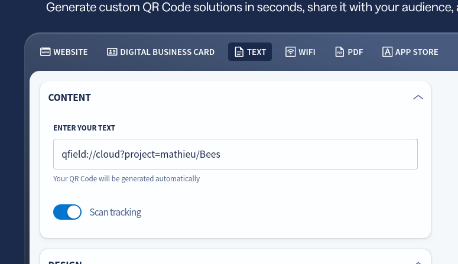
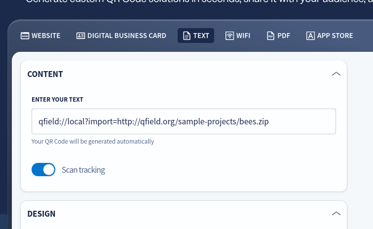

# QR Codes

QField leverages QR codes to streamline sharing, importing, and deploying projects, datasets, and application plugins.

## QR Codes for Projects

QR codes can trigger QField to launch automatically and initiate cloud or web project downloads.

### Cloud Projects Hosted on QFieldCloud

QR codes for QFieldCloud projects open project details pages in QField, displaying title, description, and author metadata alongside download options.

!!! Workflow
    1. Open a QR code generator application or website.
    2. Set the input type to text.
    3. Enter the cloud project URI using the following syntax:

        ```text
        qfield://cloud?project=username/project_name
        ```

        Replace `username` with your QFieldCloud account name and `project_name` with the target cloud project name.

        !


!!! Note
    If the project is **Public**, any QField user can download it.
    If set to **Private**, QFieldCloud verifies user account access permissions before granting project downloads.

### Compressed Web Projects

Simplify importing web-hosted compressed project files (`.zip`) by creating import QR codes.
Scanning the code launches QField and opens a project import confirmation dialog.

!!! Workflow
    1. Open a QR code generator application or website.
    2. Set the input type to text.
    3. Enter the import URI using the following syntax:

        ```text
        qfield://local?import=[https://example.com/project.zip](https://example.com/project.zip)
        ```

        Replace the URL with a direct web link pointing to your hosted `.zip` project archive.

        !


!!! Note
    The URL specified in the URI must point directly to a `.zip` archive file rather than a web download landing page.
    Imported projects save automatically into the **Imported Projects** directory on your device.

## Application Plugin QR Codes
:material-tablet: Fieldwork

Install QField application plugins directly by scanning plugin QR codes inside the Plugin Manager.
Read more on the [Plugins Documentation](../advanced-how-tos/plugins.md).

!!! Workflow
    1. Open the **Side Dashboard** and tap the three-dotted menu *(⋮)*.
    2. Select **Plugin Manager**.
    3. Tap **Install plugin from URL**.
    4. Tap the QR code icon inside the dialog to open the camera scanner.
    5. Scan the plugin QR code to download and install the plugin automatically.

!!! Note
    The QR code must link directly to a publicly hosted `.zip` plugin archive file.
