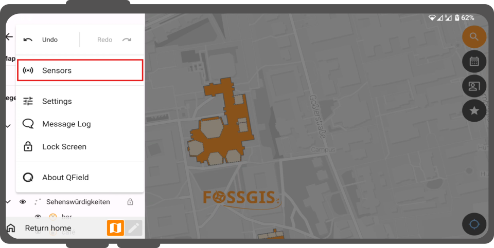
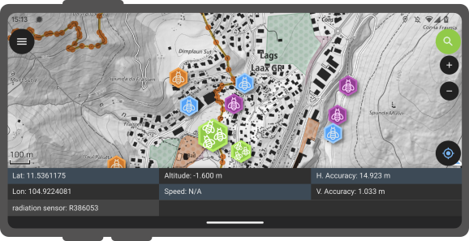
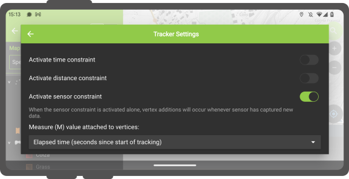

# Sensors

QField supports background sensor logging, allowing you to passively collect sensor data, display live measurements on the map canvas, and store readings inside feature attribute fields.

## Activating Sensors
:material-tablet: Fieldwork

Toggle and manage registered sensors from the project dashboard.

!!! Workflow
    1. Open the **Side Dashboard**.
    2. Tap the three-dotted menu *(⋮)* and select **"Sensors"**.
        !
    3. Tap a sensor name in the submenu to toggle data collection.
    When active, a sensor icon displays next to the sensor name; when inactive, a dot icon displays.

Active sensors collecting data display live readings inside a sensor information panel at the bottom of the map canvas.

!

## Sensor-Driven Tracking

Store live sensor readings linked to GNSS positions by initiating tracking sessions on point vector layers.

### Configuration in QGIS
:material-monitor: Desktop preparation

!!! Workflow
    1. In QGIS, open _Vector Layer Properties... > Attribute Form_ for your target point layer.
    2. Select the attribute field intended to store sensor readings.
    3. Set **"Default Value"** to `sensor_data('sensor_name')` (replace `'sensor_name'` with your target sensor identifier).
    Read more in the [Attribute Form Documentation](../project-setup/attributes-form.md#define-default-values).

### Running Sensor-Driven Tracking
:material-tablet: Fieldwork

!!! Workflow
    1. Open your project in QField and initiate a tracking session on the configured point layer.
    2. (Optional) Enable the sensor constraint toggle when configuring the tracking session to record a new point feature each time the sensor captures new data.

!

!
