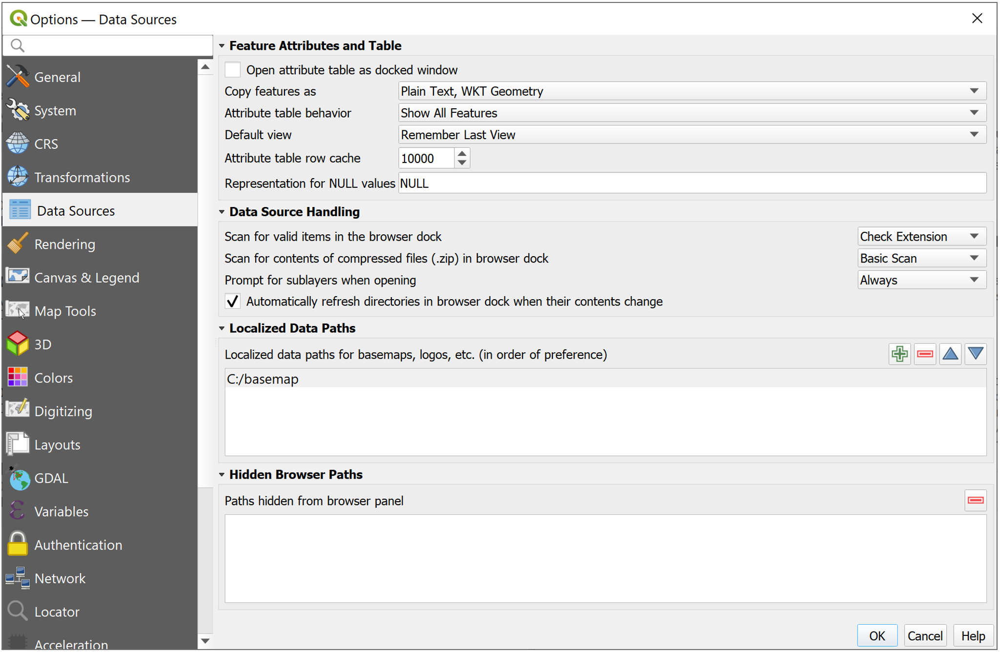
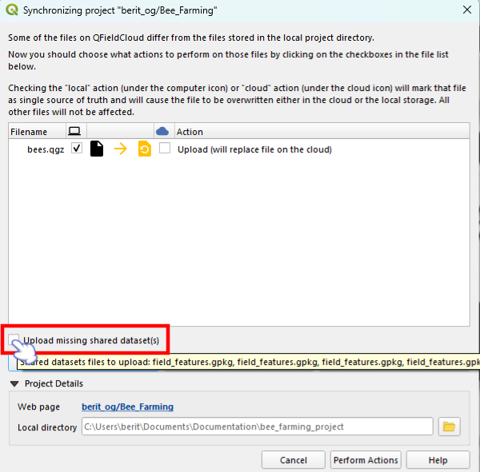
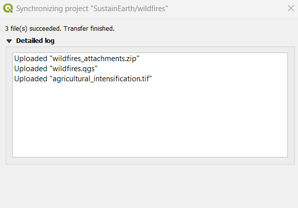
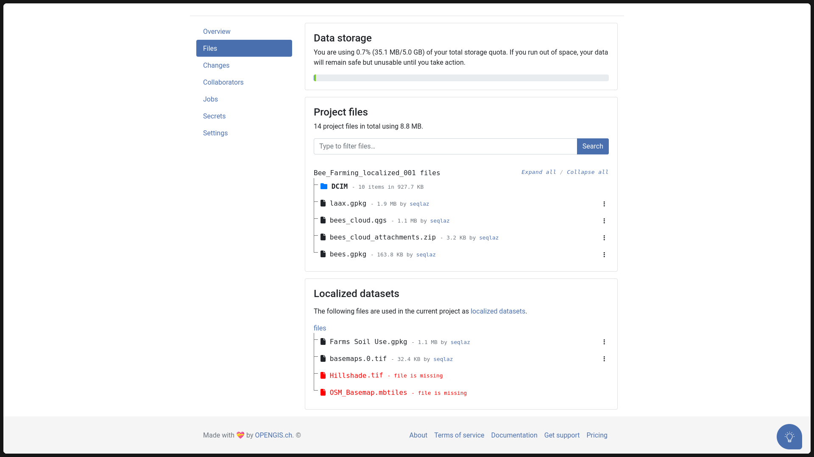
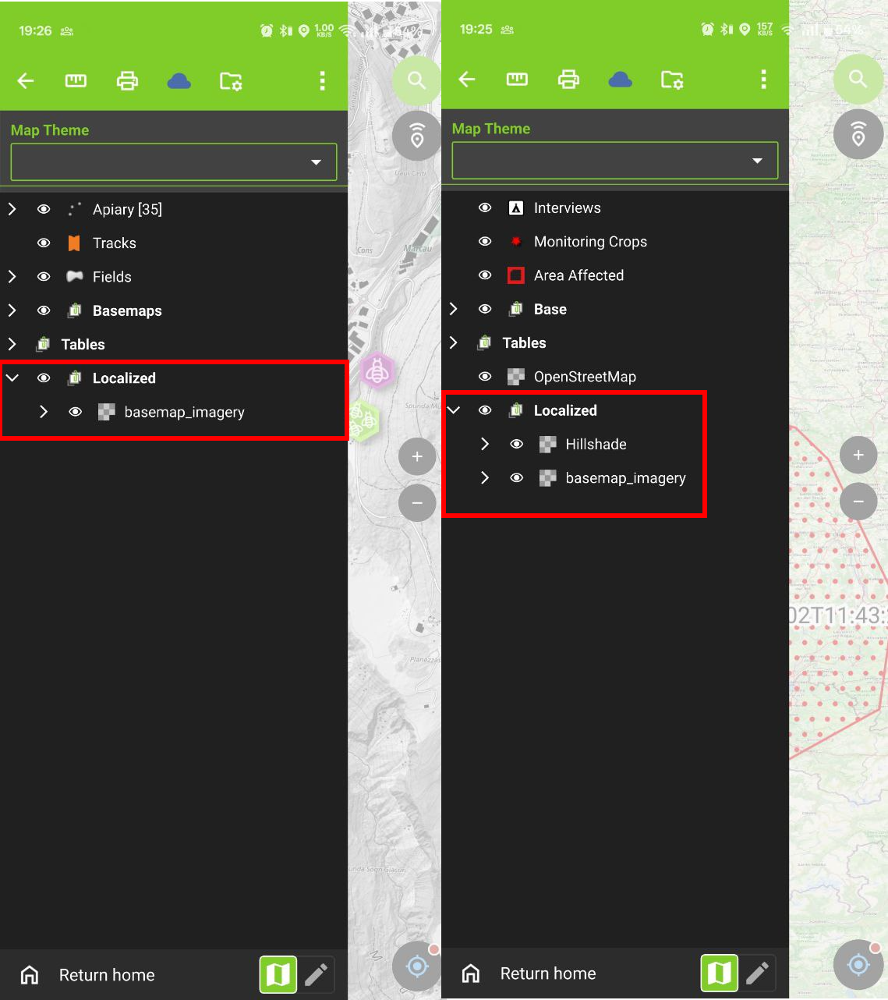
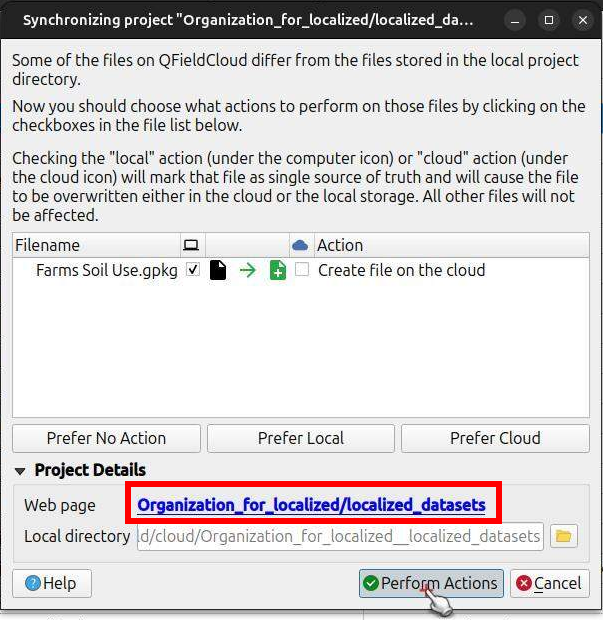
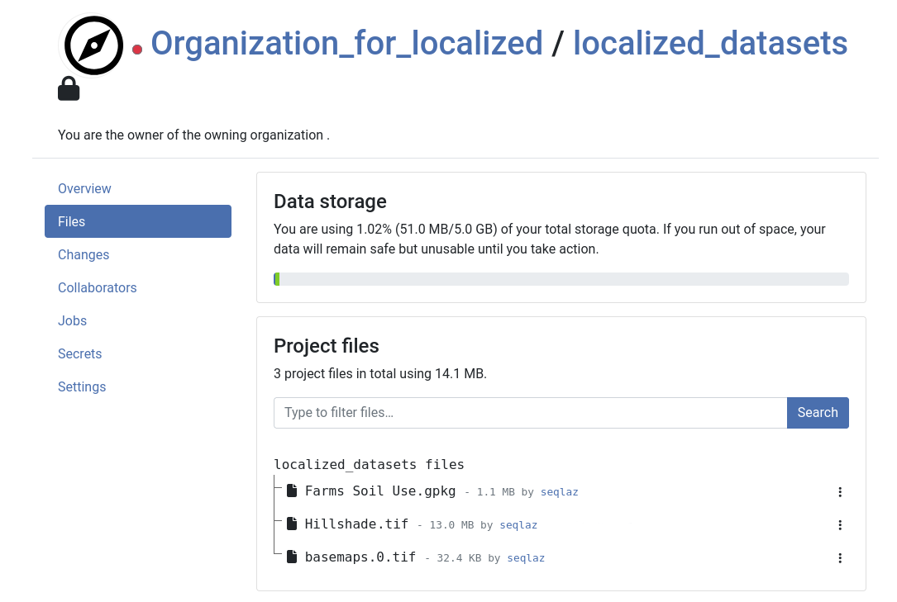

# Shared Datasets

QField allows you to store datasets in a central folder—referred to as a "shared datasets folder"—and access them across multiple projects.

Sharing layers across projects reduces storage usage for large datasets (such as background raster orthophotos or regional vector datasets) and simplifies dataset updates across devices.

You can share data across projects using two methods:

- **Manual Transfer:** Copy datasets directly onto device storage.
- **QFieldCloud Synchronization:** Upload datasets to a dedicated project on QFieldCloud accessible to dependent projects.

## Managing Localized Data Paths in QGIS
:material-monitor: Desktop preparation

When preparing projects in QGIS, store shared layers inside directory paths configured as "Localized Data Paths".

!!! Workflow
    1. In QGIS, navigate to _Settings > Options... > Data Sources_.
    2. Under the **"Localized Data Paths"** section, click the plus (**"+"**) button and add the folder path where shared datasets are stored.
    3. Restart QGIS to apply localized path settings.

!

## Manual Transfer to Mobile Devices
:material-tablet: Fieldwork

Transfer shared datasets manually to mobile devices by copying files into the local QField application folder.

!!! Workflow
    1. Locate your device's [App Directory](../../how-to/project-setup/storage.md#5-qfield-app-directory).
    (To check the app path in QField, open the **Side Dashboard** > three-dotted menu *(⋮)* > **"About QField"**).
    2. Copy your shared dataset files into `[App Directory]/QField/basemaps`.
    QField automatically scans this directory for shared datasets across all local projects.

!

## Configuring Shared Datasets with QFieldCloud

QFieldCloud streamlines shared dataset management across projects using QGIS localized data path settings.
Cloud projects reference shared datasets stored in a central QFieldCloud project named exactly **`shared_datasets`**.

Before synchronizing projects that depend on shared datasets, create a cloud project named **`shared_datasets`** under your personal account or organization on QFieldCloud.

The directory structure inside the **`shared_datasets`** cloud project mirrors the localized path structure on your desktop computer.
For example, if your QGIS Localized Data Path is `./GIS_Common/BaseData/` containing `Administrative-boundaries.gpkg`, the file appears as `Administrative-boundaries.gpkg` at the root of the **`shared_datasets`** cloud project.

!!! Note
    Only collaborators assigned **Manager** or **Admin** roles (or organization owners) can add or update files inside the **`shared_datasets`** project.

### Preparation of QGIS Projects with Shared Datasets
:material-monitor: Desktop preparation

!!! Workflow
    1. Configure Localized Data Paths in QGIS as described in [Managing Localized Data Paths in QGIS](#managing-localized-data-paths-in-qgis).
    2. Verify that shared layer file paths in your QGIS project are relative to one of the configured localized data paths.

### Uploading Shared Datasets to QFieldCloud
:material-monitor: Desktop preparation

Upload shared datasets to QFieldCloud using the QFieldSync plugin after verifying that the **`shared_datasets`** project exists in QFieldCloud.

!!! Workflow
    1. Open your project in QGIS and open the QFieldSync plugin dialog.
    2. Initiate the synchronization process to open the QFieldSync action panel.
    3. Enable the **"Upload missing localized dataset(s)"** checkbox.
    (Hovering over the checkbox displays a list of localized files selected for upload. This option is available only to users with upload permissions on the `shared_datasets` project).
    4. Click **"Perform Actions"** to upload project files and shared datasets to QFieldCloud.

!

!!! Note
    When sharing datasets across organization projects, create an empty cloud project named `shared_datasets` under your organization account before synchronizing dependent projects.

### Reviewing the Upload Log

After synchronization completes, inspect the QFieldSync process log to confirm which shared dataset files were uploaded to QFieldCloud.

!

### Managing Shared Datasets in QFieldCloud Web Interface

Uploaded shared datasets display in two locations within the QFieldCloud web interface:

- Inside the dedicated **`shared_datasets`** project.
- Referenced under the **Files** tab of any regular cloud project that uses them.

!!! Workflow
    1. Open your project in the QFieldCloud web interface.
    2. Select the **"Files"** tab.
    3. Locate the **"Shared datasets"** section to view referenced shared files.

!

### Managing Permissions for Shared Datasets

Granting collaborators access to a regular project does not grant access to files inside the **`shared_datasets`** project.
You must grant users access to the **`shared_datasets`** project so they can download shared files.

!!! Workflow
    1. Open the **`shared_datasets`** project in the QFieldCloud web interface.
    2. Select the **"Collaborators"** tab.
    3. Add project collaborators and assign them at least the **Reader** role.
    The **Reader** role allows users to view and download shared files in QField and QFieldSync without modifying central datasets.

!!! Note
    Collaborators who need to upload, update, or remove files in the **`shared_datasets`** project require the **Manager** or **Admin** role.

### Troubleshooting Shared Datasets

When a project references shared files that have not yet been uploaded to the **`shared_datasets`** project, QFieldCloud displays missing file warnings in red text inside the web interface.

To resolve missing shared files, confirm that the **`shared_datasets`** project exists on QFieldCloud and re-synchronize the project from QGIS using QFieldSync with **"Upload missing localized dataset(s)"** enabled.

When opening a QGIS project that references shared files already uploaded to **`shared_datasets`**, QFieldSync detects the existing cloud files and hides the **"Upload missing localized dataset(s)"** checkbox.

### Downloading Shared Datasets in QField
:material-tablet: Fieldwork

!!! Workflow
    1. Open a cloud project containing shared datasets in QField and tap synchronize.
    2. QField downloads each shared dataset **once**, storing files locally to serve all projects referencing those datasets.

!

### Direct Synchronization of the `shared_datasets` Project

Users with Manager or Admin permissions can synchronize files directly into the **`shared_datasets`** project without synchronizing dependent projects.

#### Using QFieldSync
:material-monitor: Desktop preparation

!!! Workflow
    1. In QFieldSync, download the **`shared_datasets`** project from QFieldCloud to a local directory on your computer.
    2. Add, update, or remove shared dataset files inside the downloaded folder directory.
    3. Synchronize the **`shared_datasets`** project in QFieldSync to push changes to QFieldCloud.

!

!

!!! Note
    Collaborator permissions must be assigned explicitly on the **`shared_datasets`** project.
    Admin roles on dependent projects do not grant administrative access to the **`shared_datasets`** project.

#### Using the QFieldCloud CLI

Automate dataset synchronization to the **`shared_datasets`** project using the `qfieldcloud-cli` command-line tool (included in the `qfieldcloud-sdk` Python package).

!!! Workflow
    1. Authenticate with QFieldCloud:

        ```bash
        qfieldcloud-cli login USER PASSWORD
        export QFIELDCLOUD_TOKEN="YOUR_SECRET_TOKEN"
        ```

    2. Retrieve the project ID for your `shared_datasets` project:

        - [List the QFieldCloud projects](https://opengisch.github.io/qfieldcloud-sdk-python/examples/#list-your-projects) and get the project ID of the **`shared_datasets`** project:

        ```bash
        $ qfieldcloud-cli list-projects
        Listing projects…
        Projects the current user has access to:
        | ID                                   | OWNER/NAME           | IS PUBLIC |
        ---------------------------------------------------------------------------
        | 90e83606-dce8-4b0d-854a-388904d8a739 | USER/shared_datasets | 0         |
        ```

        !!! note
            Your project ID will be different

    3. Upload local shared dataset directories to the shared_datasets project:

        [Upload the shared datasets](https://opengisch.github.io/qfieldcloud-sdk-python/examples/#upload-local-files-to-qfieldcloud) from your local source directory to the **`shared_datasets`** project:

        ```bash
        qfieldcloud-cli upload-files 'YOUR_PROJECT_ID' "./path/to/your/local/shared/data/"
        ```

You can set up this [command as a regular cronjob that runs periodically](https://opengisch.github.io/qfieldcloud-sdk-python/examples/#schedule-and-trigger-a-package-job) (e.g., daily), or trigger it manually based on other conditions, to keep your shared datasets on QFieldCloud up-to-date.
