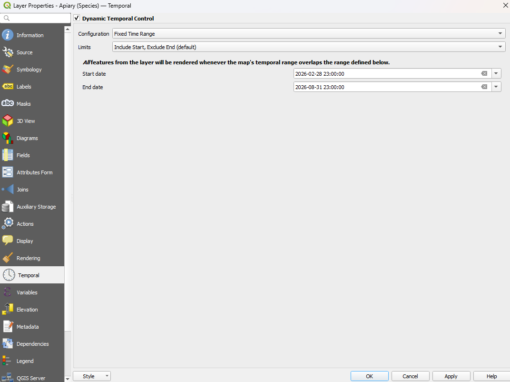

# Temporal filtering

QField can replicate "active temporal settings" that you set in QGIS to your layer.
In QField this is indicated by a clock that becomes visible in the "Side Dashboard".
When disabled, the clock will appear grey.
Once the filter has been set, the clock turns green and only the elements that are within the temporal range will be rendered on the map canvas.

!

!!! Workflow

    :material-monitor: Desktop preparation

    1. In QGIS open the vector properties of your layer with the temporal field(s)
    2. Direct to the "temporal" section and enable the "Dynamic Temporal Control"
     !!
    3. Choose between your preferred rendering mode.
    You can read more about the different rendering options in [the official QGIS documentation](https://docs.qgis.org/latest/en/docs/user_manual/working_with_vector/vector_properties.html#temporal-properties).
    4. Save and synchronize your project.

    :material-tablet: QField

    Once you have packaged the most recent version of your project you will see the clock icon appearing in the "Side Dashboard".

    1. Open the "Side Dashboard"
    2. Click on the clock icon and select the desired rendering timeframe.
    3. Close and look for the remaining features

     !

     QField's temporal filtering behaves exactly like the fixed range temporal navigation mode in QGIS.
