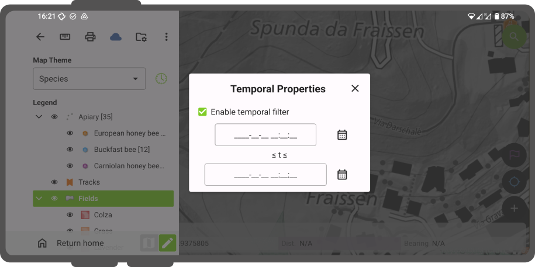
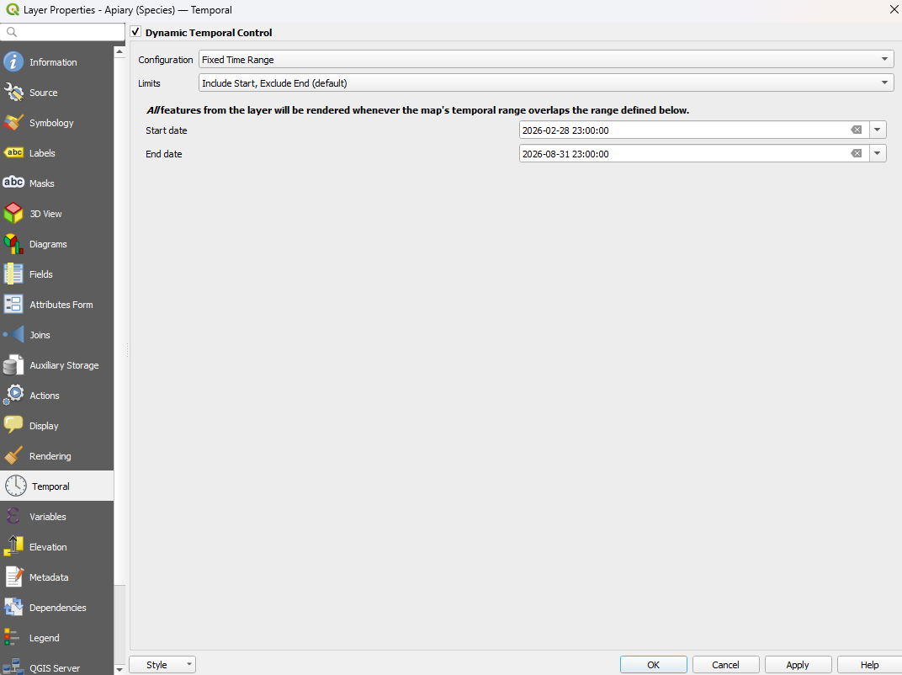
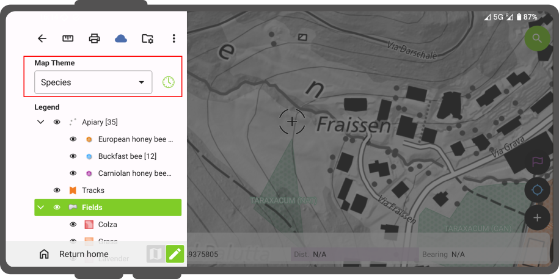

# Temporal Filtering

QField replicates active temporal controller settings configured in QGIS to dynamically filter vector layer features on the map canvas.
Temporal filtering status displays via a clock icon in the **Side Dashboard**:

- **Grey clock icon:** Temporal filter is inactive.
- **Green clock icon:** Temporal filter is active, displaying only features falling within the defined time range.

!

## Configuring Temporal Filtering in QGIS
:material-monitor: Desktop preparation

Configure temporal settings on vector layers in QGIS before exporting projects to QField.

!!! Workflow
    1. In QGIS, navigate to _Vector Layer Properties... > Temporal_.
    2. Enable **"Dynamic Temporal Control"**.
        !
    3. Select your preferred temporal configuration mode (such as single field datetime, separate start/end date fields, or event duration).
    Read more in the [QGIS Vector Layer Temporal Properties Documentation](https://docs.qgis.org/latest/en/docs/user_manual/working_with_vector/vector_properties.html#temporal-properties). <!-- markdown-link-check-disable-line -->
    4. Save your project and synchronize it to QField.

## Applying Temporal Filters in QField
:material-tablet: Fieldwork

Filter layer features by time range directly on your mobile device.

!!! Workflow
    1. Open the **Side Dashboard**.
    2. Tap the clock icon in the header bar.
    3. Select or define the desired time range.
    4. Close the panel to inspect temporal features rendered on the map canvas.

!

!!! Note
    QField temporal filtering operates identically to the fixed range temporal navigation mode in QGIS.
