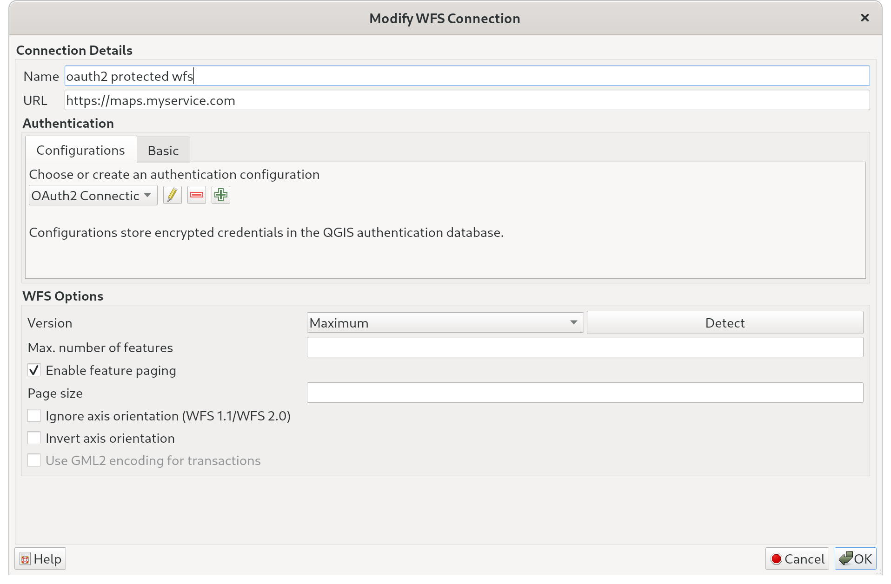
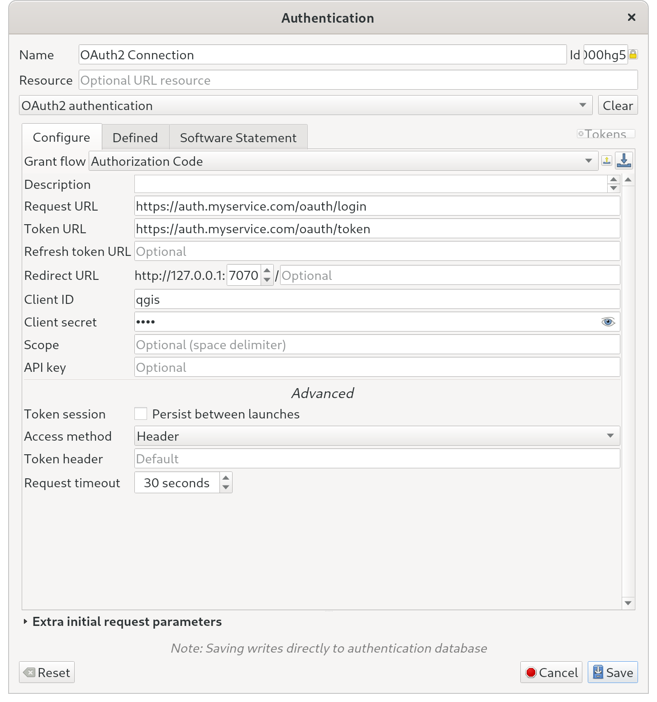
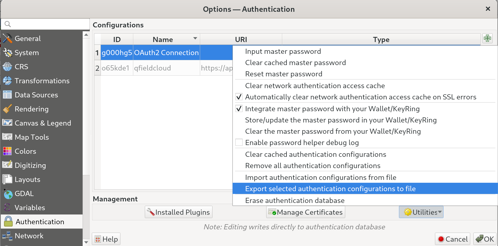

# Authentication

QField supports connecting to OAuth2 protected web services. By using
OAuth2, it is possible to protect layers and services with a wide
variety of authentiaction schemes like for example two factor
authentication.

To successfully load OAuth2-protected layer(s) in QField, the QGIS
project must be setup to use OAuth2.

## Prepare the authentication in QGIS
:material-monitor: Desktop preparation

To setup a WFS with OAuth2 in QGIS follow these steps in the QGIS
project configuration.

In the WFS layer configuration:

!

Add a new authentication configuration. Parameters need to be adjusted
to the OAuth2 server setup:

!

## Export the authentication from QGIS
:material-monitor: Desktop preparation

!!! note
    Exporting an auth configuration requires at least QGIS 3.20. It is
    possible to only use QGIS 3.20 to prepare the auth config and configure
    the QGIS project itself with an earlier version of QGIS.

!!! note
    It is important that the Configuration ID of the exported configuration
    and the configuration stored in the QGIS project match.

At this point, verify that you are able to properly connect to the
service from QGIS. This authentication configuration must first be
exported from QGIS itself.

To do so, open the QGIS options dialog and focus on the
authentication panel. There, you can select the *OAuth2 configuration*
used by the project layer(s) by clicking on the appropriate row in the
configurations table widget. Then, use the lower-right
utilities button to select the *export selected authentication
configurations to file* action.

!

When prompted for a password, leave it blank. You will be warned
that she might be leaking sensitive information. In the case of
OAuth2 configurations, it is safe to do so.

Once you have exported the authentication configuration to an XML
file, she copies that file onto the device(s) running QField. The
file has to be copied to the devices `<drive>:/Android/data/ch.opengis.qfield/files/QField/auth/` QField directory. The `/QField/auth/` path is created when first
launching QField.

!!! note
    Since QField 2 the auth files needs to be stored in the app directory `<drive>:/Android/data/ch.opengis.qfield/files/QField/auth` instead of the devices main directory `<drive>:/QField/auth`.

Once the authentication configuration XML file is copied, you can copy
the project file containing OAuth2-protected layer(s) onto the device(s)
and open the project in QField. You will be prompted for the
user, password, and 2-step-verification authentication code within a
browser panel that will pop up in QField itself.

Once authenticated, content will be rendered without the need to
re-enter user information for the duration of the session.
