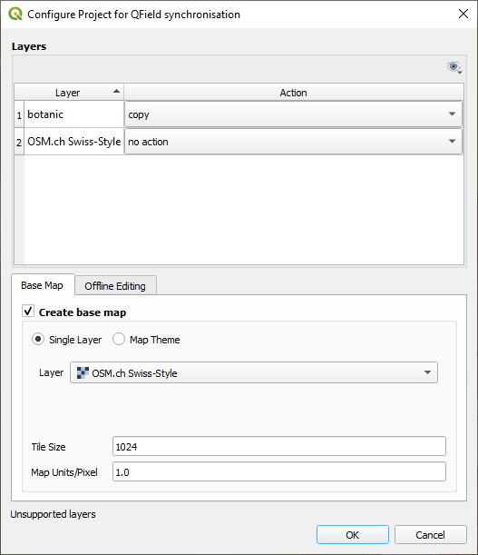
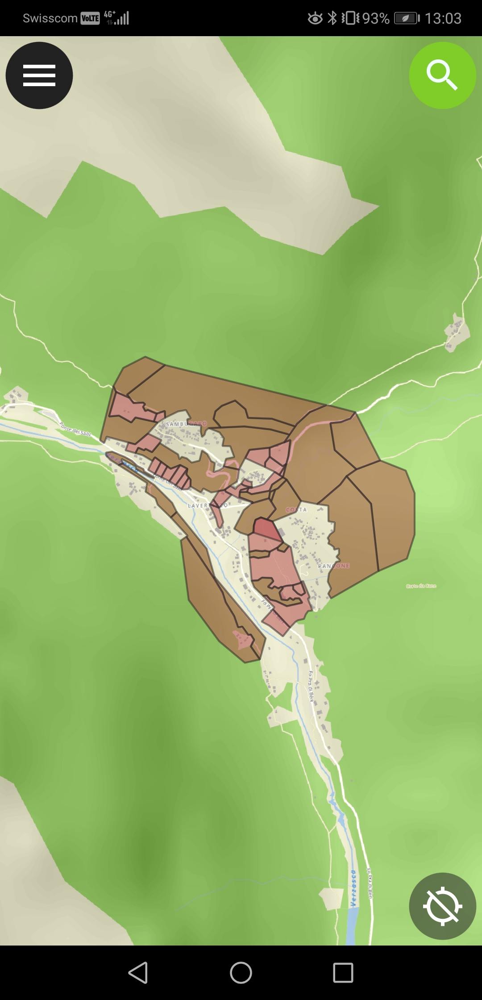

# Base maps

QField is able to load a base map from a web service or use an existing project as Base Map. 
QField is also able to directly use vector data and raster data without a QGIS
project.

## Configure a web service as base map
:material-desktop-mac:{ .device-icon } Desktop preparation

In QGIS with the plugin QFieldSync, set the base map to the "Project
Configuration"

!

Then make the package of the project to load it on your device.

!

Below the result on QField.

!

## Using a project as Base Map
:material-tablet-android:{ .device-icon } Fieldwork

To use an existing project as Base Map, do a long press on the project
and check "Base Map Project".

## Openging individual data
:material-tablet-android:{ .device-icon } Fieldwork

QField is able to use vector data and raster data without a QGIS
project.

### Opening individual vector

It is possible to open directly vector data. For example below with a
GPKG:

### Opening individual raster

It is also possible to open directly raster data. For example below with
a TIF:

