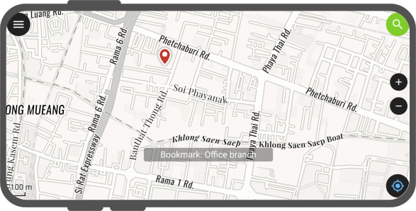
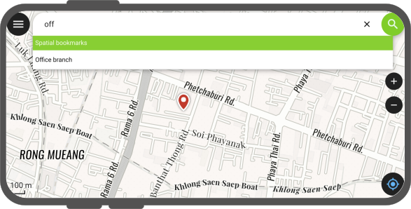
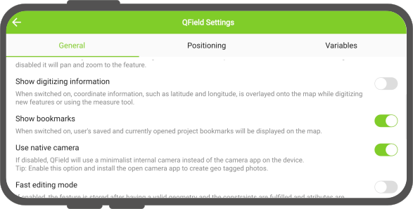
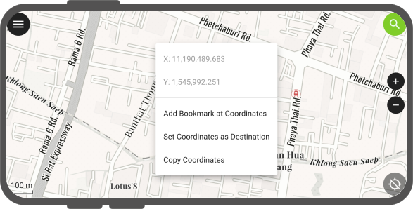

# Bookmarks

QField allows you to save and display bookmarks that will be remembered across sessions and projects.

## Viewing Bookmarks
:material-tablet-android:{ .device-icon } Fieldwork

By default, QField will display bookmarks as marker overlays over the map. User-added bookmarks are displayed across all projects and datasets.

A single tap on a marker will display the bookmark name while a touble tap will set the map extent to re-center around the bookmark location.

!

You can also use the top search bar to find bookmarks and click on matching bookmark names to move the map extent to re-center around the bookmark location.

!

QField also offers a setting to toggle off the displaying of bookmarks, which can be found in the settings panel.

!

## Adding Bookmarks
:material-tablet-android:{ .device-icon } Fieldwork

To add a new bookmark, simply tap and hold any part of the map and select the *Add Bookmark at Coordinates* action within the popped up menu.

!

After selecting this action, a panel will appear offering you the possibility to rename the bookmark and select the color used to draw its map marker overlay.

!

It is also possible to add a bookmark at the current device's location when positioning is enabled. To do so, simply tap and hold on the positioning button at the lower right corner and select the *Add Bookmark at Current Location* action.

!

!!! note
    When adding a bookmark, the current map scale is taken into consideration to save an extent centered around the tapped coordination or current location. This allows you to determine the extent that will be used when double-tapping on a bookmark marker or selecting a bookmark item in the search bar.

## Project Bookmarks

QField can display and search for project-embedded bookmarks. The addition and manage of such bookmarks is done [in QGIS itself](https://docs.qgis.org/latest/en/docs/user_manual/introduction/general_tools.html#spatial-bookmarks).
