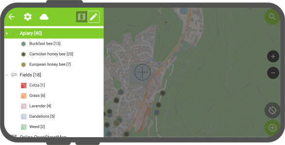
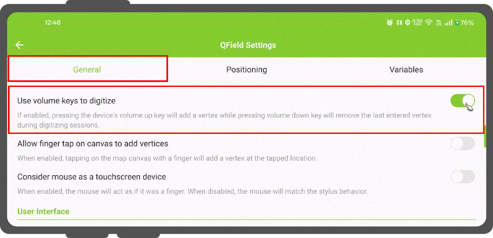
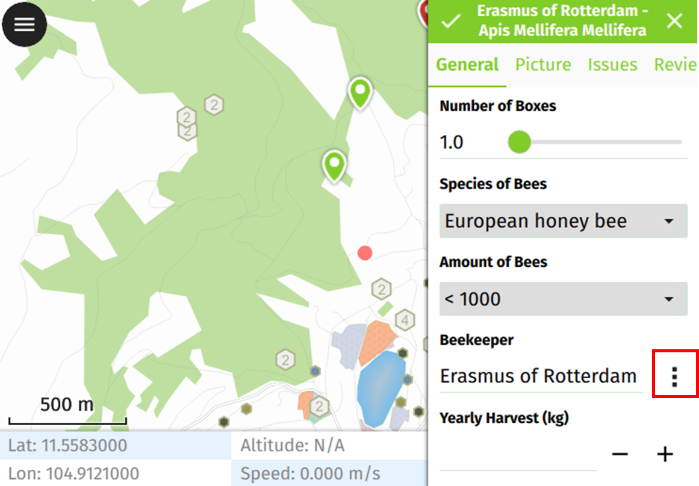
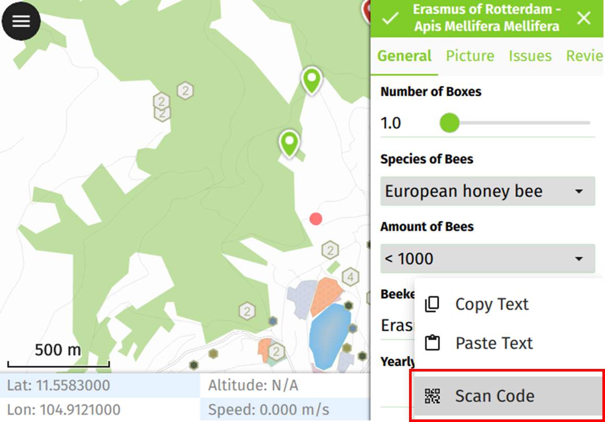
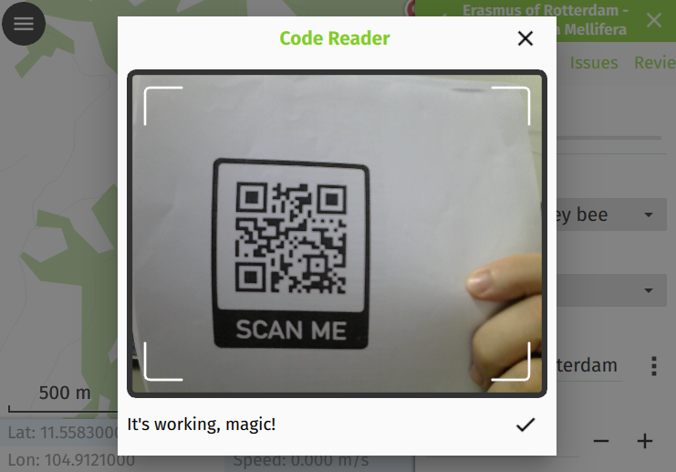
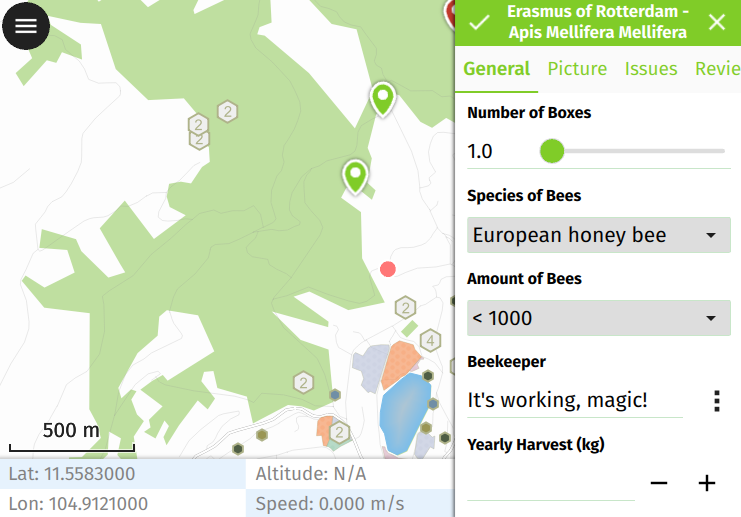
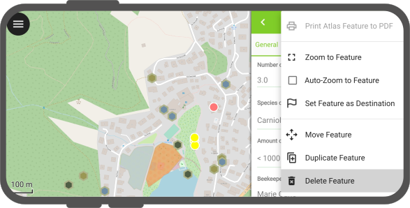
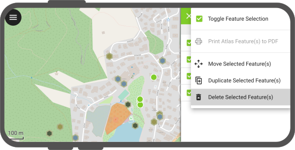

# Digitize and Edit

With QField you can digitize, edit and delete points, lines and polygons and their according attributes while being in the field.
Similar to QGIS, QField has two modes.
The *browse mode* and the *digitize mode*.

## Browse Mode

As the name suggests, while being in browse mode, you can view and select features within all identifiable layers in the project.
It is also possible to edit attributes of existing features, by clicking on a feature of interest and opening its attribute table.

!

## Digitize Mode

:material-tablet: Fieldwork

To start digitizing new features, enable the *Digitize mode* by clicking on the *pencil icon*
in the side "Dashboard" and selecting the layer within which you want to add new features.
The current layer within which features are to be added is highlighted in green.

!

!!! Tip
    QField insures that digitized geometries will not have duplicate vertices and respects the geometry precision settings from the currently selected layer.

### Adding point features

!!! Workflow

    1. Navigate the crosshair in the center of the screen to the desired location
    2. Click the *Green Plus (+) button* at the lower   right of the screen add a new point feature.
    (Optionable): You can use the *lock to position* button to force the crosshair to center on your location if you have enabled positioning.
    3. (Optionable): You can click the *(x) button* to cancel the current feature creation.

    !

### Adding line or polygon features

!!! Worlflow

    1. Navigate the crosshair in the center of the screen to the desired start of the line or polygon
    2. Click the *Plus (+) button* at the lower right of the screen to add the first node.
    3. Adding more points to form you line or polygon by clicking the *Plus (+) button* each time you want to add a new node.
    4. (Optionable) Click the *Minus (-) button* to remove the last added node.

    5. Click on the *Save button* to finish your edition.
    You need to add at least 2 nodes for line features and 3 for polygons.

    6. (Optionable): You can click the *(x) button* to cancel the current feature creation.

    !

### Additional Editing Settings

There are other more advanced settings, which you can enable to make your data collection more efficient:

- **Use volume keys to digitize**: If you want to avoid to have to tap on your device for every note you can enable this option to add and remove nodes using the  volume keys.
**Note:** This feature is only available for Android Devices
- **Allow finger tap on canvas to add vertices**: If you want to use your finger to add notes as well rather than having to press the button the whole time.

!!! Workflow

    1. To enable both options, open the side "Dashboard" Panel and direct to *Settings* > *General*

    !

### Attribute form

After digitizing a geometry, the attribute form will appear allowing you to edit attribute values for the newly added feature.

!!! note
    You can hide the attribute form upon feature addition via a configuration option for a given layer via its properties dialog in QGIS.

Moreover, you have the option to digitize the form using the scanning QR and Barcode reader functionality available within the feature form's text edit widget.

!

Upon clicking the icon button with the three dots, a menu will be presented offering three distinct actions: "Copy", "Paste", and "Scan Code".

!

Opting for the "Scan Code" action will trigger QField's code reader, initiating the scanning process to decode the code.

!

Once the codes have been successfully scanned, users can validate their choice by clicking the checkmark (✔️) OK button.
This action will populate the attribute with the decoded value, streamlining the digitization process.

!

In addition, the Code Reader offers the capability to read NFC text tags.

!

!!! note
    Both the QR code camera and the NFC text tag detector are enabled by default when you open the Code Reader.
    You have the flexibility to disable either of these features to ensure that your device's battery is not used unnecessarily by using hardware that you may not need at the moment.

#### Remember attribute values

For quick collection of rather homogeneous datasets, it is crucial to not having to enter the same attribute values multiple times.
The pins on the right of every attribute enable the last entered value option for each attribute individually so that the next time you will add a feature on the same layer, these attributes will be automatically pre-filled. It needs to be noted that this last entered value only applies when collecting new features not when editing existing ones, unless otherwise specified.

!

## Geometry editing

:material-tablet: Fieldwork

To edit the geometry of pre-existing features, enable the *Digitize mode* by tapping on the *pencil icon* underneath the legend.

Once in digitize mode, a new *Edit geometry* button will appear in the title bar of an identified feature form.
Clicking on the button will activate the geometry editing environment which offers four tools:

- A vertex editor tool;
- A geometry split tool;
- A geometry reshape tool; and
- A geometry ring tool.

### Vertex tool

The vertex editor allows you to move or delete pre-existing vertices as well as adding new vertices to geometries.

### Split tool

The split tool allows you to split line and polygon geometries into two halves, one of which will become a new feature of its own.

### Reshape tool

The reshape tool allows you to change line and polygon geometries by drawing shapes which will result in a reshaped line following the edge of the drawn shape or a polygon with the drawn shaped used to clip or expand the geometry.

### Reshape eraser tool

The reshape eraser tool is designed to ease the removal of parts of a line or polygon geometry.
The tool mimics eraser tools from 2D drawing programs and works best with a stylus.

Suppose you have a polygon representing a building footprint, but there's an unwanted protrusion.
You can use the erase tool to precisely remove that portion of the polygon, ensuring accuracy in your geometry representation.

### Ring tool

The ring tool allows you to digitize rings (i.e. holes) into polygon geometries.
Once a ring is created, QField will offer the possibility of filling the ring with a new feature.

### Demonstration of geometries editing

A video demonstration of some editing possibilities:

!

## Merging features

QField allows you to merge features and their geometries into a single feature.
To do so, identify two (or more) features on the map, select them in the features list and merge them by selecting the *Merge Selected Features* in the *Menu (⁝) Button*.

To execute merging within QField, ensure the following conditions:

1. **Editable Vector Layer:**
   - The target layer must be an editable layer.

2. **Multi-Type Geometry:**
   - Ensure that the geometry type of the layer is multi-type.

3. **Data Provider's Abilities:**
   - Verify that the data provider associated with the layer (preferably GeoPackage) possesses the capability to:
      - Modify geometries: The ability to make changes to existing geometrical structures.
      - Delete features: The capability to remove individual features from the dataset.

## Freehand digitizing

The freehand digitizing mode allows you to "draw" lines and polygons using their stylus pen or mouse.
The mode is available for line and polygon feature additions as well as the above-mentioned geometry editor's rings,
split, and reshape tools.

The freehand digitizing mode is activated through a new toolbar button which appears when QField is set to editing mode and a stylus pen or a mouse is hovering the map canvas while a line or polygon vector is selected.

<!-- markdown-link-check-disable-line -->

## Snapping

:material-monitor: Desktop preparation

While digitizing new features, new points can be snapped to existing geometries.

All configuration can be done in *Project* > *Snapping Settings*

### Snapping Types

It is possible to snap new points:

- only to nodes of existing geometries
- only to segments of existing geometries
- to nodes and segments of existing geometries

### Snapping to layers

It is also possible to only snap to one or a few layers.

### Snapping tolerance

The snapping tolerance can be specified in map units or pixels.

In almost any case, the units should be set to pixels.
We made good experiences with a tolerance value of 20.

## Snap to Common Angle

The Snap to Common Angle feature enhances the precision and efficiency of digitizing geometries by allowing to snap to predefined common angles: 10°, 15°, 30°, 45°, and 90°.
This functionality is similar to the advanced digitizing tool in QGIS.

To activate Snap to Common Angle, open the geometry editor and tap on the Snap to Common Angle icon in the toolbar to bring up a menu of common angles.
Choose the desired angle from the menu. Then, start digitizing your geometry or adding vertices, and the functionality will automatically align your input to the selected angle.
QField will remember the angle relative to the last segment situation for consistent snapping behaviour during subsequent edits.

## Topological editing

If topological editing is activated on the project in QGIS before exporting for QField, shared nodes of neighboring geometries are modified together when moving / deleting vertices and additional vertices are added to segments when a new node is added from neighboring geometries.

### Multi-editing of attributes

QField allows you to select multiple features and edit their attributes all at once.
In some cases, it can result in very efficient workflows.
To do so, identify two (or more)features on the map, select them in the features list and merge them by selecting the *Edit feature* button in the list's title bar.

!

## Copy, Cut and Paste

It is possible to copy, cut and paste features from one layer to another.
This function is achieved by attribute matching.
If there are any matching attributes in the target layer, the copied feature will copy the values where fields are matching while others non-matching fields will remain blank.
The same applies when cutting a feature from one layer to another.
The geometry type does not matter.

Check out the video to see the copy, paste function in action.

## Delete features

:material-tablet: Fieldwork

Deleting a feature is done by selecting the *Delete feature* action in the feature form's *(⋮)* menu.

!

QField also allows you to delete multiple features at a time.
To do so, first identify the features by short tapping on the relevant parts of the map.
Then activate the multi-selection mode by long pressing on one of the features you want to delete.
When checkbox appears next to the feature names, select further features to delete (you can tap on the map to add more features too).
Once done, select the "Delete Selected Feature(s): action in the features list *(⋮)* menu.

!
