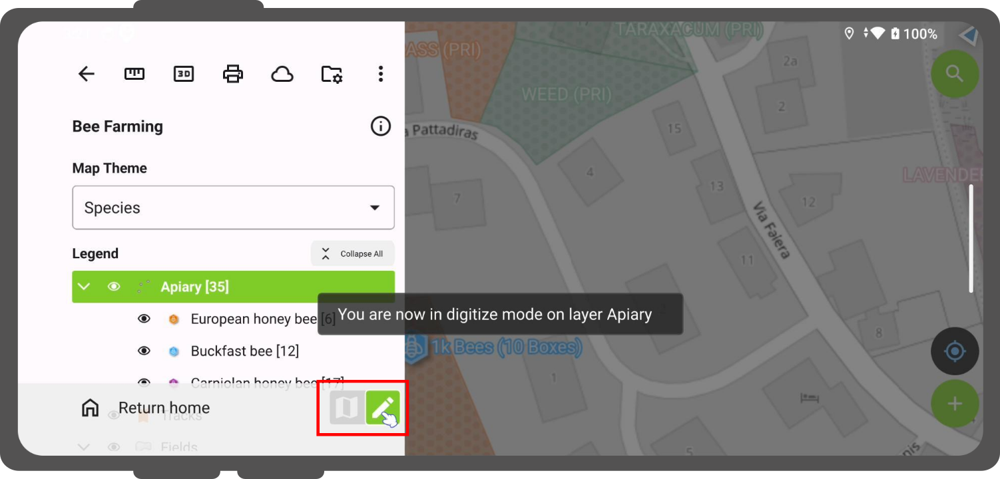
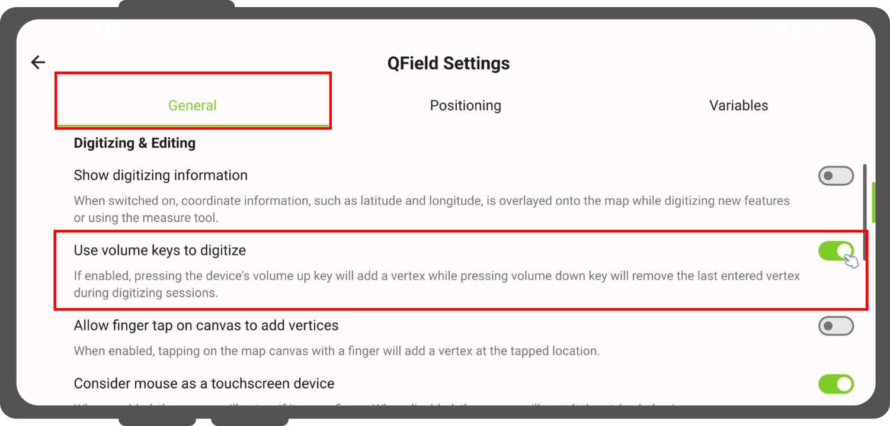
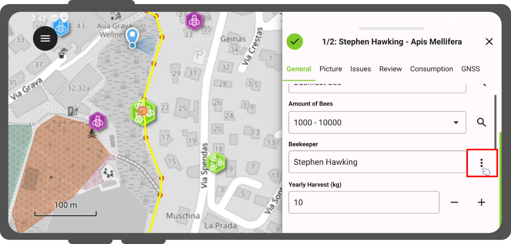
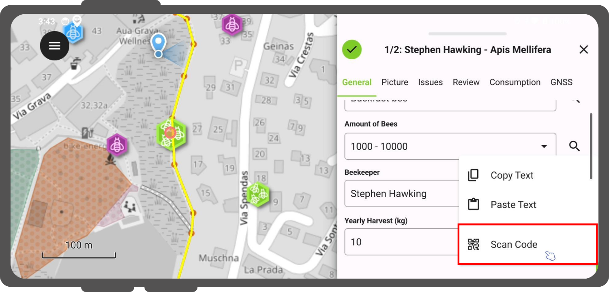
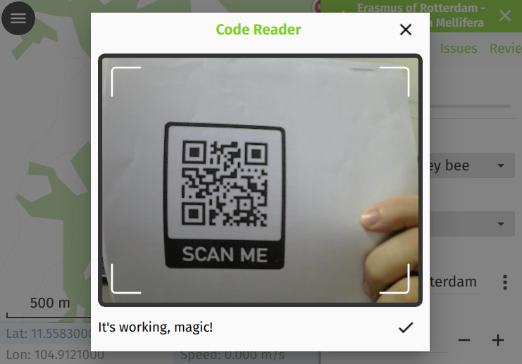
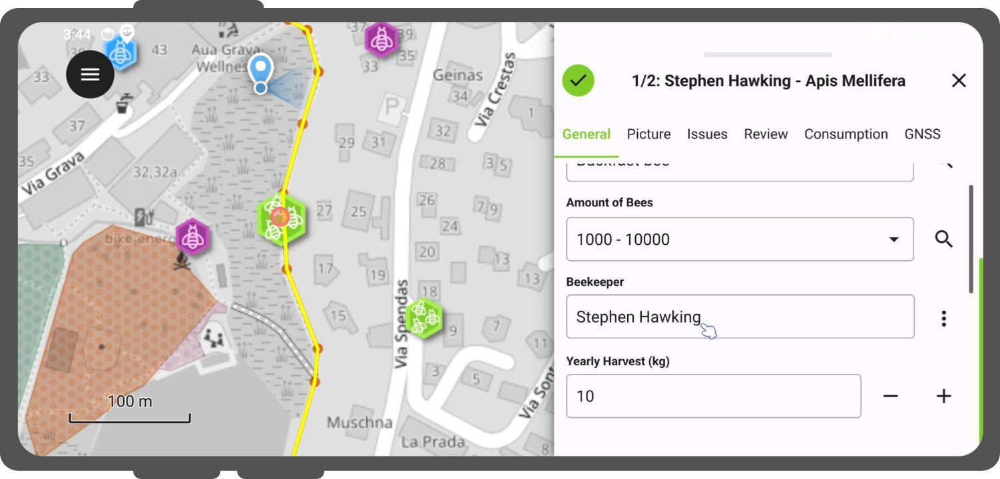
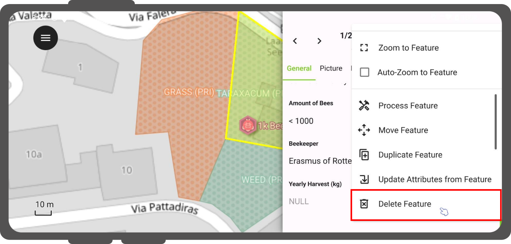
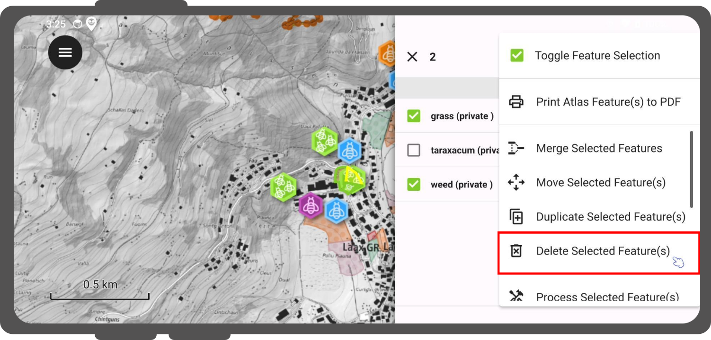

# Digitize and Edit

Digitize, edit, and delete point, line, and polygon features and attributes directly in the field using QField.
QField supports two primary interaction modes: **Browse Mode** and **Digitize Mode**.

## Browse Mode

Browse mode allows you to view and identify features across all identifiable vector layers in your project.
Open feature attribute forms to inspect or edit attributes of existing features by tapping a feature on the map canvas.

!

## Digitize Mode
:material-tablet: Fieldwork

Enable digitize mode to collect new spatial features.

!!! Workflow
    1. Open the **Side Dashboard** and tap the pencil icon to enable editing.
    2. Select the target layer to collect features.
    The active editing layer highlights in green.

!

!!! Tip
    QField prevents duplicate vertices during digitizing and respects geometry precision settings configured on the layer.

### Adding Point Features

!!! Workflow
    1. Center the map crosshair over the target location.
    2. Tap the green plus button (**"+"**) at the bottom right of the screen to add a point feature.
    (Optional: Tap **"Lock to position"** in the location pie menu to lock the crosshair to your current GNSS position).
        !
    3. (Optional) Tap the cancel button (**"✕"**) to discard feature creation.

### Adding Line or Polygon Features

!!! Workflow
    1. Center the map crosshair over the starting location.
    2. Tap the plus button (**"+"**) at the bottom right to place the first vertex.
    3. Move the crosshair and tap the plus button (**"+"**) to place subsequent vertices.
    4. (Optional) Tap the minus button (**"-"**) to remove the last entered vertex.
    5. Tap the **Save** button to complete feature creation.
    (Line features require a minimum of 2 vertices; polygon features require a minimum of 3 vertices).
    6. (Optional) Tap the cancel button (**"✕"**) to discard feature creation.

### Additional Digitizing Settings

Enable advanced digitizing settings to streamline field data collection:

- **"Use volume keys to digitize":** Uses device volume buttons to add and remove vertices during digitizing sessions (available on Android devices).
- **"Allow finger tap on canvas to add vertices":** Taps on the map canvas place vertices directly at the tapped location.

!!! Workflow
    1. Open the **Side Dashboard** and navigate to _Settings > General_.
    2. Toggle **"Use volume keys to digitize"** or **"Allow finger tap on canvas to add vertices"**.

!

### Attribute Form

An attribute form displays automatically after digitizing geometry to enter feature attribute values.

!!! Note
    Suppress feature forms upon feature addition by configuring layer properties in QGIS.

Populate attribute fields using the integrated Code Reader inside Text Edit widgets:

!!! Workflow
    1. Tap the three-dotted menu *(⋮)* next to a text field in the feature form.
        !
    2. Select **"Scan Code"**.
        !
    3. Point the camera at a QR code, barcode, or hold an NFC text tag near the device.
        !
    4. Tap the checkmark button (**"✔"**) to populate the decoded text into the field.
        !

!!! Note
    The QR code camera reader and NFC tag detector are active by default when opening the Code Reader.
    Toggle sensors off inside the scanner interface to preserve battery power.

#### Remember Attribute Values

Pin attribute values to reuse field inputs across newly digitized features.
Tap the pushpin icon on the right side of an attribute field to preserve its value for subsequent feature creations on the same layer.
Remembered attribute values apply to newly created features rather than edits to existing features.

## Geometry Editing
:material-tablet: Fieldwork

Modify existing feature geometries in digitize mode.

!!! Workflow
    1. Enable digitize mode by tapping the pencil icon in the **Side Dashboard**.
    2. Identify the target feature on the map canvas.
    3. Tap **"Edit geometry"** in the title bar of the feature form to activate geometry editing tools:
        - **Vertex Tool:** Moves, adds, or deletes individual feature vertices.
        - **Split Tool:** Splits line or polygon geometries into separate features.
        - **Reshape Tool:** Modifies line and polygon geometries by drawing new paths.
        - **Reshape Eraser Tool:** Erases geometry sections using stylus or touch strokes.
        - **Ring Tool:** Cuts interior rings (holes) into polygon geometries.

### Vertex Tool

Move or delete existing vertices, or insert new vertices along geometry segments.

### Split Tool

Draw a split line across line or polygon geometries to divide a feature into two independent features.

### Reshape Tool

Draw new geometry boundaries to expand or clip line and polygon features.

### Reshape Eraser Tool

Erase portions of line or polygon geometries using stylus or finger drawing inputs.
For example, erase unwanted protrusions on building footprint polygons to clean up boundaries.

### Ring Tool

Digitize interior rings (holes) inside polygon geometries.
After creating a ring, QField offers to fill the hole with a new polygon feature.

### Geometry Editing Demonstration

## Merging Features

Merge multiple features and geometries into a single feature.

!!! Workflow
    1. Identify two or more features on the map canvas.
    2. Long-press a feature in the identification list to enter multi-selection mode.
    3. Select target features to merge.
    4. Tap the top three-dotted menu *(⋮)* and select **"Merge Selected Features"**.

Requirements for merging features:

- Target layers must be editable vector layers.
- Layer geometry types must support multi-geometries (such as MultiPolygon or MultiLineString).
- Data providers (such as GeoPackage) must support modifying geometries and deleting features.

## Freehand Digitizing

Draw lines and polygons using a stylus or finger input in freehand digitizing mode.
Freehand digitizing supports adding line and polygon features, as well as split, reshape, and ring tools.

Freehand mode activates when hovering a stylus or mouse over the map canvas while an editable line or polygon layer is selected.

 <!-- markdown-link-check-disable-line -->

## Snapping
:material-monitor: Desktop preparation

Snap newly digitized vertices to existing vector geometries.
Configure snapping settings in QGIS before exporting projects to QField.

!!! Workflow
    1. In QGIS, navigate to _Project > Snapping Options..._.
    2. Select snapping targets (**"Vertex"**, **"Segment"**, or **"Vertex and Segment"**).
    3. Select snapping target layers.
    4. Set snapping tolerance in pixels (a tolerance of `20` pixels is recommended).

## Snap to Common Angle

Snap digitizing segments to predefined common angles: 10°, 15°, 30°, 45°, and 90°.

!!! Workflow
    1. Open the geometry editor in QField.
    2. Tap the **"Snap to Common Angle"** icon on the toolbar.
    3. Select a target angle from the menu.
    4. Place vertices on the map canvas; QField aligns segments to the selected angle relative to the previous segment.

## Topological Editing

When topological editing is enabled in QGIS project properties, editing shared vertices updates neighboring geometries simultaneously, and placing new vertices adds nodes to intersecting adjacent boundary segments.

### Multi-Editing of Attributes

Edit attribute values for multiple selected features simultaneously.

!!! Workflow
    1. Identify two or more features on the map canvas.
    2. Long-press a feature in the identification list to enter multi-selection mode.
    3. Select target features to edit.
    4. Tap the edit button in the title bar to update shared attribute values across all selected features.

## Copy, Cut, and Paste

Copy, cut, and paste features across different vector layers based on matching attribute names.
Values in matching attribute fields copy to the destination layer, while non-matching fields remain blank.

## Delete Features
:material-tablet: Fieldwork

Delete individual features or perform batch deletions.

!!! Workflow
    **Delete a single feature:**

    1. Identify a feature on the map canvas.
    2. Tap the three-dotted menu *(⋮)* inside the feature form and select **"Delete feature"**.

!

!!! Workflow
    **Delete multiple features:**

    1. Tap features on the map canvas to open the identification list.
    2. Long-press a feature in the list to enter multi-selection mode.
    3. Select additional features to delete.
    4. Tap the three-dotted menu *(⋮)* and select **"Delete Selected Feature(s)"**.

!
